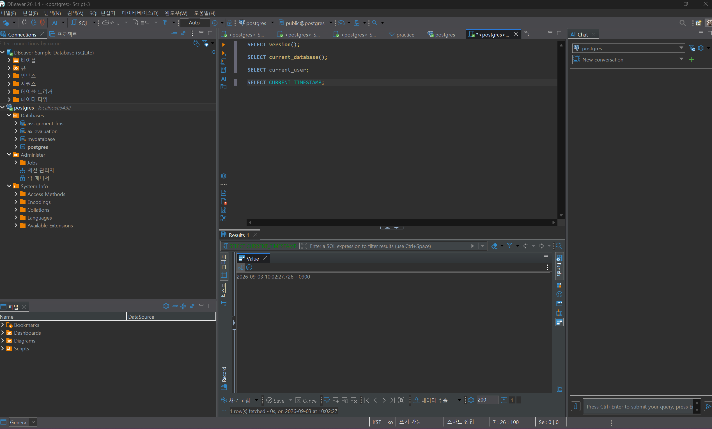
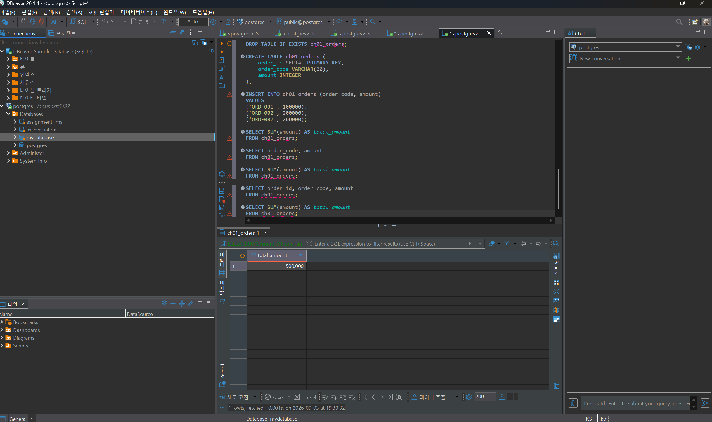
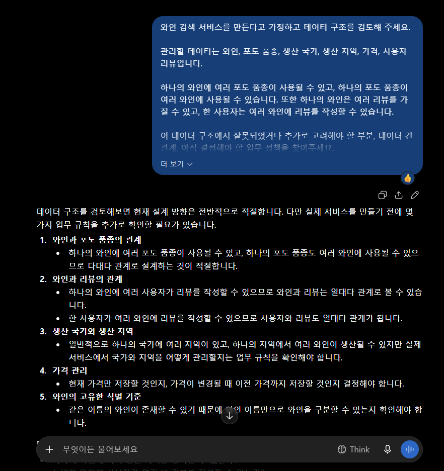

# Chapter 01 확장 실습 답안 템플릿

> **과제:** AI 시대에 데이터베이스를 왜 배워야 하는가  
> **사용 방법:** 이 파일을 내려받아 **본인의 GitHub 저장소**에 `chapter01_answer.md`라는 이름으로 저장한 뒤 답안을 작성합니다.  
> **제출 방법:** LMS에는 파일을 업로드하지 않고, **본인 GitHub 저장소의 `chapter01_answer.md` 파일 URL**을 제출합니다.

---

## 0. 학생 정보

| 항목 | 작성 내용 |
| --- | --- |
| 학번 |  |
| 이름 |전예진|
| GitHub 계정 |https://github.com/wjs0951467-wq|
| 과제 작성일 |2026-09-03|
| 사용한 AI 도구 |챗지피티|

> 실제 비밀번호, API Key, 전체 DB 접속 URL, 개인정보는 이 파일이나 캡처 화면에 기록하지 않습니다.

---

# 1. PostgreSQL 실행 환경 확인

## 1-1. 실행한 SQL

```sql
SELECT version();
SELECT current_database();
SELECT current_user;
SELECT CURRENT_TIMESTAMP;
```

## 1-2. 실행 결과 기록

```text
PostgreSQL 버전 → 18.4
현재 데이터베이스 → postgres
현재 사용자 → postgres
현재 시간 → 2026-09-03 09:53:29.560 +0900
```

## 1-3. 내가 확인한 내용

1. SQL을 작성하는 프로그램과 PostgreSQL은 같은 프로그램인가요?

```text
나의 답: 아니다. SQL을 작성하고 실행하는 프로그램은 PostgreSQL에 접속해서 SQL을 실행하기 위한 도구이고, PostgreSQL은 실제로 데이터를 저장하고 SQL을 처리하는 데이터베이스 관리 시스템이다.
```

2. `current_database()` 결과는 무엇을 의미하나요?

```text
나의 답:현재 내가 접속해서 사용하고 있는 데이터베이스의 이름을 의미한다. 이번 실습에서는 postgres라는 데이터베이스에 접속되어 있었다.
```

3. SQL이 실행되었다는 사실만으로 데이터 내용도 올바르다고 할 수 있나요?

```text
나의 답:아니다. SQL이 오류 없이 실행되더라도 데이터가 잘못 저장되어 있거나 SQL이 원하는 의미와 다르게 작성되었다면 결과가 틀릴 수 있다. 따라서 SQL 실행 여부뿐만 아니라 결과가 실제 업무 의미에 맞는지도 확인해야 한다.
```

## 1-4. 증거 화면

아래 경로에 캡처 이미지를 저장하는 것을 권장합니다.

```text
assignments/chapter01/images/step01_environment.png
```

이미지를 저장했다면 아래 링크의 파일명을 실제 파일명에 맞게 수정합니다.

```markdown

```

**이미지 삽입 위치:**

<!-- 아래 줄의 주석을 지우고 실제 이미지 Markdown을 넣어도 됩니다. -->



---

# 2. Chapter 01 핵심 내용 복습

교재 문장을 그대로 복사하지 말고 자신의 말로 작성합니다.

| 본문의 핵심 | 나의 설명 |
| --- | --- |
| AI가 SQL을 만들어도 DB를 배워야 한다 |AI가 SQL을 작성해줄 수는 있지만, 내가 SQL의 결과값이 실제 결과값과 동일한지 확인할 수 있어야 하기 때문에 DB를 배워야 한다.|
| 데이터 구조가 중요하다 |데이터를 체계적으로 구조화해야 나중에 조회하고 관리하기 쉽다.|
| SQL 결과를 검증해야 한다 |SQL이 오류 없이 실행되어도 결과가 내가 원하는 결과와 다를 수 있기 때문에 검증해야 한다.|
| 데이터 품질이 AI 답변 품질에 영향을 준다 |데이터가 정확하지 않으면 AI가 그 데이터를 바탕으로 결과를 낼 때 결과에도 영향을 줄 수 있다.|
| 저장 방식은 데이터 양만 보고 선택하지 않는다 |저장 방식을 선택할 때는 데이터의 양뿐만 아니라 작업자 수, 데이터 사이의 관계, 권한 등을 고려해야 한다.|

## 가장 중요하다고 생각한 한 문장

```text
AI의 결과를 믿기 전에 데이터의 품질과 사실을 확인해야 한다.
```

---

# 3. 실행 성공과 결과 정확성의 차이

## 3-1. SQL 실행 전 예상

학생 A는 질문 2개, 학생 B는 질문 1개, 학생 C는 질문이 없습니다.

```text
전체 학생 수: 3 명
전체 질문 수: 3 개
질문이 있는 학생 수: 2 명
질문이 없는 학생 수: 1 명
```

## 3-2. 임시 테이블 생성 및 데이터 입력 완료 확인

- [x] `ch01_students` 생성
- [x] `ch01_questions` 생성
- [x] 학생 3명 입력
- [x] 질문 3건 입력
- [x] 두 테이블의 데이터를 직접 조회

## 3-3. 잘못된 학생 수 SQL 실행 결과

실행한 SQL:

```sql
SELECT COUNT(*) AS student_count
FROM ch01_students AS s
INNER JOIN ch01_questions AS q
    ON q.student_id = s.student_id;
```

실행 결과:

```text
3
```

## 3-4. JOIN 상세 결과 관찰

```text
학생 A가 나타난 행 수:1행
학생 B가 나타난 행 수:1행
학생 C가 나타난 행 수:2행
```

다음 질문에 답합니다.

### Q1. 학생 C가 왜 결과에서 사라졌나요?

```text
학생 C에게 연결된 질문 데이터가 없기 때문이다. INNER JOIN은 양쪽 테이블에 서로 연결되는 데이터가 있는 경우만 결과에 보여주기 때문에 질문이 없는 학생 C는 결과에서 제외된다.
```

### Q2. 학생 A가 왜 여러 행으로 나타났나요?

```text
학생 A에게 여러 개의 질문 데이터가 연결되어 있기 때문이다. 학생 한 명에 질문이 여러 개 있으면 INNER JOIN 결과에서는 질문 하나마다 한 행씩 만들어진다.
```

### Q3. 위 `COUNT(*)`가 실제로 세고 있었던 것은 무엇인가요?

```text
학생의 수가 아니라 INNER JOIN으로 만들어진 결과 행의 수를 세고 있었다. 따라서 한 학생에게 질문이 여러 개 있으면 그만큼 여러 행으로 계산된다.
```

### Q4. 결과 숫자가 우연히 실제 학생 수와 같아도 바로 믿으면 안 되는 이유는 무엇인가요?

```text
결과 숫자만 같다고 해서 내가 원하는 값을 정확하게 계산한 것은 아니기 때문이다. SQL이 무엇을 기준으로 행을 만들고 무엇을 세고 있는지 확인해야 하며, 우연히 숫자가 같을 수도 있다.
```

## 3-5. 질문 한 건을 추가한 뒤 다시 실행

추가한 데이터:

```text
질문 ID: 104
학생 ID: 1 (학생 A)
질문 내용: 추가 질문입니다.
```

다시 실행한 결과:

```text
AI SQL 결과:4
실제 학생 수:3명
```

### 결과 해석

```text
데이터가 바뀐 뒤 무엇이 달라졌는지:학생 A에게 질문 1건을 추가하면서 INNER JOIN 결과의 행 수가 3개에서 4개로 증가했다.

실제 학생 수는 왜 그대로인지:질문만 추가했을 뿐 새로운 학생을 추가한 것은 아니기 때문에 실제 학생 수는 3명으로 그대로이다.

이 실험을 통해 알게 된 점:INNER JOIN 후 COUNT(*)는 학생 수가 아니라 JOIN으로 만들어진 결과 행의 수를 세기 때문에 질문 데이터가 추가되면 결과 숫자도 증가할 수 있다는 것을 알게 되었다.
```

## 3-6. 학생 테이블을 직접 센 결과

```sql
SELECT COUNT(*) AS student_count
FROM ch01_students;
```

결과:

```text
3명
```

### 두 SQL의 차이를 내 말로 설명

```text
첫 번째 SQL은 JOIN으로 만들어진 결과 행의 수를 세고 있었다.

두 번째 SQL은 JOIN으로 만들어진 결과 행의 수를 세고 있었다.

따라서 SQL을 검토할 때는 문법보다 먼저
JOIN으로 만들어진 결과 행의 수를 확인해야 한다.
```

## 3-7. 증거 화면

권장 경로:

```text
assignments/chapter01/images/step03_join_result.png
```

`여기에 STEP 3 핵심 증거 화면을 삽입하세요.`!
[alt text](../images/step03_join_result.png)

---

# 4. 잘못된 데이터가 결과를 바꾸는 과정

## 4-1. 주문 데이터 확인

다음 데이터를 입력한 뒤 실제 결과를 확인합니다.

```text
ORD-001, 100000
ORD-002, 200000
ORD-002, 200000
```

## 4-2. 실행 전 예상

업무적으로 주문이 `ORD-001`, `ORD-002` 두 건이고 `order_code`가 주문을 고유하게 구분한다고 **가정할 경우** 예상 합계:

```text
300,000원
```

> 위 가정 자체가 실제 업무 규칙인지 확인해야 한다는 점도 기억합니다.

## 4-3. SQL 합계

```sql
SELECT SUM(amount) AS total_amount
FROM ch01_orders;
```

실제 결과:

```text
500,000원
```

## 4-4. 결과 해석

### `SUM` 문법 자체가 잘못된 것인가요?

```text
아닙니다. 
```

### 결과 차이의 원인은 무엇인가요?

```text
ORD-002가 중복 입력되어 있기 때문이다.
업무적으로는 ORD-001과 ORD-002 두 건의 주문이라고 가정했지만,
데이터에는 ORD-002가 두 번 저장되어 있어 500,000원이 계산되었다.
```

### SQL이 정확하게 실행되어도 업무 숫자가 잘못될 수 있는 이유를 설명하세요.

```text
SQL은 데이터베이스에 저장된 데이터를 정확하게 계산했지만,
처음부터 데이터가 잘못 입력되거나 중복되어 있다면 계산 결과도 잘못될 수 있다.
따라서 SQL의 문법과 실행 결과뿐만 아니라 데이터가 업무 규칙에 맞게 저장되어 있는지도 확인해야 한다.
```

## 4-5. AI에게 같은 데이터를 분석시킨 결과

AI가 계산한 합계:

```text
500,000원
```

AI가 중복 가능성을 언급했나요?

```text
네. ORD-002가 두 번 나타나는 것을 확인하고 중복 데이터일 가능성을 언급했습니다.
```

AI가 `ORD-002` 두 행이 실제 두 주문인지 중복 입력인지 스스로 확정할 수 있나요? 이유도 적으세요.

```text
아니요. 데이터만 보고는 확정할 수 없다.
ORD-002가 실제로 두 건의 주문인지, 같은 주문이 실수로 중복 입력된 것인지는
업무 규칙이나 원본 주문 기록을 추가로 확인해야 하기 때문이다.
```

추가로 확인해야 할 업무 규칙:

```text
1. order_code가 실제로 주문을 고유하게 구분하는 값인지 확인한다.
2. 같은 order_code를 가진 주문이 여러 건 존재할 수 있는지 확인한다.
3. 중복 데이터가 발생했을 때 어떤 데이터를 정상 주문으로 인정할지 확인한다.
```

내가 최종적으로 내린 판단:

```text
현재 데이터만 보면 SQL의 합계 500,000원은 정확하게 계산된 결과이다.
하지만 ORD-002가 중복 입력된 것이라면 업무적으로는 300,000원이다.
따라서 실제 업무 규칙과 원본 데이터를 확인하기 전에는 300,000원 또는 500,000원 중 하나를 확정할 수 없다.
```

## 4-6. 증거 화면

권장 경로:

```text
assignments/chapter01/images/step04_duplicate_result.png
```

`여기에 STEP 4 핵심 증거 화면을 삽입하세요.`


---

# 5. 파일·스프레드시트·DBMS 선택 연습

각 사례에 대해 **AI에게 묻기 전에 먼저 본인의 판단을 작성**합니다.

## 사례 A. 개인 독서 기록

```text
나의 선택:파일
선택 이유:개인 혼자 기록하는것이고 독서를 하면 적어도 어떠한 책을 읽었는지 본인이 알아야한다 생각하기 때문이다.
어떤 조건이 추가되면 다른 방식으로 바꿀 것인지:독서왕이라면 스프레드시트로 바꾸거나 한 학급이나 여러인원을 관리한다면 DBMS로 바꿀 것이다.
```

## 사례 B. 동아리 행사 신청 명단

```text
나의 선택:스프레드시트
선택 이유:동아리 인원이 많이 않을거라 생각하기 때문이다.
어떤 조건이 추가되면 다른 방식으로 바꿀 것인지:대규모 동아리라면 DBMS로 바꿀 것 같다.
```

## 사례 C. 온라인 강의 서비스

```text
나의 선택:DBMS
선택 이유:불특정 다수가 이용할 수 있는 서비스이고, 여러 강의를 수강할 수 있기 때문입니다. 그리고 권한관리가 강하기 때문이다.
어떤 조건이 추가되면 다른 방식으로 바꿀 것인지:웬만하면 바꾸진 않을 것 같다.
```

## 판단 기준 체크

- [X] 데이터 증가
- [X] 여러 사용자의 동시 수정
- [X] 데이터 사이의 관계
- [X] 반복 조회와 집계
- [X] 정확성·일관성
- [X] 변경 이력
- [X] 권한 구분
- [X] 백업·복구
- [X] 웹·앱에서 지속 사용

### C

```text
나의 답:아닙니다. 데이터의 양뿐만 아니라 데이터 간의 관계, 여러 사용자의 동시 사용 여부, 권한 관리, 데이터 정확성 등을 고려하여 저장 방법을 선택해야 합니다.
```

---

# 6. 나만의 서비스 데이터 구조 초안

> 이 내용은 이후 Chapter에서 계속 확장할 수 있으므로 신중하게 작성합니다.

## 6-1. 서비스 정의

```text
서비스 이름:와인 검색 서비스

이 서비스는
와인의 이름, 품종, 국가, 지역, 가격 등의 정보를 검색하고
사용자가 원하는 와인을 쉽게 찾아보기
하기 위한 서비스이다.
```

## 6-2. 관리할 데이터 후보

```text
1. 와인
2. 와인 품종
3. 생산 국가
4. 생산 지역
5. 가격
```

## 6-3. 한 행의 의미

| 데이터 후보 | 한 행의 의미 |
| --- | --- |
| 와인 | 하나의 와인 정보를 의미한다. |
| 와인 품종 | 하나의 포도 품종 정보를 의미한다. |
| 생산 국가 | 하나의 와인 생산 국가 정보를 의미한다. |


## 6-4. 관계를 자연어로 설명

```text
1. 하나의 생산 국가는 여러 개의 와인을 가질 수 있다.
2. 하나의 와인에는 여러 개의 포도 품종이 사용될 수 있다.
3. 하나의 포도 품종은 여러 개의 와인에 사용될 수 있다.
4. 하나의 와인은 여러 개의 리뷰를 가질 수 있다.
5. 한 사용자는 여러 와인에 리뷰를 작성할 수 있다.
```

## 6-5. 아직 결정하지 않은 정책

```text
Q1. 리뷰를 작성할 때 평점만 작성할 수 있게 할 것인가, 리뷰 내용도 함께 작성하게 할 것인가?
Q2. 와인의 가격이 변경되었을 때 기존 가격을 기록으로 남길 것인가?
Q3. 사용자가 와인에 평점이나 리뷰를 작성할 수 있도록 할 것인가?
```

> 확정되지 않은 정책을 AI가 임의로 결정한 경우 그대로 받아들이지 않습니다.

---

# 7. AI를 검토자로 활용하기

## 7-1. 내가 AI에게 전달한 핵심 프롬프트

개인정보나 비밀번호 등 민감한 내용은 제거한 뒤 기록합니다.

```text
와인 검색 서비스를 만든다고 가정하고 데이터 구조를 검토해 주세요.

관리할 데이터는 와인, 포도 품종, 생산 국가, 생산 지역, 가격, 사용자 리뷰입니다.

하나의 와인에 여러 포도 품종이 사용될 수 있고, 하나의 포도 품종이 여러 와인에 사용될 수 있습니다. 또한 하나의 와인은 여러 리뷰를 가질 수 있고, 한 사용자는 여러 와인에 리뷰를 작성할 수 있습니다.

이 데이터 구조에서 잘못되었거나 추가로 고려해야 할 부분, 데이터 간 관계, 아직 결정해야 할 업무 정책을 찾아주세요.

특히 데이터 관계를 임의로 가정하지 말고, 실제 서비스에서 담당자에게 확인해야 할 사항도 함께 제안해 주세요.
```

## 7-2. AI의 주요 제안과 나의 판단

최소 5개를 작성합니다.

## 7-2. AI의 주요 제안과 나의 판단

| AI의 제안 | 수용 / 수정 / 거절 | 나의 판단 근거 |
| --- | --- | --- |
| 하나의 와인에 여러 포도 품종이 사용될 수 있으므로 다대다 관계를 고려해야 한다. | 수용 | 실제 와인은 여러 품종이 혼합될 수 있으므로 적절한 관계라고 판단했다. |
| 하나의 생산 국가에는 여러 와인이 연결될 수 있다. | 수용 | 한 국가에서 여러 와인이 생산될 수 있으므로 자연스러운 관계라고 판단했다. |
| 하나의 와인은 여러 개의 리뷰를 가질 수 있다. | 수용 | 여러 사용자가 같은 와인에 리뷰를 작성할 수 있도록 하는 서비스 구조에 적합하다. |
| 한 사용자가 같은 와인에 여러 리뷰를 작성할 수 있도록 한다. | 수정 | 실제 서비스의 운영 정책에 따라 달라질 수 있으므로 바로 확정하지 않고 미정 정책으로 남겼다. |
| 가격이 변경되면 이전 가격을 모두 저장하는 것이 좋다. | 수정 | 가격 변경 이력을 반드시 저장할지는 서비스의 목적과 업무 규칙을 확인한 뒤 결정해야 한다고 판단했다. |


## 7-3. AI에게 자기 답변을 다시 비판하도록 요청한 결과

첫 번째 답변과 달라진 점:

```text
처음에는 데이터 간 관계를 중심으로 제안했지만, 다시 검토하도록 요청하자 실제 업무 규칙을 확인해야 하는 부분이 더 중요하다는 점을 확인했다.
```

AI가 처음에 임의로 가정했던 내용:

```text
한 사용자가 같은 와인에 여러 번 리뷰를 작성할 수 있는지, 가격 변경 이력을 저장해야 하는지 등을 구체적인 근거 없이 가정할 가능성이 있었다.
```

추가로 업무 담당자에게 확인해야 한다고 판단한 내용:

```text
와인의 고유한 식별 기준, 같은 와인의 중복 등록 여부, 리뷰 작성 횟수 제한, 가격 변경 이력 관리 여부 등을 실제 서비스의 업무 규칙에 따라 확인해야 한다.
```

## 7-4. AI 활용에 대한 나의 평가

```text
가장 유용했던 부분:

AI가 데이터 간 관계에서 놓칠 수 있는 부분과 추가로 고려해야 할 정책을 찾아주는 데 유용했다.

수정하거나 거절한 부분:

AI가 업무 규칙을 확인하지 않고 일부 정책을 임의로 가정할 수 있는 부분은 그대로 받아들이지 않았다.

그렇게 판단한 근거:

AI는 제공된 데이터와 조건을 바탕으로 답변하기 때문에 실제 서비스의 업무 규칙이나 운영 정책을 알 수 없기 때문이다.

AI가 없었다면 놓쳤을 가능성이 있는 질문:

하나의 와인에 여러 품종을 연결하는 방법, 같은 와인에 대한 리뷰 작성 규칙, 가격 변경 이력을 관리할 필요가 있는지 등을 추가로 확인해야 한다는 점을 놓쳤을 가능성이 있다.
```

## 7-5. AI 활용 증거 화면

권장 경로:

```text
assignments/chapter01/images/step07_ai_review.png
```

AI 대화 전체를 캡처할 필요는 없습니다. 핵심 요청과 검토 과정이 보이는 화면 1장 정도면 충분합니다.

`여기에 AI 활용 증거 화면을 삽입하세요.`

---

# 8. 기준 데이터·파생 데이터·AI 생성 결과 구분

내 서비스에 맞게 작성합니다.

| 구분 | 내 서비스의 예 | 판단 이유 |
| --- | --- | --- |
| 기준 데이터 | 와인 이름, 포도 품종, 생산 국가, 생산 지역, 가격 | 실제 와인 정보를 직접 저장하는 원본 데이터이기 때문이다. |
| 파생 데이터 | 와인별 평균 평점, 리뷰 개수, 검색 결과 수 | 기준 데이터인 리뷰나 와인 정보를 이용해 계산하여 만들어지는 데이터이기 때문이다. |
AI 생성 결과 | AI가 추천한 와인, 와인 설명, 음식과의 페어링 추천 | AI가 기존 데이터를 바탕으로 생성한 결과이므로 원본 데이터와 구분해야 하기 때문이다. |

### 기준 데이터가 변경되면 파생 데이터는 어떻게 해야 하나요?

```text
기준 데이터가 변경되면 그 데이터를 이용해서 만들어진 파생 데이터도 다시 계산하거나 업데이트해야 한다. 예를 들어 리뷰의 평점이 변경되면 와인의 평균 평점도 다시 계산해야 한다.
```

### AI 결과만 있고 원본 데이터가 없다면 결과를 충분히 검증할 수 있나요?

```text
확실히 검증하기 어렵다. AI가 어떤 원본 데이터를 바탕으로 결과를 만들었는지 확인할 수 없기 때문에 실제 데이터와 비교하여 결과가 정확한지 판단하기 어렵다.
```

---

# 9. 최종 성찰

아래 세 문장은 반드시 **본인의 말**로 작성합니다.

```text
1. SQL이 실행되어도 결과를 바로 믿으면 안 되는 이유는
   SQL에 오류가 없더라도 내가 생각한 데이터와 다른 결과가 나올 수 있기 때문 이다.

2. AI를 데이터베이스 학습에 활용할 때 가장 중요한 것은
   AI가 알려주는 내용을 그대로 믿지 않고 내가 직접 확인하는 것이다.

3. 이번 실습 이후 내가 더 확인하고 싶은 것은
   내가 과연 이걸 할 수 있을까 하는 자신에 대한 확신이다.
```

## 이번 Chapter에서 새롭게 알게 된 점 3가지

```text
1.SQL이 정상적으로 실행되는 것과 결과가 정확한 것은 다르다는 것을 알게 되었다.
2.여러 데이터를 같이 조회할 때 데이터가 반복해서 나올 수 있다는 것을 알게 되었다.
3.데이터가 잘못 입력되면 SQL이 정확하게 계산해도 잘못된 결과가 나올 수 있다는 것을 알게 되었다.
```

## 아직 이해가 명확하지 않은 부분

```text
1.여러 테이블의 관계를 실제 데이터베이스에서 어떻게 설계하는지 아직 어렵다.
2.어떤 데이터를 기준 데이터로 저장하고 어떤 데이터를 파생 데이터로 관리해야 하는지 어렵다.
3. 사실 모든게 다 어렵다.
```

---

# 10. 제출 전 자기 점검

- [X] PostgreSQL 실행 화면을 확인했다.
- [X] SQL 실행 전에 예상 결과를 먼저 작성했다.
- [X] `INNER JOIN` 예제에서 누락과 반복을 설명할 수 있다.
- [X] 숫자가 우연히 같아도 의미가 다를 수 있음을 설명했다.
- [X] 중복 데이터가 집계 결과에 미치는 영향을 확인했다.
- [X] 저장 방식을 데이터 양만으로 판단하지 않았다.
- [X] 개인 서비스 주제를 하나 정했다.
- [X] 데이터 후보와 한 행의 의미를 작성했다.
- [X] 미확정 정책을 최소 3개 작성했다.
- [X] AI 제안을 수용·수정·거절로 구분했다.
- [X] AI 제안에 대한 판단 근거를 작성했다.
- [X] 기준 데이터·파생 데이터·AI 결과를 구분했다.
- [X] 핵심 증거 이미지가 Markdown에서 정상적으로 보인다.
- [X] 비밀번호·API Key·개인정보가 노출되지 않았다.

"체크는 다 하였지만 두루뭉실하게 대충 알고있다. 사실은 모르고 있을지도 모른다."
---

# 11. LMS 제출 정보

## 내 GitHub 답안 파일 URL

아래에는 **교수자 템플릿 URL이 아니라 본인이 작성한 답안 파일의 GitHub URL**을 기록합니다.

```text
https://github.com/wjs0951467-wq/database-repository/blob/main/assignments/chapter01/chapter01_answer.md
```

내 실제 제출 URL:

```text
내 실제 제출 URL:
https://github.com/wjs0951467-wq/database-repository/blob/main/assignments/chapter01/chapter01_answer.md
```

> LMS에는 위 **본인 저장소의 `chapter01_answer.md` 파일 URL 하나**를 제출합니다.

---

## 권장 학생 저장소 구조

```text
<본인-저장소>/
└── assignments/
    └── chapter01/
        ├── chapter01_answer.md
        └── images/
            ├── step01_environment.png
            ├── step03_join_result.png
            ├── step04_duplicate_result.png
            └── step07_ai_review.png
```

이 구조를 사용하면 이후 Chapter 02, Chapter 03도 같은 방식으로 계속 추가할 수 있습니다.
