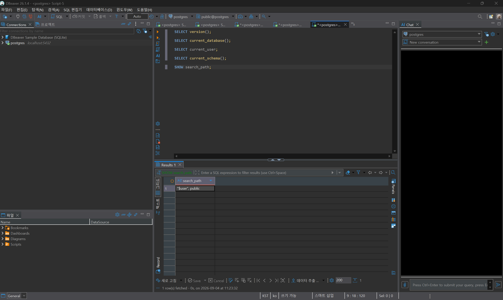
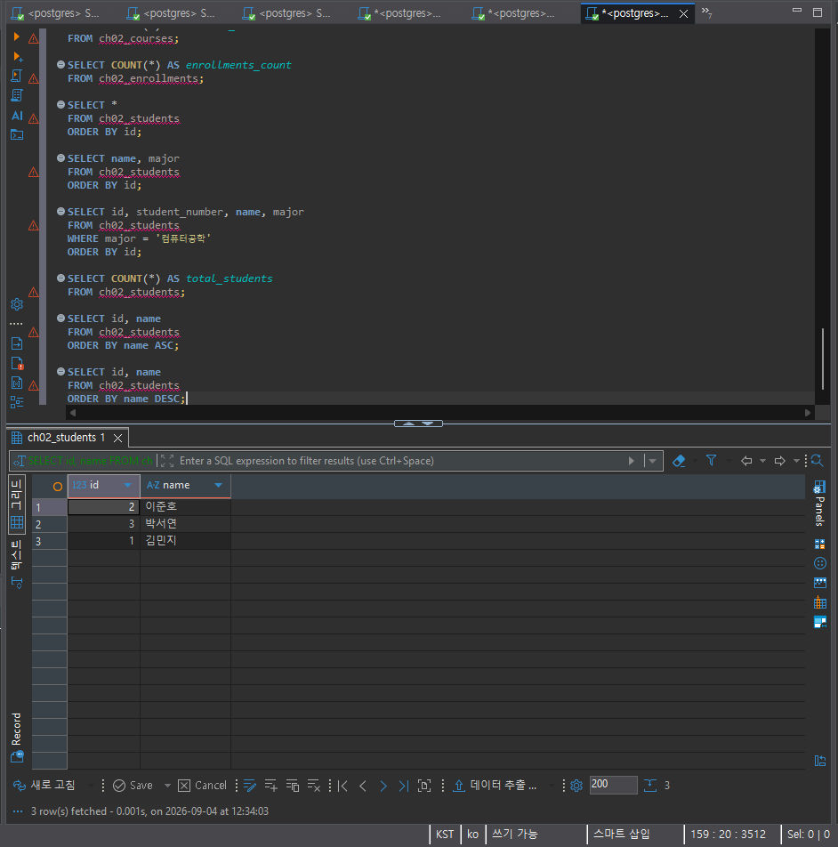
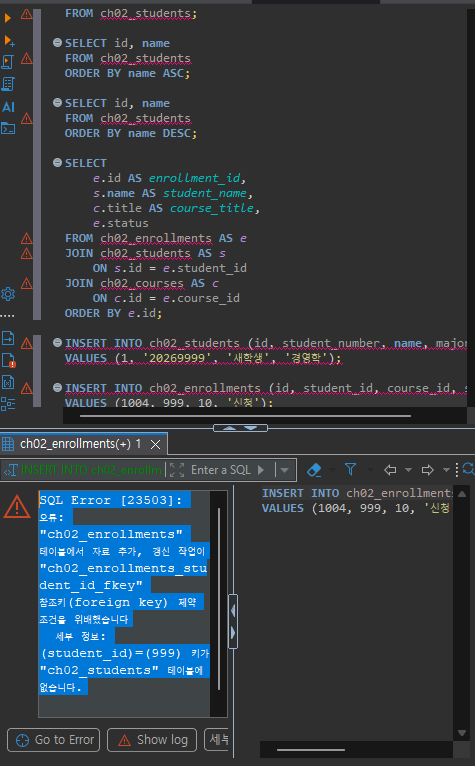
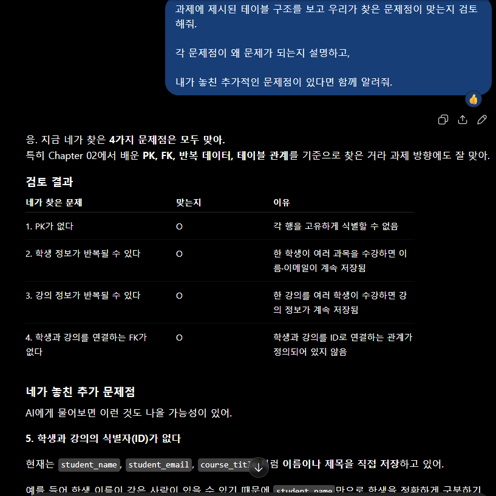

# Chapter 02 확장 실습 답안 템플릿

> **과제:** 데이터와 DBMS의 기본 개념  
> **사용 방법:** 이 파일을 내려받아 본인의 GitHub 저장소에 `chapter02_answer.md`라는 이름으로 저장한 뒤 실습하면서 바로 작성합니다.  
> **제출 방법:** LMS에는 파일을 직접 업로드하지 않고, **본인 GitHub 저장소의 `chapter02_answer.md` 파일 URL**을 제출합니다.

---

## 제출 전 개인정보 주의

LMS에서 제출자를 확인할 수 있으므로 이 공개 Markdown 파일에 학번이나 실명을 반드시 적을 필요는 없습니다.

```text
GitHub 계정 또는 별칭:wjs0951467-wq
과제 작성일:2026-09-04
사용한 AI 도구:Chat GPT
```

> 실제 비밀번호, API Key, 전체 DB 접속 URL, 개인정보가 포함된 화면은 올리지 않습니다.

---

# 1. PostgreSQL에서 현재 위치 확인

## 1-1. 실행한 SQL

```sql
SELECT version();
SELECT current_database();
SELECT current_user;
SELECT current_schema();
SHOW search_path;
```

## 1-2. 실행 결과 기록

```text
PostgreSQL 버전: PostgreSQL 18.4 on x86_64-windows, compiled by msvc-19.44.35227, 64-bit
현재 데이터베이스: postgres
현재 사용자: postgres
현재 스키마: public
search_path: "$user", public
```

## 1-3. 구조를 내 말로 설명

```text
PostgreSQL은:데이터베이스를 관리하고 SQL을 실행할 수 있게 해주는 DBMS이다.

현재 접속한 데이터베이스는:postgres이며, PostgreSQL이 관리하는 여러 데이터베이스 중 하나이다.

스키마는:데이터베이스 안에서 테이블 등의 객체를 묶어서 관리하는 논리적인 공간이다. 이번 실습에서는 public 스키마를 확인했다.

DBeaver 또는 psql 같은 도구는:PostgreSQL에 접속해서 SQL을 작성하고 실행할 수 있도록 도와주는 클라이언트 도구이다.
```

## 1-4. 계층 구조 완성

```text
사용자
→ DBeaver 또는 psql 같은 클라이언트
→ PostgreSQL DBMS
→ 데이터베이스
→ 스키마
→ 테이블
→ 행 / 열
```

## 1-5. 증거 화면

권장 경로:

```text
assignments/chapter02/images/step01_environment.png
```

```markdown

```

`여기에 STEP 1 핵심 증거 화면을 삽입하세요.`

---

# 2. 데이터베이스 안의 스키마와 테이블 관찰

## 2-1. 스키마 조회 결과

실행한 SQL:

```sql
SELECT schema_name
FROM information_schema.schemata
ORDER BY schema_name;
```

관찰한 스키마 이름 중 3개 이내를 적습니다.

```text
1.information_schema
2.pg_catalog
3.public
```

### `public`은 무엇인가요?

```text
나의 설명:현재 데이터베이스에서 기본적으로 사용헐 수 잇는 스키마이다. 테이블을 만들때 별도의 스키마를 지정하지 않으면 보통 public 스키마에 만들어진다.
```

### 데이터베이스와 스키마는 같은 것인가요?

```text
나의 설명:같은 것이 아니다. 데이터베이스가 더 큰 단위이고 스키마는 데이터베이스 안에서 테이블과 같은 객체를 구분하고 관리하기 위한 논리적인 공간이다. 하나의 데이터베이스 안에는 여러 스키마가 존재할 수 있다.
(ex.데이터베이스>스키마>테이블..)
```

## 2-2. 현재 보이는 테이블 조회

```sql
SELECT table_schema, table_name
FROM information_schema.tables
WHERE table_type = 'BASE TABLE'
  AND table_schema NOT IN ('pg_catalog', 'information_schema')
ORDER BY table_schema, table_name;
```

```text
조회된 사용자 테이블 수 또는 눈에 띈 테이블:여러 개의 테이블이 조회되었으며, 모두 public 스키마에 속해 있었다.

아직 테이블이 거의 없어도 괜찮은 이유:필요한 데이터를 저장하기 위해 사용자가 직접 만들 수 있기 때문에 처음부터 많은 테이블이 존재할 필요는 없다.
```

## 2-3. 관찰 정리

```text
PostgreSQL 서버 안에는 여러 데이터베이스가 있을 수 있다.
한 데이터베이스 안에는 여러 스키마가 있을 수 있다.
스키마 안에는 테이블과 같은 데이터베이스 객체가 존재한다.
```

---

# 3. TEMP TABLE로 테이블·행·열·키 직접 확인

## 3-1. 임시 테이블 생성 완료 확인

- [x] `ch02_students` 생성
- [x] `ch02_courses` 생성
- [x] `ch02_enrollments` 생성

각 테이블의 **한 행 의미**를 적습니다.

| 테이블 | 한 행의 의미 |
| --- | --- |
| `ch02_students` | 한 명의 학생 정보를 의미한다. |
| `ch02_courses` | 하나의 과목 정보를 의미한다. |
| `ch02_enrollments` | 한 학생이 한 과목을 수강하는 정보를 의미한다. |

## 3-2. 열의 의미 확인

### `ch02_students`

| 열 | 값의 의미 | 내부 식별자 / 업무 식별자 / 일반 속성 |
| --- | --- | --- |
| `id` | 학생을 시스템에서 구분하기 위한 번호 | 내부 식별자 |
| `student_number` | 학생의 학번 | 업무 식별자 |
| `name` | 학생의 이름 | 일반 속성 |
| `major` | 학생의 전공 | 일반 속성 |

### `ch02_enrollments`

| 열 | 값의 의미 | PK / FK / 일반 속성 |
| --- | --- | --- |
| `id` | 수강 정보를 구분하기 위한 번호 | PK |
| `student_id` | 어떤 학생의 수강 정보인지 나타내는 번호 | FK |
| `course_id` | 어떤 과목의 수강 정보인지 나타내는 번호 | FK |
| `status` | 수강 상태 | 일반 속성 |

## 3-3. 입력된 행 수

```text
students 행 수:3
courses 행 수:2
enrollments 행 수:3
```

## 3-4. 내부 식별자와 업무 식별자

```text
students.id가 필요한 이유:학생을 시스템 내부에서 고유하게 구분하고 다른 테이블에서 학생을 참조하기 위해 필요하다.

student_number가 필요한 이유:실제 업무에서 학생을 구분하기 위해 사용하는 학번이 필요하기 때문이다.

둘을 항상 같은 값으로 사용하지 않아도 되는 이유:id는 시스템 내부에서 사용하는 식별자이고, student_number는 업무에서 사용하는 식별자이므로 목적이 다르기 때문이다.
```

## 3-5. 숫자처럼 보이는 학번을 문자열로 저장한 이유

```text
나의 설명:학번은 숫자로만 이루어져 있어도 계산할 값이 아니라 학생을 식별하기 위한 고유번호 값이므로 문자열로 저장하는 것이 적절하다.  
```

---

# 4. 테이블과 조회 결과는 다르다

## 4-1. 원본 테이블 행 수

```text
ch02_students 전체 행 수:3행
```

## 4-2. 일부 열만 조회

실행 SQL:

```sql
SELECT name, major
FROM ch02_students
ORDER BY id;
```

```text
원본 테이블의 열 수와 조회 결과의 열 수가 다른 이유:SELECT 문에서 name과 major 두 개의 열만 지정했기 때문에 조회 결과에는 두 개의 열만 나타난다. 원본 테이블의 id와 student_number가 삭제된 것은 아니다.
```

## 4-3. 조건을 적용한 조회

실행 SQL:

```sql
SELECT id, student_number, name, major
FROM ch02_students
WHERE major = '컴퓨터공학'
ORDER BY id;
```

```text
원본 테이블 행 수:3
조회 결과 행 수:2
원본 테이블의 데이터가 삭제된 것인가?:아니다.
그렇게 판단한 이유:WHERE 조건으로 조회하면 조건에 맞는 행만 조회 결과에 나타난다.
전체 학생 수를 다시 확인하면 3명으로 그대로 유지되어 있음으로 원본 테이블의 데이터가 삭제되는 것은 아니다. 
```

## 4-4. 정렬 결과 비교

```sql
SELECT id, name
FROM ch02_students
ORDER BY name ASC;

SELECT id, name
FROM ch02_students
ORDER BY name DESC;
```

```text
ASC 결과의 첫 학생:김민지
DESC 결과의 첫 학생:이준호

이 실험을 통해 ORDER BY에 대해 알게 된 점:ORDER BY는 조회 결과의 행 순서를 정렬하는 기능이다.
ASC는 오름차순, DESC는 내림차순으로 정렬한다.
ORDER BY로 정렬해도 원본 테이블의 데이터 자체는 변경되지 않는다.
```

## 4-5. 증거 화면

권장 경로:

```text
assignments/chapter02/images/step04_result_set.png
```

`여기에 STEP 4 핵심 증거 화면을 삽입하세요.`

---

# 5. PK와 FK를 실제로 관찰

## 5-1. 정상 데이터의 관계 읽기

다음 SQL 결과를 보고 작성합니다.

```sql
SELECT
    e.id AS enrollment_id,
    s.name AS student_name,
    c.title AS course_title,
    e.status
FROM ch02_enrollments AS e
JOIN ch02_students AS s
    ON s.id = e.student_id
JOIN ch02_courses AS c
    ON c.id = e.course_id
ORDER BY e.id;
```

```text
한 행이 의미하는 것:한 학생이 특정 과목을 수강 신청한 하나의 수강(enrollment) 정보를 의미한다.

같은 student_id가 여러 enrollment 행에서 반복될 수 있는 이유:한 학생이 여러 과목을 수강할 수 있기 때문이다.

같은 course_id가 여러 enrollment 행에서 반복될 수 있는 이유:한 과목을 여러 학생이 수강할 수 있기 때문이다.
```

## 5-2. 기본키 중복 오류 관찰

중복 PK 입력을 시도한 결과:

```text
실행 성공 / 실패:실패
오류 메시지에서 확인한 핵심 단어:중복된 키 값, ch02_students_pkey, 고유 제약 조건
왜 실패했다고 생각하는가:ch02_students의 id가 PRIMARY KEY로 설정되어 있는데, 이미 id가 1인 학생이 존재하기 때문에 같은 id를 다시
입력할 수 없어서 실패했다.
```

## 5-3. 존재하지 않는 학생을 참조하는 FK 오류 관찰

존재하지 않는 `student_id`를 사용한 수강신청 입력 결과:

```text
실행 성공 / 실패:실패
오류 메시지에서 확인한 핵심 단어:참조키(foreign key), ch02_enrollments_student_id_fkey, student_id
왜 실패했다고 생각하는가:ch02_enrollments의 student_id는 ch02_students의 id를 참조하는 FOREIGN KEY인데, ch02_students 테이블에 id가 999인 학생이 존재하지 않기 때문에 입력할 수 없다.
```

## 5-4. PK와 FK의 차이 정리

```text
PK는 각 행을 고유하게 식별하기 하기 위한 키이다.

FK는 다른 테이블의 행을 참조하여 테이블 간의 관계를 연결하기 하기 위한 키이다.

FK 값이 여러 행에서 반복될 수 있는 이유는
한 학생이 여러 과목을 수강할 수 있고, 한 과목을 여러 학생이 수강할 수 있기 때문이다.
```

## 5-5. 증거 화면

권장 경로:

```text
assignments/chapter02/images/step05_pk_fk.png
```

> 오류 메시지는 전체 화면이 아니라 테이블명·constraint·참조 오류가 보이는 정도만 캡처합니다.

`여기에 STEP 5 핵심 증거 화면을 삽입하세요.`

---

# 6. 관계와 카디널리티를 자연어로 설명

현재 임시 데이터 기준으로 작성합니다.

```text
학생 한 명은 여러 수강신청을 가질 수 있는가?:있다.

강의 한 개는 여러 수강신청을 가질 수 있는가?:있다.

수강신청 한 건은 학생 몇 명을 참조하는가?:1명

수강신청 한 건은 강의 몇 개를 참조하는가?:1개
```

아래 구조를 완성합니다.

```text
students 1 ── N enrollments N ── 1 courses
```

### 학생과 강의가 N:M 관계라고 볼 수 있는 이유

```text
나의 설명:학생 한명은 여러 강의를 수강할 수 있고, 강의 한개도 여러 학생이 수강할 수 있기 때문에 학생과 강의는 N:M 관게이다.
```

> 아직 0개 허용 여부, 필수 관계, 삭제 정책까지 확정하지 않습니다. 그런 규칙은 Chapter 05~06에서 다룹니다.

---

# 7. AI가 만든 테이블 구조 직접 검토

## 7-1. AI에게 묻기 전에 내가 먼저 찾은 문제

다음 구조를 보고 최소 4개를 적습니다.

```sql
CREATE TABLE student_courses (
    student_name VARCHAR(50),
    student_email VARCHAR(100),
    course_title VARCHAR(100),
    instructor_name VARCHAR(50)
);
```

```text
문제 1.각 행을 고유하게 식별할 PK가 없다.
문제 2.학생 정보가 여러 행에서 반복될 수 있다.
문제 3.강의 정보가 여러 행에서 반복될 수 있다.
문제 4.학생과 강의를 연결하는 FK가 없다.
```

## 7-2. AI 검토 요청 프롬프트

사용한 핵심 프롬프트를 기록합니다.

```text
과제에 제시된 테이블 구조를 보고 우리가 찾은 문제점이 맞는지 검토해줘.
각 문제점이 왜 문제가 되는지 설명하고,
내가 놓친 추가적인 문제점이 있다면 함께 알려줘.
```

## 7-3. AI 제안과 나의 판단

| AI의 지적 또는 제안 | 동의 / 수정 / 보류 | 나의 근거 |
| --- | --- | --- |
| 각 행을 고유하게 식별할 기본키(PK)가 없다. | 동의 | 학생과 강의 정보만으로는 각 행을 확실하게 구분하기 어렵기 때문에 기본키가 필요하다. |
| 학생 정보가 여러 행에서 반복될 수 있다. | 동의 | 한 학생이 여러 강의를 수강하면 학생 이름과 이메일이 여러 행에 반복되어 저장될 수 있다. |
| 강의 정보가 여러 행에서 반복될 수 있다. | 동의 | 하나의 강의를 여러 학생이 수강하면 강의 제목과 담당자 정보가 여러 행에 반복될 수 있다. |
| 학생과 강의를 연결하는 외래키(FK)가 없다. | 동의 | 학생과 강의를 ID로 연결하는 구조가 없기 때문에 두 데이터 사이의 관계를 명확하게 관리하기 어렵다. |
| 학생 ID와 강의 ID가 없어 데이터를 정확하게 식별하고 연결하기 어렵다. | 동의 | 이름이나 강의 제목 대신 고유한 ID를 사용하면 같은 이름이나 같은 제목이 있어도 데이터를 정확하게 구분할 수 있다. |

## 7-4. 본문과 대조한 항목

AI 설명 중 최소 하나를 `chapter02.md`와 비교합니다.

```text
AI가 설명한 내용:학생과 강의의 관계를 관리하려면 각 데이터를 고유하게 식별할 수 있는 PK가 필요하고, 학생과 강의를 연결하기 위해 FK를 사용하는 것이 적절하다.

본문에서 확인한 내용:Chapter 02에서 PK는 각 행을 고유하게 식별하는 키이고,
FK는 다른 테이블의 PK를 참조하여 테이블 사이의 관계를 연결하는 키라고 설명하고 있다.

일치 / 부분 일치 / 수정 필요:일치

내가 최종적으로 이해한 내용:PK는 테이블의 각 행을 구분하기 위한 키이고, FK는 다른 테이블의 데이터를 참조하여 테이블 사이의 관계를 연결하기 위한 키이다.
따라서 학생과 강의처럼 서로 관계가 있는 데이터를 관리할 때 학생 테이블과 강의 테이블을 별도로 만들고 FK를 이용해 연결하는 것이 적절하다.
```

## 7-5. 증거 화면

권장 경로:

```text
assignments/chapter02/images/step07_ai_review.png
```

`여기에 AI 검토 과정의 핵심 화면을 삽입하세요.`

---

# 8. Chapter 01의 개인 서비스 아이디어를 DB 용어로 다시 표현

Chapter 01에서 정한 개인 서비스 주제를 그대로 사용하거나 새 주제를 정해도 됩니다.

## 8-1. 서비스 기본 정보

```text
서비스 이름:와인 검색 서비스
서비스 목적:와인의 이름, 품종, 생산 국가, 생산 지역, 가격 등의 정보를 검색하고 사용자가 원하는 와인을 쉽게 찾을 수 있도록 하는 서비스이다.
```

## 8-2. PostgreSQL 구조 후보

```text
데이터베이스 이름 후보:wine_search
스키마 이름 후보:wine_service
```

> 아직 실제 데이터베이스나 스키마를 생성하지 않아도 됩니다.

## 8-3. 테이블 후보와 한 행 의미

최소 3개를 작성합니다.

| 테이블 후보 | 한 행의 의미 | 내부 ID 후보 | 업무 식별자 후보 |
| --- | --- | --- | --- |
| wines | 하나의 와인 정보를 의미한다. | wine_id | wine_nam |
| grape_varieties | 하나의 포도 품종 정보를 의미한다. | grape_variety_id | variety_name |
| countries | 하나의 생산 국가 정보를 의미한다. | country_id | country_name |
| regions | 하나의 생산 지역 정보를 의미한다. | region_id | region_name |
| reviews | 한 사용자가 하나의 와인에 작성한 리뷰 한 건을 의미한다. | review_id | 없음 |

## 8-4. FK 후보

```text
1. wines.country_id → countries.country_id
   이유:하나의 와인이 어느 생산 국가에 속하는지 연결하기 위해 필요하다.

2. wines.region_id → regions.region_id
   이유:
```하나의 와인이 어느 생산 지역에서 생산되었는지 연결하기 위해 필요하다.

3. reviews.wine_id → wines.wine_id
   이유:
```어떤 와인에 작성된 리뷰인지 연결하기 위해 필요하다.

4. reviews.user_id → users.user_id
   이유:
```어떤 사용자가 해당 리뷰를 작성했는지 연결하기 위해 필요하다.

## 8-5. 자연어 관계 문장

```text
1.하나의 생산 국가는 여러 개의 와인을 가질 수 있다. 
2.하나의 생산 지역은 여러 개의 와인에 연결될 수 있다. 
3.하나의 와인은 여러 개의 리뷰를 가질 수 있다. 
4.한 사용자는 여러 개의 와인 리뷰를 작성할 수 있다. 
5.하나의 와인에는 여러 개의 포도 품종이 사용될 수 있고, 하나의 포도 품종은 여러 개의 와인에 사용될 수 있다.
```

## 8-6. 아직 확정하지 않을 정책

```text
Q1.하나의 와인에 동일한 사용자가 여러 번 리뷰를 작성할 수 있도록 할 것인가?
Q2.와인의 가격이 변경되었을 때 이전 가격의 변경 이력을 저장할 것인가?
Q3.하나의 와인에 사용되는 포도 품종의 비율까지 저장할 것인가?
```

---

# 9. AI를 개인 구조의 검토자로 사용

## 9-1. 사용한 프롬프트

```text
Chapter 01에서 만든 와인 검색 서비스의 데이터 구조를 검토해줘. 와인, 포도 품종, 생산 국가, 생산 지역, 가격, 사용자 리뷰를 관리하려고 하는데 특히 하나의 와인에 여러 포도 품종이 사용될 수 있는데, 이 구조에서 문제점이나 추가로 필요한 테이블과 관계가 있는지 알려줘. PK와 FK, 다대다 관계도 함께 설명해줘.
```

## 9-2. AI가 질문한 내용 중 유용했던 것

```text
1.하나의 와인에 여러 포도 품종이 사용될 수 있으므로 와인과 포도 품종은 다대다(N:M) 관계가 될 수 있다는 점을 확인했다.
2.다대다 관계를 직접 저장하기보다는 wine_grape_varieties와 같은 연결 테이블을 두는 것이 적절하다는 점을 알게 되었다.
3.동일한 사용자가 같은 와인에 여러 번 리뷰를 작성할 수 있는지, 가격이 변경되었을 때 이전 가격을 저장할 것인지 등은 데이터 구조만 보고 임의로 결정하면 안 되고 업무 정책을 확인해야 한다는 점이 유용했다.
```

## 9-3. AI가 너무 빨리 결정한 내용 또는 내가 보류한 내용

```text
1.동일한 사용자가 같은 와인에 여러 번 리뷰를 작성할 수 있는지는 실제 서비스 정책을 확인해야 하므로 아직 결정하지 않았다.
2.와인의 가격이 변경될 때 이전 가격을 모두 저장할지는 가격 이력 관리가 필요한지 먼저 확인해야 하므로 보류했다.
```

## 9-4. 검토 후 수정한 구조

| 수정 전 | 수정 후 | 수정 이유 |
| --- | --- | --- |
| wines와 grape_varieties만 별도로 관리 | wines + grape_varieties + wine_grape_varieties | 한 와인에 여러 품종이 사용되고 한 품종이 여러 와인에 사용될 수 있으므로 다대다 관계를 연결 테이블로 관리하기 위해 |
| 와인과 품종의 관계를 직접 저장 | wine_grape_varieties에 wine_id와 grape_variety_id를 저장 | 두 테이블의 관계를 FK로 연결하기 위해 |
| 가격 변경 정책을 바로 결정 | 가격 이력 저장 여부를 보류 | 실제 서비스에서 가격 이력을 관리할 필요가 있는지 확인해야 하기 때문에 |

---

# 10. 최종 개념 정리

아래 문장을 본인의 말로 완성합니다.

```text
PostgreSQL은 데이터를 저장하고 관리할 수 있도록 해주는 관계형 데이터베이스 관리 시스템이다.

DBeaver 또는 psql은 PostgreSQL에 접속하여 SQL을 실행하고 데이터베이스를 확인하고 관리하는 도구이다.

데이터베이스와 스키마의 차이는 데이터베이스가 전체 데이터를 관리하는 큰 공간이라면 스키마는 그 안에서 테이블 등을 묶어서 관리하는 논리적인 공간이라는 것이다.

테이블 한 행은 하나의 데이터 대상을 의미하며, 테이블의 목적에 따라 한 행이 무엇을 의미하는지 정의해야 한다.

조회 결과가 원본 테이블과 다른 이유는 SELECT, WHERE, ORDER BY, JOIN 등을 사용하여 필요한 열이나 행만 선택하거나 여러 테이블의 데이터를 조합할 수 있기 때문이다.

내부 식별자와 업무 식별자의 차이는 내부 식별자는 데이터베이스에서 각 행을 구분하기 위해 사용하는 값이고, 업무 식별자는 실제 업무에서 데이터를 구분할 때 사용하는 값이라는 것이다.

PK는 테이블의 각 행을 고유하게 식별하기 위한 키이다.

FK는 다른 테이블의 PK 등을 참조하여 테이블 사이의 관계를 연결하는 키이다.
```

---

# 11. 이번 Chapter에서 새롭게 알게 된 점

최소 3개를 작성합니다.

```text
1.PK는 각 행을 고유하게 구분하기 위한 키이고, 같은 값이 중복될 수 없다는 것을 알게 되었다. 
2.FK는 다른 테이블의 데이터를 참조하여 테이블 사이의 관계를 연결하는 키이며, 한 학생이 여러 과목을 수강할 수 있기 때문에 FK 값은 반복될 수 있다는 것을 알게 되었다. 
3.SELECT로 필요한 열이나 행만 조회하면 조회 결과와 원본 테이블의 전체 데이터가 달라질 수 있다는 것을 알게 되었다.
```

## 아직 헷갈리는 내용

```text
1.PK와 업무 식별자를 실제 데이터베이스 설계에서 어떻게 구분해서 정해야 하는지 아직 잘 모르겠다. 
2.여러 테이블 사이의 관계를 보고 언제 연결 테이블을 만들어야 하는지 아직 익숙하지 않다.
```

## AI에게 다시 질문하고 싶은 내용

```text
실제 서비스를 데이터베이스로 설계할 때 PK, FK, 연결 테이블을 어떤 기준으로 결정하는지 더 자세히 알려줘.
```

---

# 12. 제출 전 자기 점검

- [x] PostgreSQL에서 현재 database / schema / search_path를 확인했다.
- [x] DBMS, database, schema, table을 구분해서 설명할 수 있다.
- [x] TEMP TABLE 3개를 생성하고 직접 데이터를 조회했다.
- [x] 각 테이블의 한 행 의미를 작성했다.
- [x] 테이블과 조회 결과가 다르다는 것을 실제 SQL로 확인했다.
- [x] `ORDER BY`를 사용하지 않으면 업무 순서를 가정하면 안 된다는 점을 이해했다.
- [x] 내부 식별자와 업무 식별자의 차이를 설명할 수 있다.
- [x] PK 중복 입력 실패를 직접 확인했다.
- [x] 존재하지 않는 FK 참조 실패를 직접 확인했다.
- [x] FK 값이 반복될 수 있는 이유를 설명할 수 있다.
- [x] AI가 만든 테이블을 내가 먼저 검토했다.
- [x] AI 설명 중 최소 하나를 본문과 대조했다.
- [x] 개인 서비스의 테이블 후보를 3개 이상 작성했다.
- [x] 개인 서비스의 FK 후보와 미확정 정책을 기록했다.
- [x] 실제 비밀번호·API Key·민감한 접속 정보가 포함되지 않았는지 확인했다.
- [x] 이미지 링크가 GitHub에서 정상적으로 보이는지 확인했다.

---

# 13. GitHub 제출 정보

답안 파일 권장 위치:

```text
assignments/chapter02/chapter02_answer.md
```

이미지 권장 위치:

```text
assignments/chapter02/images/
```

LMS 제출 URL 형식:

```text
https://github.com/wjs0951467-wq/database-repository/blob/main/assignments/chapter02/chapter02_answer.md
```

## 최종 확인

- [x] 위 URL을 로그아웃 상태 또는 다른 브라우저에서 열어도 확인 가능하다.
- [x] Markdown이 정상 렌더링된다.
- [x] 이미지가 깨지지 않는다.
- [x] LMS에 교수자 템플릿 URL이 아니라 **내 답안 파일 URL**을 제출했다.
