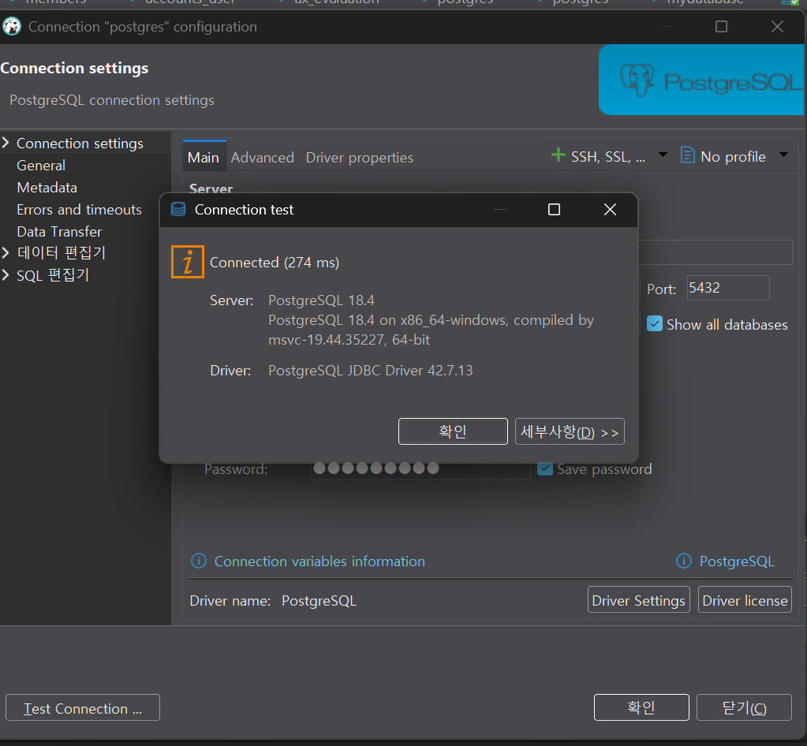
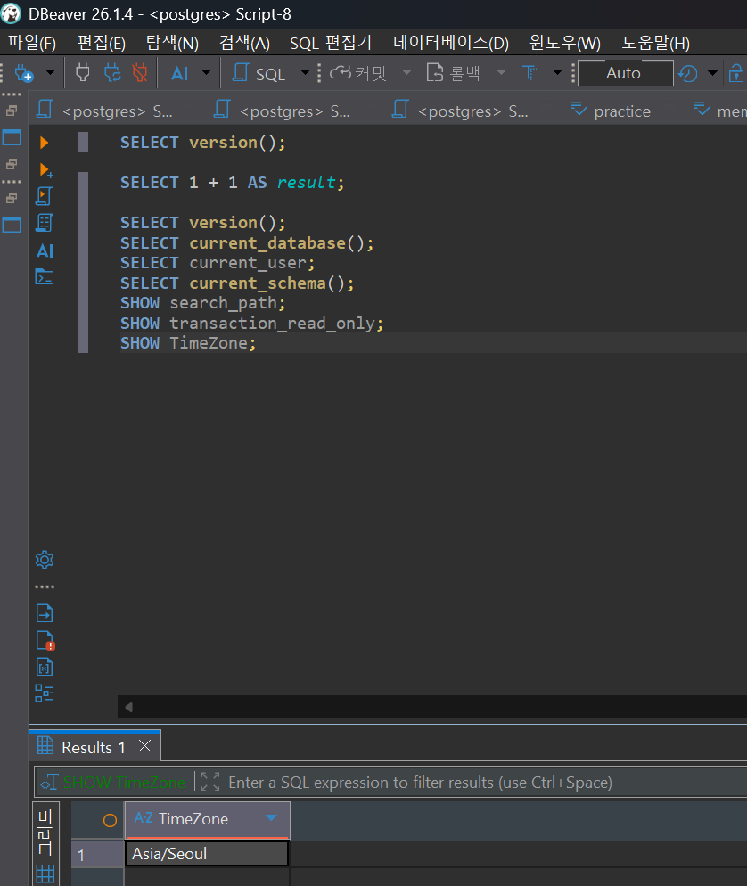
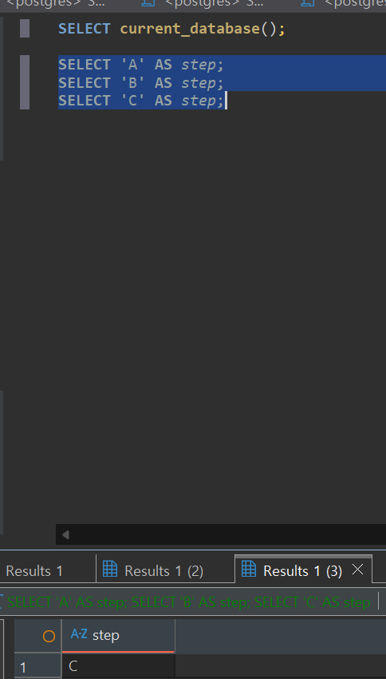

# Chapter 03 확장 실습 답안 템플릿

> **과제:** PostgreSQL과 DBeaver로 실습 환경 검증하기  
> **사용 방법:** 이 파일을 내려받아 본인의 GitHub 저장소에 `chapter03_answer.md`라는 이름으로 저장한 뒤 실습하면서 바로 작성합니다.  
> **제출 방법:** LMS에는 파일을 직접 업로드하지 않고, **본인 GitHub 저장소의 `chapter03_answer.md` 파일 URL**을 제출합니다.

---

## 제출 전 보안 주의

이 과제 파일과 캡처 화면에는 다음 정보를 올리지 않습니다.

```text
실제 PostgreSQL 비밀번호
전체 DB 접속 URL
API Key / Token
개인정보
공개할 필요가 없는 사내 서버 주소
```

LMS에서 제출자를 확인할 수 있으므로 공개 저장소의 답안 파일에 학번이나 실명을 반드시 적을 필요는 없습니다.

```text
GitHub 계정 또는 별칭:wjs0951467-wq
과제 작성일:2026-09-08
사용한 AI 도구:chat gpt
```

---

# 1. PostgreSQL과 DBeaver 환경 확인

## 1-1. 내 환경

| 항목 | 작성 내용 |
| --- | --- |
| 운영체제 | Windows 11 |
| PostgreSQL 버전 | PostgreSQL 18.4 |
| DBeaver 버전 | 26.1.4 |
| Host | `localhost` |
| Port | 5432 |
| Database | postgres |
| Username | postgres |

> 비밀번호는 기록하지 않습니다.

## 1-2. PostgreSQL과 DBeaver 역할 설명

```text
PostgreSQL은:데이터를 저장하고 관리하며 SQL 명령을 처리하는 데이터베이스 관리 시스템(DBMS)이다.

DBeaver는:PostgreSQL 같은 데이터베이스에 연결해서 SQL을 작성하고 실행하고, 데이터와 실행 결과를 화면에서 확인할 수 있게 도와주는 프로그램이다.

두 프로그램의 차이는:PostgreSQL은 실제 데이터를 저장하고 SQL을 처리하는 데이터베이스 서버이고, DBeaver는 사용자가 PostgreSQL에 접속해서 데이터베이스를 편리하게 확인하고 사용할 수 있도록 도와주는 클라이언트 프로그램이라는 차이가 있다.
```

---

# 2. 연결 테스트와 첫 SQL

## 2-1. DBeaver 연결 결과

- [X] PostgreSQL 연결 유형 선택
- [X] Host 확인
- [X] Port 확인
- [X] Database 확인
- [X] Username 확인
- [X] Test Connection 성공

### 연결 성공 화면

권장 이미지 경로:

```text
assignments/chapter03/images/step02_connection.png
```

`여기에 연결 성공 화면을 삽입하세요.`


## 2-2. 첫 SQL 실행

```sql
SELECT 1 + 1 AS result;
```

실행 전 예상:

```text
2
```

실제 결과:

```text
2
```

이 결과가 의미하는 것:

```text
DBeaver에서 작성한 SQL이 PostgreSQL 서버로 정상전달 > PostgreSQL이 SQL을 처리한 뒤 결과를 DBeaver 화면에 정상반환
```

---

# 3. 현재 연결 위치를 SQL로 검증

다음 SQL을 실행합니다.

```sql
SELECT version();
SELECT current_database();
SELECT current_user;
SELECT current_schema();
SHOW search_path;
SHOW transaction_read_only;
SHOW TimeZone;
```

## 3-1. 결과 기록

| 확인 항목 | 실제 결과 | 내가 이해한 의미 |
| --- | --- | --- |
| `version()` | PostgreSQL 18.4 | 현재 실제로 연결된 PostgreSQL 서버의 버전이 18.4라는 의미이다. |
| `current_database()` | postgres | 현재 SQL이 실행되고 있는 데이터베이스가 `postgres`라는 의미이다. |
| `current_user` | postgres | 현재 PostgreSQL에 `postgres` 사용자로 접속해 있다는 의미이다. |
| `current_schema()` | public | 현재 사용되는 스키마가 `public`이라는 의미이다. |
| `search_path` | "$user", public | 객체 이름에 스키마를 생략했을 때 먼저 사용자 이름과 같은 스키마를 찾고, 그다음 `public` 스키마를 찾는다는 의미이다. |
| `transaction_read_only` | off | 현재 세션이 읽기 전용 상태가 아니라는 의미이다. 하지만 모든 객체를 만들거나 수정할 권한이 있다는 뜻은 아니다. |
| `TimeZone` | Asia/Seoul | 현재 PostgreSQL 세션에서 사용하는 시간대 설정을 의미한다. |

## 3-2. 반드시 설명할 것

### DBeaver 연결 이름과 `current_database()`는 왜 같은 개념이 아닌가요?

```text
DBeaver의 연결 이름은 사용자가 보기 편하게 붙인 이름일 수 있지만,
current_database()는 현재 PostgreSQL 세션이 실제로 접속한 데이터베이스 이름을 반환한다.
따라서 화면에 보이는 연결 이름만으로 현재 데이터베이스를 판단하면 안 되고,
SQL로 실제 접속 위치를 확인해야 한다.
```

### `current_schema()`와 `search_path`는 어떤 관계가 있나요?

```text
search_path는 스키마 이름을 생략했을 때 PostgreSQL이 어떤 스키마를 어떤 순서로 찾을지 정한 경로이고,
current_schema()는 그 search_path 안에서 현재 우선적으로 사용되는 스키마를 보여준다.
현재 환경에서는 search_path가 "$user", public이고 실제로 사용할 수 있는 우선 스키마가 public이라서
current_schema() 결과가 public으로 나온다.
```

### `transaction_read_only = off`라는 결과만으로 모든 테이블을 만들 권한이 있다고 단정할 수 있나요?

```text
단정할 수 없다.
off는 현재 세션이 읽기 전용 상태가 아니라는 뜻일 뿐이고,
실제로 테이블을 만들거나 데이터를 수정할 수 있는지는
사용자의 CREATE, INSERT 등의 권한과 대상 스키마나 테이블의 권한을 별도로 확인해야 한다.
```

## 3-3. 증거 화면

권장 경로:

```text
assignments/chapter03/images/step03_location_check.png
```

`여기에 현재 DB/사용자/스키마/search_path 결과 화면을 삽입하세요.`

---

# 4. `ai_database_book` 데이터베이스 확인

## 4-1. 현재 데이터베이스

```sql
SELECT current_database();
```

실제 결과:

```text
postgres
```

- [ ] 결과가 `ai_database_book`이다.
- [x] 다른 DB라면 올바른 연결로 전환했다.

## 4-2. 연결을 바꾼 뒤 다시 검증

```text
전환 전 데이터베이스:postgres
전환 후 데이터베이스:ai_database_book
전환 여부를 판단한 근거:DBeaver에서 ai_database_book 데이터베이스에 연결하는 새 PostgreSQL 연결을 만든 뒤,
새 SQL 편집기에서 SELECT current_database();를 실행했다.
그 결과 ai_database_book이 출력되어 실제 연결이 변경된 것을 확인했다.
```

### 화면에서 보이는 연결 이름만 믿지 않고 SQL을 다시 실행해야 하는 이유

```text
DBeaver 화면에 보이는 연결 이름은 사용자가 임의로 지정할 수 있는 이름이기 때문에
실제 접속 중인 데이터베이스 이름과 항상 같다고 볼 수 없다.
따라서 SELECT current_database();를 실행해서
PostgreSQL 서버가 반환하는 실제 데이터베이스 이름을 확인해야 한다.
```

---

# 5. SQL 실행 범위 실험

SQL Editor에 다음 세 문장을 입력합니다.

```sql
SELECT 'A' AS step;
SELECT 'B' AS step;
SELECT 'C' AS step;
```

## 5-1. 한 문장 실행

```text
내가 실행한 문장:SELECT 'A' AS step;
실제 결과:A
```

## 5-2. 선택 영역 실행

```text
선택한 문장:
SELECT 'A' AS step;
SELECT 'B' AS step;
실제 결과:
A
B
```

## 5-3. 전체 스크립트 실행

```text
실제 결과:A, B, C
결과 탭 또는 실행 순서에서 관찰한 점:한 문장만 실행했을 때는 한 개의 결과만 보였지만,
전체 스크립트를 실행하니 A, B, C가 모두 실행되는 것을 확인했다.
따라서 실행 전에 내가 어느 범위까지 선택했는지 확인하는 것이 중요하다고 느꼈다.
```

## 5-4. 결과 해석

```text
한 문장 실행과 전체 스크립트 실행의 차이:한 문장 실행은 현재 선택한 SQL 한 문장만 실행하지만,
전체 스크립트 실행은 작성된 여러 SQL 문장을 한꺼번에 실행한다.

변경 SQL에서 실행 범위를 잘못 선택하면 위험한 이유:SELECT만 실행하려고 했는데 UPDATE나 DELETE 같은 변경 SQL까지 함께 실행되면
원하지 않는 데이터 수정이나 삭제가 발생할 수 있기 때문이다.
그래서 실행 전에 선택한 SQL 범위를 반드시 확인해야 한다.
```

### 증거 화면

권장 경로:

```text
assignments/chapter03/images/step05_execution_scope.png
```

`여기에 실행 범위 비교 화면을 삽입하세요.`

---

# 6. 제공된 환경 확인 SQL 실행

Public 저장소의 Chapter 03 파일을 사용합니다.

```text
code/chapter03/setup_check.sql
code/chapter03/setup_validate_local.sql
```

## 6-1. `setup_check.sql`

실행 결과에서 확인한 항목:

```text
PostgreSQL 버전:18.4
현재 DB:ai_database_book
현재 사용자:postgres
현재 스키마:public
search_path:"$user", public
읽기 전용 여부:off
TimeZone:Asia/Seoul
1 + 1 결과:2
public 스키마 존재 여부:true
public USAGE 권한:true
public CREATE 권한:true
```

### 이 파일을 여러 번 실행해도 비교적 안전한 이유

```text
setup_check.sql은 현재 데이터베이스 환경을 확인하기 위한 SELECT와 SHOW 중심의 조회 SQL로 구성되어 있고,
데이터를 삭제하거나 수정하는 DROP, DELETE, UPDATE, INSERT, ALTER 같은 명령이 포함되어 있지 않기 때문이다.
따라서 같은 환경에서 여러 번 실행해도 데이터 자체를 변경할 가능성이 낮다.
```

## 6-2. `setup_validate_local.sql`

```text
실행 결과:
PASS / FAIL:PASS
```

실패했다면 실패 항목:

```text
없음
```

그 실패가 실제 문제인지 환경 차이인지 판단한 근거:

```text
실패 항목이 없었고, 현재 데이터베이스가 ai_database_book이며
public 스키마가 존재하고 USAGE와 CREATE 권한도 확인되었다.
또한 읽기 전용 상태가 아니고 SQL 계산 결과도 정상이라
권장 로컬 실습 환경 조건을 충족한 것으로 판단했다.
```

---

# 7. 안전한 오류 진단 실습

실제 오류가 있었다면 그 오류를 사용합니다. 오류가 없었다면 **데이터를 삭제하거나 서버를 강제로 중지하지 말고**, 안전한 SQL 문법 오류를 하나 만들어 관찰합니다.

예:

```sql
SELEC 1;
```

> 오류를 확인한 뒤 올바른 `SELECT 1;`로 복구합니다.

## 7-1. 오류 기록

```text
오류 메시지 핵심 문장:SQL Error [42601]: 구문 오류, "SELEC" 부근


내가 먼저 생각한 원인 1:문법오류라 생각했다.

내가 먼저 생각한 원인 2:

실제로 확인한 방법:오류 메시지에 "구문 오류"와 "SELEC"가 표시된 것을 확인했고,
기존 데이터베이스 연결은 정상인 상태였기 때문에 SQL 문법을 다시 확인했다.

실제 원인:SELECT의 마지막 T를 빠뜨려 SELEC라고 입력한 SQL 문법 오류였다.

수정한 내용:SELEC 1;을 SELECT 1;로 수정했다.
```

## 7-2. 수정 후 재검증

```sql
SELECT 1;
SELECT current_database();
```

```text
재검증 결과:SELECT 1;이 정상 실행되어 1이 출력되었고,
SELECT current_database(); 결과가 ai_database_book으로 확인되었다.
따라서 SQL 문법을 수정한 뒤 정상 상태로 복구되었음을 확인했다.
```

## 7-3. 오류를 유형으로 분류

- [ ] 서버 실행 문제
- [ ] Host 문제
- [ ] Port 문제
- [ ] Database 문제
- [ ] Username/인증 문제
- [x] SQL 문법 문제
- [ ] 권한 문제
- [ ] 기타

선택 이유

```text
오류 메시지에 "구문 오류"와 "SELEC"가 직접 표시되었고,
SELECT 1;로 수정한 뒤 정상 실행되었기 때문에 SQL 문법 문제라고 판단했다.
```

---

# 8. AI를 오류 분석 보조 도구로 사용

## 8-1. AI에게 전달한 프롬프트

비밀번호·개인정보·전체 접속 URL은 제거하고 기록합니다.

```text
나는 PostgreSQL과 DBeaver를 처음 배우는 왕초보자입니다.

아래 오류를 바로 하나의 원인으로 단정하지 말고,
초보자가 안전하게 확인할 순서대로 분석해 주세요.

다음 형식으로 설명해 주세요.

1. 오류 메시지에서 확인되는 사실
2. 가능한 원인 후보
3. 각 원인을 확인하는 안전한 방법
4. 확인 결과에 따라 다음에 할 행동
5. 실행하면 위험할 수 있어 피해야 할 명령

실제 비밀번호나 개인정보는 포함하지 않았습니다.

오류 메시지:
SQL Error [42601]: 오류: 구문 오류, "SELEC" 부근
위치: 1
Error position: line: 146
```

## 8-2. AI 답변 검토

| AI가 제안한 확인 방법 | 실제로 확인했는가? | 결과 | 수용 / 수정 / 거절 |
| --- | --- | --- | --- |
| 오류 메시지에서 `SELEC` 부분 확인 | 예 | `SELECT`의 마지막 `T`가 빠진 것을 확인했다. | 수용 |
| PostgreSQL 연결 상태 확인 | 예 | 기존 SQL은 정상 실행되고 있어 서버 연결 문제는 아니라고 판단했다. | 수용 |
| 올바른 문법으로 다시 실행 | 예 | `SELECT 1;` 실행 결과 `1`이 정상 출력되었다. | 수용 |

### AI가 오류 원인을 너무 빨리 단정한 부분이 있었나요?

```text
AI가 여러 원인 후보를 제시했지만, 오류 메시지에 "구문 오류"와 "SELEC"가 직접 표시되어 있었기 때문에 서버나 연결 문제보다 SQL 문법 오류일 가능성이 높다고 판단했다.
AI의 설명을 그대로 믿기보다 실제 오류 메시지와 실행 결과를 함께 확인했다.
```

### 오류 메시지와 실제 환경 중 무엇을 확인해서 최종 판단했나요?

```text
오류 메시지에 "SELEC" 부근의 구문 오류라고 표시된 것을 먼저 확인했다.
그리고 PostgreSQL 연결이 정상인지 확인하기 위해 올바른 SELECT 문을 다시 실행했다.
SELECT 1;이 정상적으로 실행되고 current_database()도 정상적으로 확인되어
최종적으로 SQL 문법 오류라고 판단했다.
```

### AI 활용에서 가장 유용했던 점

```text
오류 메시지를 보고 가능한 원인을 여러 가지로 나누어 생각할 수 있게 도와준 점이 가장 유용했다.
또한 바로 설정을 변경하기보다 안전하게 확인할 순서를 정리해 주어서 초보자인 내가 오류를 단계적으로 확인하는 데 도움이 되었다.
```

### AI 답변을 그대로 실행하지 않고 확인해야 하는 이유

```text
AI가 제안한 해결 방법이 내 실제 환경과 맞지 않을 수도 있고, 잘못된 명령을 실행하면 데이터나 설정에 문제가 생길 수 있기 때문이다.
따라서 AI의 답변은 원인 후보와 확인 방법을 참고하는 용도로 사용하고, 오류 메시지와 실제 실행 결과를 직접 확인한 뒤 필요한 방법만 적용해야 한다.
```

---

# 9. Chapter 01~02 개인 서비스와 연결

앞에서 선택한 개인 서비스가 PostgreSQL을 사용한다고 가정합니다.

```text
서비스 이름:와인 검색 서비스

사용할 데이터베이스 이름 후보:ai_database_book

사용할 스키마 이름 후보:wine_project

앞으로 만들고 싶은 테이블 후보 3개:
1.wines
2.grape_varieties
3.wine_grape_varieties
4.countries
5.regions
6.reviews
```

### 아직 SQL을 만들지 않고 이름과 역할만 정하는 이유

```text
아직 각 테이블의 구조와 관계를 정확하게 확정하지 않았기 때문이다.
먼저 와인 검색 서비스에서 어떤 데이터를 저장해야 하는지와 각 테이블의 역할 및 한 행의 의미를 정리한 뒤, 이후 Chapter에서 SQL과 관계 설정을 더 배운 다음 실제 테이블을 만드는 것이 더 안전하다고 생각했다.
```

### Chapter 02에서 정리했던 한 행의 의미 중 수정할 부분이 있나요?

```text
크게 바뀐 부분은 없지만 테이블 간 관계를 조금 더 명확하게 생각하게 되었다.
wines의 한 행은 와인 한 종류, grape_varieties의 한 행은 포도 품종 하나, reviews의 한 행은 사용자가 특정 와인에 작성한 리뷰 하나를 의미한다.
또한 와인 하나에 여러 품종이 사용될 수 있기 때문에 wine_grape_varieties 같은 연결 테이블이 필요할 수 있고, 이 테이블의 한 행은 하나의 와인과 하나의 포도 품종이 연결된 기록을 의미한다.
```

---

# 10. 초보자용 연결 가이드 작성

친구가 자신의 PC에서 같은 실습을 시작한다고 가정합니다. 아래 순서를 자신의 말로 작성합니다.

```text
1. PostgreSQL 서버가 실행되는지 확인하는 방법:
DBeaver에서 PostgreSQL 연결을 시도해 보고 Test Connection이 성공하는지 확인한다.
또는 SQL을 실행했을 때 PostgreSQL 서버가 정상적으로 결과를 반환하는지 확인한다.

2. DBeaver에서 PostgreSQL 연결을 만드는 방법:
DBeaver에서 새 데이터베이스 연결을 만들고 PostgreSQL을 선택한 뒤, Host, Port, Database, Username, Password를 입력한다. 그 다음 Test Connection으로 연결이 정상인지 확인하고 연결을 저장한다.

3. Host / Port / Database / Username의 의미:
Host는 PostgreSQL 서버가 실행되는 컴퓨터의 위치이고,
Port는 PostgreSQL 서버가 연결 요청을 받는 번호이다.
Database는 PostgreSQL 서버 안에서 실제로 접속할 데이터베이스 이름이고,
Username은 PostgreSQL에 어떤 사용자 계정으로 접속할지를 의미한다.

4. ai_database_book에 연결되었는지 확인하는 방법:
DBeaver 화면의 연결 이름만 확인하지 않고 SELECT current_database();를 실행한다.
결과가 ai_database_book으로 나오면 실제로 해당 데이터베이스에 연결된 것이다.

5. 현재 위치를 확인하는 SQL:
SELECT current_database();
SELECT current_user;
SELECT current_schema();
SHOW search_path;
이 SQL들을 사용하면 현재 데이터베이스, 사용자, 스키마와 스키마 검색 경로를 확인할 수 있다.

6. 한 문장과 전체 스크립트 실행을 구분해야 하는 이유:
한 문장 실행은 내가 확인하려는 SQL 한 문장만 실행되지만,
전체 스크립트 실행은 작성된 여러 SQL이 모두 실행될 수 있기 때문이다.
SELECT만 실행하려고 했는데 UPDATE나 DELETE 같은 SQL까지 함께 실행되면
원하지 않는 데이터 변경이 생길 수 있으므로 실행 범위를 확인해야 한다.

7. 비밀번호를 GitHub나 AI 프롬프트에 넣으면 안 되는 이유:
GitHub나 AI 프롬프트에 실제 비밀번호를 입력하면 다른 사람에게 노출될 위험이 있고,
해당 계정이나 데이터베이스에 허가 없이 접근하는 데 사용될 수 있기 때문이다.
따라서 비밀번호와 전체 접속 URL 같은 민감한 정보는 공개하지 않아야 한다.
```

---

# 11. 최종 성찰

아래 문장은 반드시 본인의 말로 작성합니다.

```text
1. DBeaver와 PostgreSQL의 가장 중요한 차이는
   PostgreSQL은 실제 데이터를 저장하고 SQL을 처리하는 데이터베이스 서버이고,
   DBeaver는 그 PostgreSQL에 연결해서 SQL을 작성하고 결과를 확인할 수 있도록
   도와주는 프로그램 이다.

2. 내가 지금 어느 데이터베이스에 연결되어 있는지 확인할 때
   화면 이름만 보지 않고 SELECT current_database();를 직접 실행해서 실제 데이
   터베이스 이름을 확인 해야 한다.

3. PostgreSQL 오류가 발생했을 때 가장 먼저 해야 할 일은
   오류 메시지를 먼저 읽고 어떤 부분에서 문제가 발생했는지 확인한 뒤
   가능한 원인을 생각하고 하나씩 안전하게 확인 이다.

4. AI를 오류 해결에 사용할 때 가장 중요한 것은
   AI가 제안한 해결 방법을 그대로 실행하지 않고
   내 실제 환경과 오류 메시지를 확인하면서 안전한 방법인지 검증한 뒤 적용하는 것 이
   다.
```

---

# 12. 제출 체크리스트

- [x] `chapter03_answer.md`의 빈 필수 항목을 작성했다.
- [x] PostgreSQL과 DBeaver의 역할 차이를 설명했다.
- [x] `current_database/current_user/current_schema/search_path`를 실제로 확인했다.
- [x] `ai_database_book` 연결 여부를 SQL로 검증했다.
- [x] SQL 실행 범위 세 가지를 비교했다.
- [x] `setup_check.sql`을 실행했다.
- [x] `setup_validate_local.sql` 결과를 확인했다.
- [x] 오류 원인을 먼저 스스로 추정한 뒤 AI를 사용했다.
- [x] AI 제안을 실제 환경에서 검증했다.
- [x] 핵심 캡처 3~4장만 골라 넣었다.
- [x] 캡처에 비밀번호·개인정보·전체 접속 URL이 없다.
- [x] Markdown 이미지가 GitHub 웹 화면에서 실제로 보인다.
- [x] 최종 답안 파일을 commit/push했다.

---

# 13. LMS 제출 URL

아래 형식의 **본인 GitHub 파일 URL**을 LMS에 제출합니다.

```text
https://github.com/<본인-GitHub-ID>/<본인-저장소>/blob/main/assignments/chapter03/chapter03_answer.md
```

내 제출 URL:

```text
https://github.com/wjs0951467-wq/database-repository/blob/main/assignments/chapter03/chapter03_answer.md
```

> 저장소 메인 URL, 교수자 템플릿 URL, Raw URL이 아니라 **작성 완료된 본인 `chapter03_answer.md` 파일 화면 URL**을 제출합니다.
