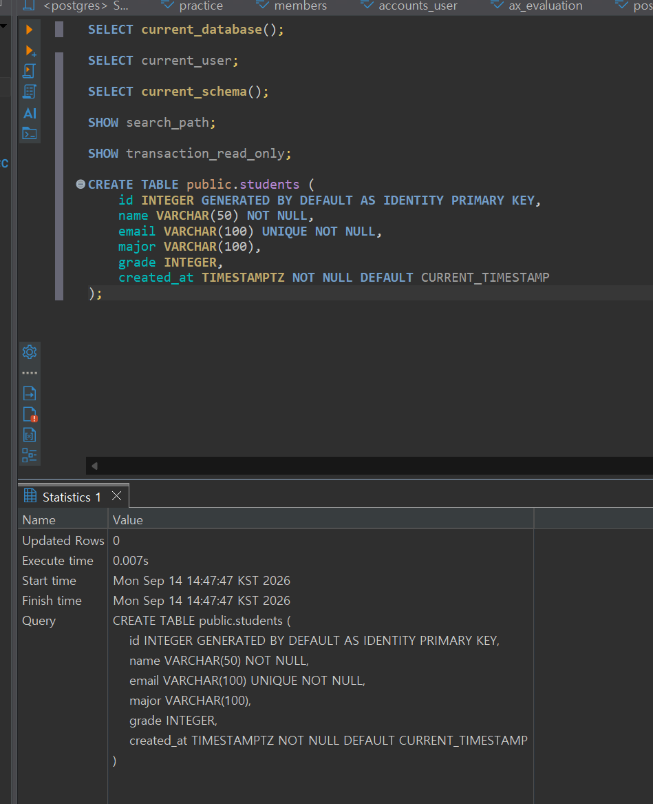
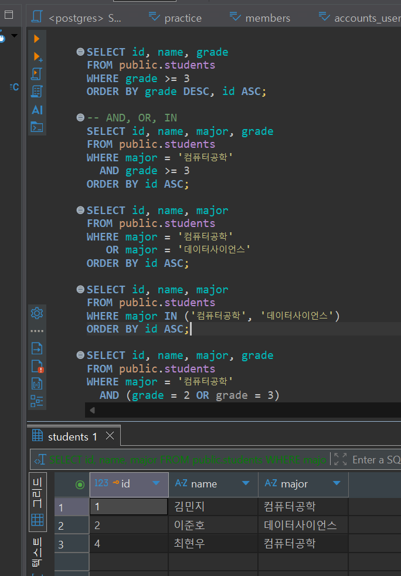
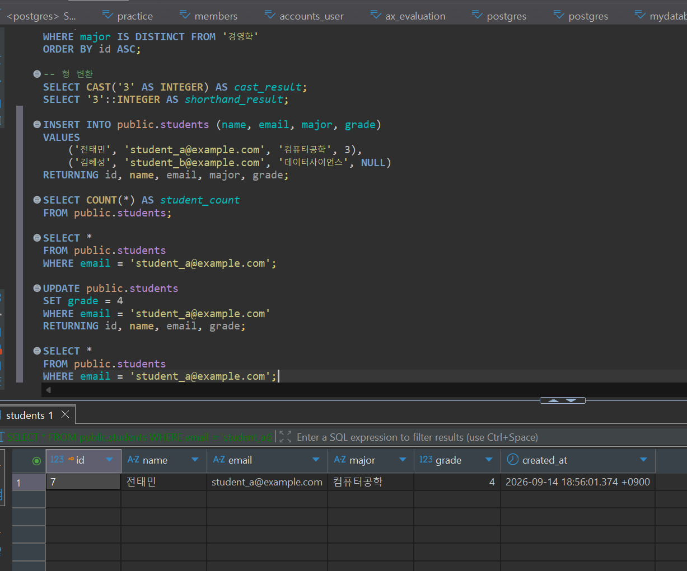
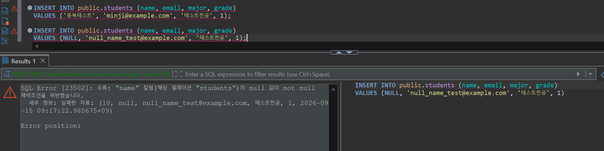

# Chapter 04 확장 실습 답안 템플릿

> **과제:** 관계형 데이터베이스와 SQL 시작하기  
> **사용 방법:** 이 파일을 내려받아 본인의 GitHub 저장소에 `chapter04_answer.md`라는 이름으로 저장한 뒤 실습하면서 바로 작성합니다.  
> **제출 방법:** LMS에는 파일을 직접 업로드하지 않고, **본인 GitHub 저장소의 `chapter04_answer.md` 파일 URL**을 제출합니다.

---

## 제출 전 주의

이 파일과 캡처 화면에는 실제 비밀번호, 전체 DB 접속 URL, API Key, 개인정보를 기록하지 않습니다.

```text
GitHub 계정 또는 별칭:wjs0951467-wq
과제 작성일:2026-09-14
사용한 AI 도구:chat gpt
```

---

# 1. 실습 환경과 시작 상태 확인

다음을 실행합니다.

```sql
SELECT current_database();
SELECT current_user;
SELECT current_schema();
SHOW search_path;
SHOW transaction_read_only;
```

| 확인 항목 | 실제 결과 | 의미 |
| --- | --- | --- |
| current_database() | ai_database_book | 현재 연결되어 있는 데이터베이스가 ai_database_book이다. |
| current_user | postgres | 현재 PostgreSQL에 postgres 사용자로 접속해 있다. |
| current_schema() | public | 현재 기본적으로 사용하고 있는 스키마가 public이다. |
| search_path | "$user", public | 객체를 찾을 때 먼저 현재 사용자 이름과 같은 스키마를 확인하고, 이후 public 스키마를 확인한다는 의미이다. |
| transaction_read_only | off | 현재 트랜잭션이 읽기 전용이 아니므로 데이터 변경 작업을 수행할 수 있는 상태임을 의미한다. |

- [X] 현재 DB가 `ai_database_book`이다.
- [X] 변경 가능한 연결인지 확인했다.
- [X] 실행할 SQL 범위를 확인했다.
- [X] Auto-commit 상태를 확인했다.

### 변경 SQL을 실행하기 전에 현재 DB와 실행 범위를 확인해야 하는 이유

```text
잘못된 DB나 너무 넓은 범위에 변경을 적용하는 실수를 막기 위해서이다.
```

---

# 2. `public.students` 구조 생성

## 2-1. 실행 전 예상

```text
테이블 이름:public.students
한 행의 의미:학생 한 명의 정보
예상 행 수:0행
기본키:id
필수 열:name, email, created_at
중복을 막는 열:email
자동 생성 열:id, created_at
```

## 2-2. 실행 파일

```text
code/chapter04/01_create_students.sql
```

## 2-3. 실행 후 확인

```text
테이블 생성 성공 여부:성공
실제 행 수:0행
DBeaver에서 확인한 위치:ai_database_book → Schemas → public → Tables → students
```

### 각 열의 역할

| 열 | 타입 | NULL 가능? | 역할 |
| --- | --- | --- | --- |
| id | INTEGER | 불가능 | 학생 한 명을 구분하는 내부 식별자, 기본키 |
| name | VARCHAR(50) | 불가능 | 학생 이름 저장 |
| email | VARCHAR(100) | 불가능 | 학생 이메일 저장, 중복 불가 |
| major | VARCHAR(100) | 가능 | 학생 전공 저장 |
| grade | INTEGER | 가능 | 학생 학년 저장 |
| created_at | TIMESTAMPTZ| 불가능 | 데이터가 생성된 시각 저장, 입력하지 않으면 현재 시각 자동 저장 |


### `id`를 학번이나 학생 수로 해석하면 안 되는 이유

```text
행을 구분하는 번호이기 때문이다.
```

### 증거 화면

권장 경로:

```text
assignments/chapter04/images/step02_table.png
```

`여기에 테이블 구조 확인 화면을 삽입하세요.`

---

# 3. 샘플 데이터 6명 입력

## 3-1. 실행 전 예상

```text
현재 행 수:0행
실행 후 예상 행 수:6행
예상되는 NULL 포함 학생:윤서진
```

## 3-2. 실행 파일

```text
code/chapter04/02_insert_students.sql
```

## 3-3. 실제 결과

```text
실제 행 수:6행
이준호 grade:3
박서연 존재 여부:유
윤서진 major:NULL
윤서진 grade:NULL
```

### 예상과 실제 비교

```text
예상과 실제가 일치했는가:일치함
다르다면 이유:
```

### `created_at` 값이 여러 행에서 같을 수 있는 이유

```text
여러 INSERT가 하나의 트랜잭션 안에서 실행되고,
CURRENT_TIMESTAMP가 같은 트랜잭션에서는 같은 시각 값을 반환할 수 있기 때문이다.
```

---

# 4. SELECT 복습과 결과 검증

각 문제는 **SQL 실행 전에 예상 행 수를 먼저 작성**합니다.

| 번호 | 조회 문제 | 예상 행 수 | 실제 행 수 | 일치? | 다르면 이유 |
| ---: | --- | ---: | ---: | --- | --- |
| 1 | 전체 학생 | 6 | 6 | 일치 |  |
| 2 | 이름·이메일만 조회 | 6 | 6 | 일치 |  |
| 3 | 특정 전공 | 2 | 2 | 일치 |  |
| 4 | 특정 학년 이상 | 2 | 2 | 일치 |  |
| 5 | 두 전공 중 하나 | 3 | 3 |  |  |
| 6 | `grade IS NULL` | 1 | 1 | 일치 |  |
| 7 | 전공 `DISTINCT` | 5 | 5 | 일치 |  |
| 8 | 정렬 후 상위 3명 | 3 | 3 | 일치 |  |

## 4-1. 내가 직접 작성한 SQL 2개

```sql
SELECT name, major
FROM public.students
WHERE major IS NOT NULL;
```

```text
이 SQL의 한 행 의미:전공 정보가 있는 학생 한 명의 이름과 전공 정보
예상 행 수:5행
실제 행 수:5행
```

```sql
SELECT name, major
FROM public.students
ORDER BY major;
```

```text
이 SQL의 한 행 의미:학생 한 명의 이름과 전공 정보
예상 행 수:6행
실제 행 수:6행
```

## 4-2. `= NULL` 대신 `IS NULL`을 사용하는 이유

```text
NULL은 일반적인 값이 아니라 값이 없거나 알 수 없는 상태를 의미하므로
= NULL로 비교하지 않고 IS NULL을 사용한다.
```

## 4-3. `ORDER BY` 없이 결과 순서를 믿으면 안 되는 이유

```text
ORDER BY를 사용하지 않으면 데이터베이스가 결과 행의 순서를 보장하지 않기 때문에 조회할 때마다 순서가 달라질 수 있다.
```

## 4-4. `DISTINCT`가 원본 데이터를 삭제하는 기능인가요?

```text
DISTINCT는 원본 테이블의 데이터를 삭제하지 않고,
SELECT 조회 결과에서 중복된 값을 제거해서 한 번만 보여주는 기능이다.
```

### 증거 화면

권장 경로:

```text
assignments/chapter04/images/step04_select.png
```

`여기에 SELECT 핵심 결과 화면을 삽입하세요.`

---

# 5. 내 가상 학생 2명 추가

실명·실제 이메일 대신 가상 데이터를 사용합니다.

## 5-1. 실행 전 계획

```text
학생 A
이름:전태민
이메일:student_a@example.com
전공:컴퓨터공학
학년:3

학생 B
이름:김혜성
이메일:student_b@example.com
전공:데이터사이언스
학년 또는 NULL:NULL

현재 행 수:6
추가 후 예상 행 수:8
```

## 5-2. 내가 실행한 INSERT

```sql
INSERT INTO public.students (name, email, major, grade)
VALUES
    ('전태민', 'student_a@example.com', '컴퓨터공학', 3),
    ('김혜성', 'student_b@example.com', '데이터사이언스', NULL)
RETURNING id, name, email, major, grade;
```

## 5-3. 실제 결과

```text
RETURNING 또는 확인 SELECT 결과:
전태민 / student_a@example.com / 컴퓨터공학 / 3
김혜성 / student_b@example.com / 데이터사이언스 / NULL
실제 전체 행 수:8행
예상과 일치 여부:일치
```

### 내가 일부 값을 NULL로 둔 이유 또는 NULL을 사용하지 않은 이유

```text
NULL을 다시 한번 직접 사용해 보면서,
값이 없는 상태가 어떻게 저장되는지 복습하기 위해서이다.
```

---

# 6. 안전한 UPDATE

내가 추가한 가상 학생 한 명만 수정합니다.

## 6-1. 먼저 대상 확인 SELECT

```sql
SELECT *
FROM public.students
WHERE email = 'student_a@example.com';
```

```text
예상 대상 행 수:1행
실제 대상 행 수:1행
```

## 6-2. UPDATE

```sql
UPDATE public.students
SET grade = 4
WHERE email = 'student_a@example.com'
RETURNING id, name, email, grade;
```

```text
예상 영향 행 수:1행
실제 영향 행 수:1행
RETURNING 결과:전태민 / student_a@example.com / grade = 4
```

## 6-3. UPDATE 후 재조회

```sql
SELECT *
FROM public.students
WHERE email = 'student_a@example.com';
```

### `WHERE` 없는 UPDATE를 실행하면 위험한 이유

```text
WHERE 조건이 없으면 특정 행만 수정하는 것이 아니라 테이블의 모든 행이 수정될 수 있기 때문에 위험하다.
```

### 증거 화면

권장 경로:

```text
assignments/chapter04/images/step06_update.png
```

`여기에 UPDATE 전/후 결과 화면을 삽입하세요.`

---

# 7. 안전한 DELETE

내가 추가한 가상 학생 한 명을 삭제합니다.

## 7-1. 삭제 전 확인

```sql
SELECT *
FROM public.students
WHERE email = 'student_b@example.com';
```

```text
예상 대상 행 수:1행
실제 대상 행 수:1행
```

## 7-2. DELETE

```sql
DELETE FROM public.students
WHERE email = 'student_b@example.com'
RETURNING id, name, email, grade;
```

```text
예상 영향 행 수:1행
실제 영향 행 수:1행
RETURNING 결과:id = 8 / 김혜성 / student_b@example.com / grade = NULL
```

## 7-3. 삭제 후 재조회

```sql
SELECT *
FROM public.students
WHERE email = 'student_b@example.com';
```

```text
삭제 후 같은 조건의 SELECT 결과 행 수:0행
```

### `DELETE` 성공 메시지만 보고 끝내지 않고 다시 SELECT해야 하는 이유

```text
DELETE가 실행되었다는 메시지만으로는 원하는 행이 실제로 삭제되었는지 확실히 알 수 없기 때문에, 같은 조건으로 다시 SELECT하여 해당 행이 0행인지 확인해야 한다.
```

---

# 8. 본문 기준 UPDATE·DELETE 상태 검증

`04_update_delete_students.sql`을 본문 시작 상태에서 실행했다면 다음을 확인합니다.

```text
최종 학생 수:7명
이준호 grade:4
박서연 존재 여부:0행
```

본문 기준 기대 상태와 비교합니다.

```text
학생 수 = 5
이준호 grade = 4
박서연 = 0행
```

### 내 실제 결과가 기준과 다르다면 원인

```text
가상 학생 2명을 추가한 뒤 그중 1명을 삭제했기 때문에,
기존 6명에 1명이 추가된 상태가 되어 현재 학생 수가 7명이다.
```

---

# 9. 의도한 실패 2개 관찰

> 실패 테스트는 데이터베이스 규칙이 실제로 데이터를 보호하는지 확인하는 실험입니다.

## 9-1. 중복 이메일 `UNIQUE` 오류

내가 사용한 SQL:

```sql
INSERT INTO public.students (name, email, major, grade)
VALUES ('중복테스트', 'minji@example.com', '테스트전공', 1);
```

```text
오류 메시지 핵심 단서:
중복된 키 값, 고유 제약 조건 위반, students_email_key,
(email)=(minji@example.com) 키가 이미 있음
왜 실패해야 맞는가:
minji@example.com 이메일이 이미 존재하는데
같은 이메일을 다시 입력하려고 했기 때문이다.
어떤 규칙이 작동했는가:
email 열에 설정된 UNIQUE 제약조건이 작동했다.
실패 후 기존 데이터가 어떻게 유지되었는가:
중복 이메일을 가진 새 행은 추가되지 않았고, 기존 데이터는 그대로 유지되었다.
```

## 9-2. 이름 `NULL` 입력 `NOT NULL` 오류

내가 사용한 SQL:

```sql
INSERT INTO public.students (name, email, major, grade)
VALUES (NULL, 'null_name_test@example.com', '테스트전공', 1);
```

```text
오류 메시지 핵심 단서:
name 칼럼, null 값, not null 제약조건 위반
왜 실패해야 맞는가:
name 열은 반드시 값이 있어야 하는데 NULL을 입력했기 때문이다.
어떤 규칙이 작동했는가:
name 열의 NOT NULL 제약조건이 작동했다.
```

### 실패한 INSERT 뒤 자동 생성 `id` 번호에 빈 구간이 생길 수 있어도 문제라고 단정할 수 없는 이유

```text
실패한 INSERT에서도 자동 생성 id 번호는 이미 사용을 시도했을 수 있기 때문에
다음 INSERT에서 번호가 건너뛸 수 있다.
id는 학생 수가 아니라 각 행을 구분하는 내부 식별자이므로,
중간에 빈 번호가 생겨도 데이터 오류라고 볼 수 없다.
```

### 증거 화면

권장 경로:

```text
assignments/chapter04/images/step09_constraint_error.png
```

`여기에 제약조건 오류 화면을 삽입하세요.`

---

# 10. `verify_students.sql`로 최종 상태 확인

실행 파일:

```text
code/chapter04/verify_students.sql
```

```text
현재 전체 학생 수:7명
NULL 개수:major NULL 개수: 1개, grade NULL 개수: 1개
이준호 grade:3
박서연 존재 여부:존재
현재 데이터 상태에서 예상과 다른 부분:
본문 기준 기대 상태는 학생 수 5명, 이준호 grade 4, 박서연 0행이지만
현재는 학생 수 7명, 이준호 grade 3, 박서연이 존재한다.
```

### 검증 SQL을 따로 두면 좋은 이유

```text
SQL 실행이 성공했다고 해서 최종 데이터가 원하는 상태라는 뜻은 아니기 때문에,
검증 SQL을 따로 두어 테이블 구조와 데이터 상태가 예상과 일치하는지 다시 확인할 수 있다.
```

---

# 11. AI를 SQL 작성자가 아니라 검토자로 활용

먼저 본인이 SQL을 작성한 뒤 AI에게 검토를 요청합니다.

## 11-1. 내가 작성한 SQL

```sql
UPDATE public.students
SET grade = 1
WHERE email = 'student_a@example.com';
```

## 11-2. AI에게 전달한 핵심 요청

```text
내가 작성한 SQL을 바로 수정하지 말고 안전성을 검토해 달라고 요청했다.

확인 요청 내용:
1. 예상 영향 행 수
2. WHERE 조건이 너무 넓지 않은지
3. NULL 처리에서 주의할 점
4. 실행 전 확인할 SELECT
5. 실행 후 확인할 SELECT
6. 놓친 위험이 있다면 질문 형태로 제시
```

## 11-3. AI 검토 결과

| AI 제안 | 수용 / 수정 / 거절 | 실제 검증 결과 | 나의 이유 |
| --- | --- | --- | --- |
| 예상 영향 행 수는 1행 | 수용 | 실행 전 SELECT에서 1행 확인 | email이 UNIQUE이고 해당 학생 1명만 조회됨 |
| UPDATE 전 같은 WHERE 조건으로 SELECT | 수용 | 대상 학생 1행 확인 | 잘못된 행 수정 방지 |
| UPDATE 후 다시 SELECT | 수용 | grade가 1로 변경된 것을 확인 | 실제 저장 결과 확인 필요 |

### AI가 예상한 영향 행 수와 실제 결과가 같았나요?

```text
같았다. AI는 1행이 영향을 받을 것으로 예상했고,
실행 전 SELECT와 실제 UPDATE 결과에서도 1행이 확인되었다.
```

### AI 답변을 실행 전에 검토해야 하는 이유

```text
AI가 제안한 SQL이나 영향 행 수가 항상 실제 데이터 상태와 일치한다고 보장할 수 없기 때문에,
실행 전에 직접 SELECT로 대상 행과 조건을 확인해야 한다.
```

---

# 12. 내 서비스 테이블 하나 확장 설계

Chapter 01~03에서 정한 개인 서비스에서 **테이블 하나**를 선택합니다.

```text
서비스 이름:와인 검색 서비스
테이블 이름:wines
한 행의 의미:와인 한 종류의 기본 정보를 의미한다.
```

| 열 이름 | 저장할 값 | 타입 후보 | NULL 가능? | UNIQUE 후보? | 이유 |
| --- | --- | --- | --- | --- | --- |
| id | 와인 내부 식별 번호 | INTEGER | 불가능 | 예 | 각 와인을 구분하기 위한 PK 후보 |
| name | 와인 이름 | VARCHAR(100) | 불가능 | 미정 | 와인 이름이 같을 가능성을 아직 확정하지 않음 |
| country | 생산 국가 | VARCHAR(100) | 불가능 또는 미정 | 아니오 | 여러 와인이 같은 국가를 가질 수 있음 |
| region | 생산 지역 | VARCHAR(100) | 가능 | 아니오 | 생산 지역 정보가 없을 수도 있음 |
| price | 와인 가격 | INTEGER 또는 NUMERIC | 가능 또는 미정 | 아니오 | 여러 와인이 같은 가격일 수 있음 |

```text
PK 후보:id
업무 식별자 후보:와인 이름 + 생산 국가 + 생산 지역 조합
아직 미확정인 규칙:와인 이름이 단독으로 UNIQUE여야 하는지,
가격이 반드시 필수값인지,
생산 지역을 반드시 입력해야 하는지는 아직 확정하지 않았다.
```

## 선택: CREATE TABLE 초안

> 아직 확정되지 않은 업무 규칙은 억지로 제약조건으로 만들지 않습니다.

```sql
CREATE TABLE wines (
    id INTEGER GENERATED BY DEFAULT AS IDENTITY PRIMARY KEY,
    name VARCHAR(100) NOT NULL,
    country VARCHAR(100) NOT NULL,
    region VARCHAR(100),
    price INTEGER
);
```

### AI에게 검토받은 뒤 수정한 부분

```text
IS NOT NULL은 조회 조건이고 테이블 제약조건에서는 NOT NULL을 사용해야 해서 수정했다.
또한 id가 자동 생성되도록 IDENTITY 설정을 추가했다.
region과 price는 아직 필수 여부가 미확정이라 NULL 가능 상태로 두었다.
```

---

# 13. 최종 성찰

아래 문장은 본인의 말로 작성합니다.

```text
1. SQL 실행 성공과 올바른 대상 선택이 다른 이유는
   SQL 문법이 맞아서 실행되더라도 내가 원하지 않은 행까지 선택되거나 수정될 수 있기 때문이다.

2. UPDATE와 DELETE 전에 SELECT를 먼저 해야 하는 이유는
   실제로 수정하거나 삭제하려는 대상이 맞는지 먼저 확인하기 위해서이다.

3. 영향받은 행 수를 확인해야 하는 이유는
   내가 예상한 만큼의 데이터만 수정되거나 삭제되었는지 확인하기 위해서이다.

4. UNIQUE 또는 NOT NULL 오류를 '보호 장치가 정상 동작한 결과'라고 볼 수 있는 이유는
   중복되면 안 되는 값이나 비어 있으면 안 되는 값이 잘못 저장되는 것을 데이터베이스가 막아 주었기 때문이다.

5. AI가 SQL을 만들어 주더라도 내가 반드시 확인해야 하는 것은
   WHERE 조건과 대상 행, 예상 영향 행 수가 실제 데이터와 맞는지 직접 SELECT로 확인하는 것이다.
```

---

# 14. 제출 체크리스트

- [X] `chapter04_answer.md`를 본인 저장소에 만들었다.
- [X] 현재 DB와 실행 환경을 확인했다.
- [X] `public.students`를 생성했다.
- [X] 샘플 6명 입력 결과를 검증했다.
- [X] SELECT 문제에서 실행 전 예상 행 수를 작성했다.
- [X] 가상 학생 2명을 추가했다.
- [X] UPDATE 전후를 SELECT로 확인했다.
- [X] DELETE 전후를 SELECT로 확인했다.
- [X] UNIQUE 오류를 관찰했다.
- [X] NOT NULL 오류를 관찰했다.
- [X] `verify_students.sql`로 상태를 확인했다.
- [X] AI 제안을 실제 SQL 결과와 비교했다.
- [X] 개인 서비스 테이블 하나를 확장 설계했다.
- [X] 핵심 캡처는 3~4장 정도로 제한했다.
- [X] 비밀번호·개인정보가 캡처에 없다.
- [X] Markdown 이미지가 GitHub 웹 화면에서 정상 표시된다.
- [X] commit/push를 완료했다.

---

# 15. LMS 제출 URL

아래 형식의 **본인 GitHub 파일 URL**을 LMS에 제출합니다.

```text
https://github.com/<본인-GitHub-ID>/<본인-저장소>/blob/main/assignments/chapter04/chapter04_answer.md
```

내 제출 URL:

```text
https://github.com/wjs0951467-wq/database-repository/blob/main/assignments/chapter04/chapter04_answer.md
```

> 교수자 템플릿 URL이나 저장소 메인 URL이 아니라 **작성 완료된 본인 `chapter04_answer.md` 파일 화면 URL**을 제출합니다.