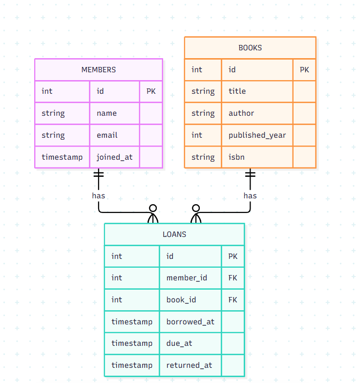
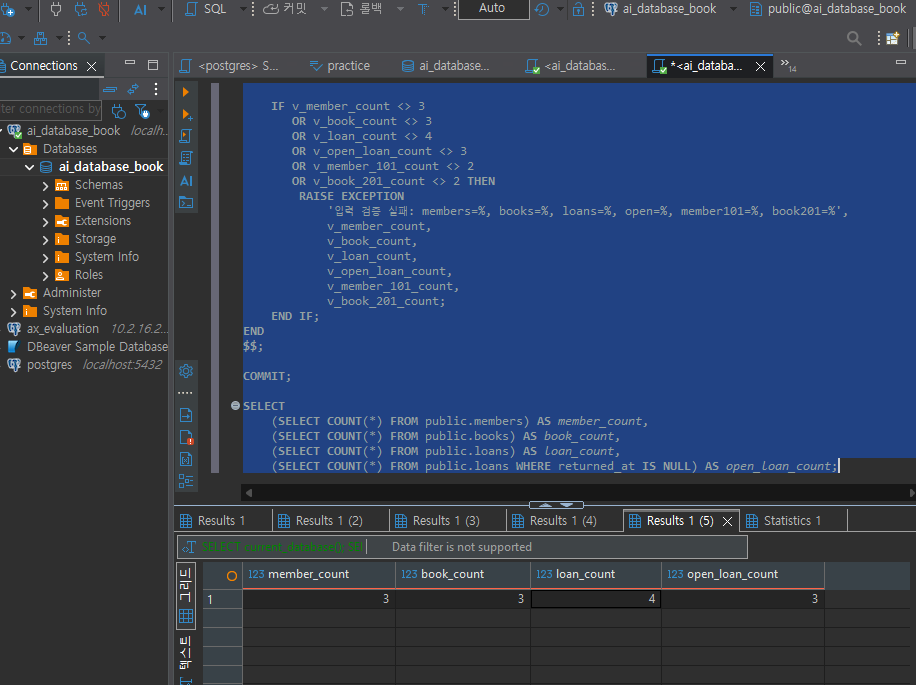
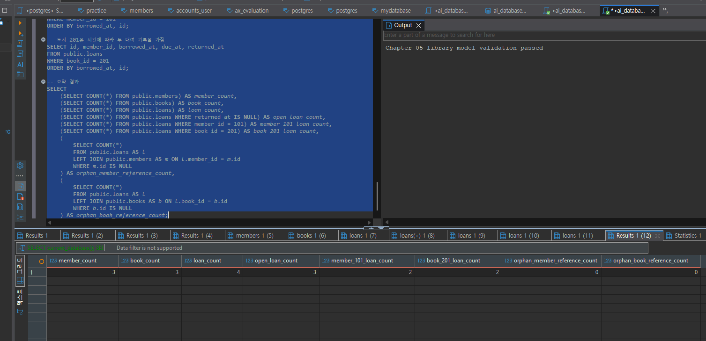
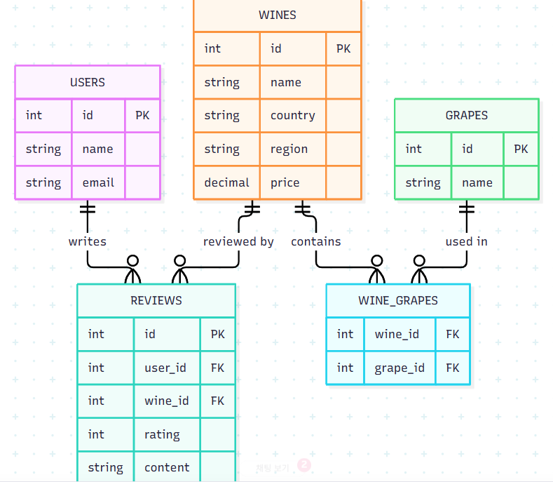

# Chapter 05 확장 실습 답안 템플릿

> **과제:** 요구사항에서 데이터 모델과 ERD 만들기  
> **사용 방법:** 이 파일을 내려받아 본인의 GitHub 저장소에 `chapter05_answer.md`라는 이름으로 저장한 뒤 실습하면서 바로 작성합니다.  
> **제출 방법:** LMS에는 파일을 직접 업로드하지 않고, **본인 GitHub 저장소의 `chapter05_answer.md` 파일 URL**을 제출합니다.

---

## 제출 전 주의

이 파일과 캡처 화면에는 실제 비밀번호, 전체 DB 접속 URL, API Key, 개인정보를 기록하지 않습니다.

```text
GitHub 계정 또는 별칭:wjs0951467-wq
과제 작성일:2026-09-16
사용한 AI 도구:chat gpt
```

---

# 1. Chapter 05 핵심 개념 복습

본문을 보지 않고 먼저 작성합니다.

```text
요구사항에서 바로 테이블부터 만들면 위험한 이유:
요구사항을 먼저 정리한 후 분석을 해야 필요한 데이터나 관계를 빠뜨리지 않고 오류 없이 진행할 수 있기 때문이다.

한 행의 의미를 먼저 정해야 하는 이유:
한 행이 무엇을 의미하는지 먼저 정해야 데이터를 필요한 부분에 알맞게 저장하고 사용할 수 있기 때문이다.

확정 요구사항과 미확정 정책을 구분해야 하는 이유:
정해지지 않은 정책을 마음대로 확정하지 않기 위해서이다.

PK와 업무상 고유값 후보의 차이:
PK는 테이블의 각 행을 구분하기 위한 값이고, 업무상 고유값 후보는 실제 업무 규칙에 따라 고유할 수도 있고 아닐 수도 있는 값이다.

N:M 관계를 그대로 두지 않고 연결 테이블을 검토하는 이유:
N:M 관계를 그대로 두기보다 연결 테이블을 사용하면 두 대상의 관계와 그 관계에서 발생하는 정보를 더 편리하게 저장하고 관리할 수 있기 때문이다.
```

---

# 2. 도서 대여 요구사항 R-01~R-07 다시 분해

| 요구사항 | 관리 대상 / 사건 | 속성 후보 | 관계 / 규칙 후보 | 미확정 질문 |
| --- | --- | --- | --- | --- |
| R-01 | 회원(관리 대상) | 없음 | 도서관이 회원을 관리한다 | 회원정보에는 어떤 항목이 필요한가? |
| R-02 | 회원(관리 대상) | 이름, 이메일, 가입일 | 회원은 이름, 이메일, 가입일 정보를 가진다. | 회원 이메일은 반드시 고유해야 하는가? |
| R-03 | 도서(관리 대상) | 제목, 저자, 출판연도, ISBN | 도서는 제목과 저자 정보를 가지고, 출판연도와 ISBN 정보는 저장할 수 있다. | 저자가 여러 명일 수 있는가? |
| R-04 | 회원·도서(관리 대상), 대여(사건) | 없음 | 회원 1명이 여러 도서를 대여할 수 있다. | 동시에 몇 권까지 대여 가능한가? |
| R-05 | 책(관리 대상), 대여(사건) | 없음 | 책은 시간에 따라 여러 번 대여될 수 있다. | 같은 책을 동시에 두 사람이 빌릴 수 있는가? |
| R-06 | 대여 기록(사건) | 대여일, 반납예정일, 실제반납일 | 대여가 발생하면 대여 기록이 남고, 대여일·반납예정일·실제반납일을 기록한다. | 반납예정일은 대여일로부터 며칠 뒤인가? |
| R-07 | 대여 기록(사건) | 실제반납일 | 아직 반납되지 않은 대여 기록은 실제반납일이 비어 있을 수 있다. | 실제 반납일이 비어있으면 무조건 미반납으로 판단하는가? |

### 본문과 비교한 뒤 수정한 내용

```text
처음에 놓친 부분:대상만 보고 사건을 놓쳤다.

처음에 잘못 분류한 부분:FK 키를 속성 후보로 잘못 분류하였다.

수정한 이유:FK는 회원의 이름이나 이메일처럼 일반 속성 후보를 찾는 단계의 답이 아니기 때문이다.
```

---

# 3. 확정 규칙과 미확정 정책 구분

## 3-1. 확정된 규칙

```text
1. 도서관은 회원을 관리하고, 도서를 관리한다.
2. 회원은 이름, 이메일, 가입일을 가진다.
3. 회원은 여러 권의 책을 대여할 수 있다.
4. 책은 시간에 따라 여러 번 대여될 수 있다.
5. 대여 기록에는 대여일, 반납예정일, 실제반납일을 저장한다.

```

## 3-2. 미확정 질문

최소 5개를 작성합니다.

```text
Q1.회원 이메일은 반드시 고유해야 하는가?
Q2.저자가 여러 명일 수 있는가?
Q3.동시에 몇 권까지 대여 가능한가?
Q4.같은 책을 동시에 두 사람이 빌릴 수 있는가?
Q5.반납예정일은 대여일로부터 며칠 뒤인가?
```

### 미확정 정책을 바로 `UNIQUE`, `CHECK`, 삭제 규칙으로 구현하면 위험한 이유

```text
아직 안 정해진 걸 DB가 강제로 막아버릴 수 있기 때문이다.
```

---

# 4. 엔터티·속성·사건 후보 구분

| 후보 | 대상 엔터티 / 사건 엔터티 / 속성 | 판단 근거 | 독립 식별 필요? |
| --- | --- | --- | --- |
| 회원 | 대상 엔터티 | 회원 한 명마다 따로 구분해서 관리해야 하기 때문이다. | 필요 |
| 도서 | 대상 엔터티 | 도서마다 제목, 저자, 출판연도, ISBN 등의 정보를 가지고 있으며 각각 구분해서 관리해야 하기 때문이다. | 필요 |
| 대여 기록 | 사건 엔터티 | 회원이 도서를 대여할 때마다 반복해서 발생하는 사건이고, 대여일, 반납예정일, 실제반납일 같은 자체 정보를 가지기 때문이다. | 필요 |
| 이메일 | 속성 | 회원이라는 대상을 설명하는 정보 중 하나이기 때문이다. | 불필요 |
| ISBN | 속설 | 도서를 설명하는 정보 중 하나이며 현재 요구사항에서는 별도 관리 대상으로 정의되지 않았기 때문이다. | 불필요 |
| 반납예정일 | 속성 | 대여 기록이라는 사건의 상태와 시점을 설명하는 정보이기 때문이다. | 불필요 |

### “명사가 보이면 무조건 테이블”이 아닌 이유

```text
문장에 나오는 모든 명사가 독립적으로 관리해야 하는 대상은 아니기 때문이다.
이메일, ISBN, 반납예정일처럼 다른 대상이나 사건을 설명하는 값은 별도 테이블이 아니라 속성으로 관리할 수 있다.
```

---

# 5. 테이블별 한 행의 의미와 키 후보

| 테이블 | 한 행의 의미 | PK 후보 | 업무상 고유값 후보 | FK 후보 |
| --- | --- | --- | --- | --- |
| `members` | 회원 한 명 | id | email | 없음 |
| `books` | 대여대상으로 관리하는 도서 한 건 | id | isbn | 없음 |
| `loans` | 특정 회원이 특정도서를 대여한 사건 한 건 | id | 없음 | member_id, book_id |

### `members.email`을 지금 바로 UNIQUE라고 확정하지 않는 이유

```text
요구사항에는 회원이 이메일을 가진다는 내용만 있고, 이메일이 반드시 중복되면 안 된다는 규칙은 아직 정해지지 않았기 때문이다.
```

### `books.isbn`을 지금 바로 NOT NULL + UNIQUE라고 확정하지 않는 이유

```text
ISBN이 꼭 있어야 하는지, 중복되면 안 되는지 아직 정해지지 않았기 때문이다.
```

---

# 6. 관계를 양방향 문장으로 작성

## 6-1. `members ↔ loans`

```text
회원 한 명은 여러 대여 기록을 가질 수 있다.

대여 기록 한 건은 한 회원을 참조한다.

카디널리티:1:N
선택성에서 확인할 점:회원은 대여 기록이 없어도 되는가?
```

## 6-2. `books ↔ loans`

```text
도서 한 건은 여러 대여 기록을 가질 수 있다.

대여 기록 한 건은 한 도서를 참조한다.

카디널리티:1:N
선택성에서 확인할 점:도서는 대여 기록이 없어도 되는가?
```

## 6-3. `members ↔ books`를 직접 N:M으로 저장하지 않고 `loans`를 두는 이유

```text
회원과 도서의 대여 관계와 대여 정보를 같이 저장하기 위해서이다.
```

### `loans`가 단순 연결표가 아니라 사건 엔터티라고 볼 수 있는 이유

```text
대여일, 반납예정일, 실제반납일처럼 대여 사건 자체의 정보를 가지고 있기 때문이다.
```

---

# 7. 도서 대여 ERD 초안

아래 항목이 보이도록 ERD를 작성합니다.

```text
members
books
loans
PK
FK
주요 속성
1:N 관계
```

권장 이미지 경로:

```text
assignments/chapter05/images/step07_library_erd.png
```

Markdown 예시:

```markdown

```

`여기에 ERD 이미지를 삽입하세요.`

### ERD를 그린 뒤 수정한 부분

```text
members, books, loans의 관계와 PK/FK가 잘 연결되어 있는지 확인하였다.
```

---

# 8. PostgreSQL로 도서 대여 모델 구현 확인

## 8-1. 현재 환경 확인

```sql
SELECT current_database();
SELECT current_user;
SELECT current_schema();
SHOW search_path;
SHOW transaction_read_only;
```

```text
현재 DB:ai_database_book
현재 사용자:postgres
현재 스키마:public
search_path:"$user", public
읽기 전용 여부:off
```

- [X] 현재 DB가 `ai_database_book`이다.
- [X] 실행 범위를 확인했다.
- [X] Auto-commit 상태를 확인했다.

## 8-2. 스키마 생성 SQL 실행

사용 파일:

```text
code/chapter05/01_library_schema.sql
```

실행 전 예상:

```text
생성될 테이블 수:3개
생성 순서:members → books → loans
각 테이블 예상 행 수:
members = 0
books = 0
loans = 0
```

실행 후 실제:

```text
members 존재:0
books 존재:0
loans 존재:0
각 테이블 행 수:
members = 0
books = 0
loans = 0
```

### `loans`를 마지막에 만드는 이유

```text
loans가 members와 books를 FK로 참조하기 때문에 먼저 members와 books가 생성되어 있어야 하기 때문이다.
```

---

# 9. 샘플 데이터 입력과 관계 관찰

사용 파일:

```text
code/chapter05/02_library_seed.sql
```

## 9-1. 실행 전 예상

```text
members 예상 행 수:3
books 예상 행 수:3
loans 예상 행 수:4
미반납 예상 건수:3
회원 101 대여 예상 건수:2
도서 201 대여 예상 건수:2
```

## 9-2. 실제 결과

```text
members 실제 행 수:3
books 실제 행 수:3
loans 실제 행 수:4
미반납 실제 건수:3
회원 101 대여 실제 건수:2
도서 201 대여 실제 건수:2
```

### 샘플 데이터에서 확인한 1:N 관계

```text
한 회원이 여러 대여 기록을 가질 수 있고, 한 도서도 여러 대여 기록을 가질 수 있다.
```

### `returned_at = NULL`이 의미하는 것

```text
아직 반납되지 않은 대여 기록이라는 의미이다.
```

### 증거 화면

권장 경로:

```text
assignments/chapter05/images/step09_seed_result.png
```

`여기에 샘플 데이터 또는 관계 확인 화면을 삽입하세요.`

---

# 10. 검증 SQL 실행

사용 파일:

```text
code/chapter05/03_library_validation.sql
```

## 10-1. 결과 기록

```text
members =3
books =3
loans =4
미반납 건수 =3
회원 101 대여 이력 =2
도서 201 대여 이력 =2
회원 참조 고아 행 =0
도서 참조 고아 행 =0
loans FK 개수 =2
검증 최종 메시지 =Chapter 05 library model validation passed
```

### 단순히 테이블 3개가 생성되었다고 설계 검증이 끝난 것이 아닌 이유

```text
테이블이 생성되어도 FK 연결, 데이터 관계, 고아 참조 여부가 정상인지 확인해야 하기 때문이다.
```

### 증거 화면

권장 경로:

```text
assignments/chapter05/images/step10_validation.png
```

`여기에 검증 PASS 화면을 삽입하세요.`

---

# 11. 작은 시나리오로 모델 검증

아래 시나리오를 현재 모델이 표현할 수 있는지 판단합니다.

| 시나리오 | 표현 가능? | 이유 | 추가 확인할 정책 |
| --- | --- | --- | --- |
| 회원 A가 서로 다른 책 2권을 대여 | 가능 | 한 회원이 여러 대여 기록을 가질 수 있기 때문이다. | 최대 대여 권수 |
| 같은 책을 시간 차를 두고 다시 대여 | 가능 | 같은 책도 시간에 따라 여러 대여 기록을 가질 수 있기 때문이다. | 재대여 가능 시점 |
| 아직 반납하지 않은 대여 | 가능 | `returned_at`을 NULL로 둘 수 있기 때문이다. | NULL을 미반납으로 볼지 |
| 회원은 있지만 대여 기록이 없음 | 가능 | 회원은 대여 기록 없이도 존재할 수 있기 때문이다. | 가입 후 대여 필수 여부 |
| ISBN이 없는 도서 | 가능 | ISBN은 NULL을 허용하기 때문이다. | ISBN 필수 여부 |
| 같은 ISBN의 실물 복본 2권 | 현재 구조로는 한계 있음 | 같은 ISBN의 여러 실물을 따로 구분하는 구조가 없기 때문이다. | 복본 관리 방법 |
| 한 도서에 저자 2명 | 현재 구조로는 한계 있음 | `author`가 하나의 값으로 저장되는 구조이기 때문이다. | 다중 저자 관리 방법 |
| 같은 도서를 두 명이 동시에 대여 | 구조상 저장은 가능하지만 정책 확인 필요 | 동시 대여를 막는 규칙이 아직 없기 때문이다. | 동시 대여 허용 여부 |

### 현재 Chapter 05 모델의 한계 3가지

```text
1. 같은 ISBN의 실물 책 여러 권을 따로 구분하기 어렵다.
2. 한 도서에 여러 저자를 관리하기 어렵다.
3. 같은 도서를 두 명이 동시에 대여하는 것을 막는 규칙이 없다.
```

---

# 12. Chapter 01~04 개인 서비스 요구사항 작성

지금까지 선택한 개인 서비스 아이디어를 사용합니다.

```text
서비스 이름:와인 검색 서비스
서비스 목적:국가, 품종, 지역, 가격, 리뷰 등의 정보를 이용해 원하는 와인을 검색하고 확인할 수 있도록 한다.
```

## 12-1. 요구사항

최소 8개를 작성합니다.

```text
P05-R01. 와인 정보를 관리한다.
P05-R02. 와인은 이름, 국가, 지역, 품종, 가격 정보를 가진다.
P05-R03. 사용자는 와인을 검색할 수 있다.
P05-R04. 사용자는 여러 와인에 리뷰를 작성할 수 있다.
P05-R05. 한 와인은 여러 리뷰를 가질 수 있다.
P05-R06. 리뷰에는 평점과 내용을 저장한다.
P05-R07. 와인은 하나 이상의 품종 정보를 가질 수 있다.
P05-R08. 사용자는 관심 있는 와인을 저장할 수 있다.
```

> 화면 기능보다 **저장해야 할 사실, 반복 사건, 상태와 관계**를 중심으로 작성합니다.

## 12-2. 미확정 질문

최소 3개를 작성합니다.

```text
P05-Q01. 한 사용자가 같은 와인에 여러 리뷰를 작성할 수 있는가?
P05-Q02. 와인의 가격은 하나만 저장하는가, 판매처별로 다르게 저장하는가?
P05-Q03. 한 와인이 여러 품종을 가질 수 있는가?
P05-Q04. 사용자가 저장할 수 있는 관심 와인 개수에 제한이 있는가?
```

---

# 13. 개인 서비스 모델 초안

## 13-1. 엔터티·사건 후보표

| 후보 | 대상 / 사건 | 한 행의 의미 | 주요 속성 | PK 후보 | 업무 식별자 후보 |
| --- | --- | --- | --- | --- | --- |
| 사용자 | 대상 | 사용자 한 명 | 이름, 이메일 | `id` | `email` |
| 와인 | 대상 | 와인 한 종류 | 이름, 국가, 지역, 가격 | `id` | 없음 |
| 품종 | 대상 | 포도 품종 한 종류 | 품종명 | `id` | `name` |
| 리뷰 | 사건 | 사용자가 와인에 작성한 리뷰 한 건 | 평점, 내용 | `id` | 없음 |

## 13-2. 관계 문장

최소 3쌍을 양방향으로 작성합니다.

```text
관계 1:
사용자 한 명은 여러 리뷰를 작성할 수 있다.
리뷰 한 건은 한 사용자를 참조한다.

관계 2:
와인 한 개는 여러 리뷰를 가질 수 있다.
리뷰 한 건은 한 와인을 참조한다.

관계 3:
와인 한 개는 하나 이상의 품종을 가질 수 있다.
품종 한 개도 여러 와인에 사용될 수 있다.
```

## 13-3. N:M 관계 검토

```text
N:M 관계 후보:와인 ↔ 품종
연결 테이블 후보:wine_grapes
연결 테이블 한 행의 의미:특정 와인과 특정 품종이 연결된 한 건
연결 테이블 자체에 필요한 사건 속성:현재는 없음
```

---

# 14. 개인 서비스 ERD 초안

ERD에 최소 다음을 표시합니다.

```text
테이블 3개 이상
각 테이블 PK
주요 속성
필요한 FK
관계선
카디널리티
```

권장 이미지 경로:

```text
assignments/chapter05/images/step14_my_erd.png
```

`여기에 개인 서비스 ERD 이미지를 삽입하세요.`


### ERD의 각 테이블이 어떤 요구사항에서 나왔는지 설명

| 테이블 | 근거 요구사항 ID | 한 행의 의미 |
| --- | --- | --- |
| `users` | P05-R04, P05-R08 | 사용자 한 명 |
| `wines` | P05-R01, P05-R02 | 와인 한 종류 |
| `grapes` | P05-R07 | 품종 한 종류 |
| `reviews` | P05-R04, P05-R05, P05-R06 | 사용자가 작성한 리뷰 한 건 |
| `wine_grapes` | P05-R07 | 특정 와인과 특정 품종이 연결된 한 건 |

---

# 15. 요구사항 추적표

| 요구사항 ID | 데이터 모델 반영 위치 | 검증 방법 | 상태 |
| --- | --- | --- | --- |
| P05-R01 | `wines` 테이블 | 와인 정보를 여러 건 저장할 수 있는지 확인 | 반영 |
| P05-R02 | `wines.name`, `country`, `region`, `price` 등 | 와인의 주요 정보를 저장할 수 있는지 확인 | 반영 |
| P05-R03 | `wines`의 국가, 지역, 가격, 품종 정보 | 조건을 이용해 와인을 조회할 수 있는지 확인 | 확인필요 |
| P05-R04 | `reviews.user_id`, `reviews.wine_id` | 한 사용자가 여러 와인에 리뷰를 작성할 수 있는지 확인 | 반영 |
| P05-R05 | `reviews.wine_id` | 한 와인에 여러 리뷰를 연결할 수 있는지 확인 | 반영 |
| P05-R06 | `reviews.rating`, `reviews.content` | 리뷰에 평점과 내용을 저장할 수 있는지 확인 | 반영 |
| P05-R07 | `grapes`, `wine_grapes` | 한 와인에 여러 품종을 연결할 수 있는지 확인 | 반영 |
| P05-R08 | `favorites.user_id`, `favorites.wine_id` | 한 사용자가 여러 관심 와인을 저장할 수 있는지 확인 | 반영 |

### ERD 그림만으로 요구사항 누락을 발견하기 어려운 이유

```text
ERD만 보면 각 요구사항이 어디에 반영되었는지 바로 확인하기 어렵고, 빠진 요구사항이 있어도 놓칠 수 있기 때문이다.
```

---

# 16. 개인 서비스 작은 데이터 시나리오 검증

가상 데이터만 사용합니다.

```text
사용자/대상 A: 사용자 A
사용자/대상 B: 사용자 B
대상 X: 와인 A
대상 Y: 와인 B
사건 1: 사용자 A가 와인 A에 리뷰를 작성한다.
사건 2: 사용자 A가 와인 B를 관심 와인으로 저장한다.
사건 3: 사용자 B는 아직 리뷰를 작성하지 않았다.
사건 4: 사용자 A가 와인 A에 다시 리뷰를 작성한다.
```

### 이 시나리오를 현재 ERD로 저장할 수 있는가?

```text
사용자, 와인, 리뷰, 관심 와인 관계를 각각 저장할 수 있어 대부분 표현 가능하다.
```

### 저장하기 어려운 상황 또는 모호한 부분

```text
같은 사용자가 같은 와인에 여러 리뷰를 작성할 수 있는지는 아직 정책이 확정되지 않았다.
```

### 시나리오 검증 후 수정한 ERD 내용

```text
리뷰와 관심 와인을 각각 별도 테이블로 두어 사용자와 와인의 관계를 구분하였다.
같은 와인에 여러 품종을 저장하기 위해 wine_grapes 연결 테이블도 사용하였다.
```

---

# 17. AI를 설계자가 아니라 리뷰어로 활용

## 17-1. AI에게 전달한 핵심 자료

```text
요구사항:
와인 정보를 관리하고, 사용자가 리뷰와 관심 와인을 저장할 수 있으며,
와인은 하나 이상의 품종 정보를 가질 수 있다.

미확정 질문:
같은 사용자가 같은 와인에 여러 리뷰를 작성할 수 있는가?
와인 가격은 하나만 저장하는가, 판매처별로 관리하는가?
관심 와인 저장 개수에 제한이 있는가?

테이블별 한 행 의미:
users = 사용자 한 명
wines = 와인 한 종류
grapes = 품종 한 종류
reviews = 사용자가 작성한 리뷰 한 건
wine_grapes = 와인과 품종이 연결된 한 건
favorites = 사용자가 관심 와인으로 저장한 한 건

관계 문장:
사용자 한 명은 여러 리뷰를 작성할 수 있다.
와인 한 개는 여러 리뷰를 가질 수 있다.
와인 한 개는 여러 품종을 가질 수 있고, 품종도 여러 와인에 연결될 수 있다.

ERD 설명:
users, wines, grapes, reviews, wine_grapes, favorites 테이블로 구성하였다.
```

## 17-2. AI 검토 요청

실제로 사용한 프롬프트 또는 핵심 내용을 기록합니다.

```text
내가 만든 와인 검색 서비스 요구사항과 ERD를 검토해 주세요.

완성된 ERD를 새로 만들어 주기보다
요구사항에 없는 정책을 임의로 정한 부분이 있는지,
테이블의 한 행 의미가 맞는지,
N:M 관계가 잘 표현되었는지,
빠진 관계나 미확정 질문이 있는지 확인해 주세요.
```

## 17-3. AI 제안 검토

| AI 제안 또는 질문 | 수용 / 수정 / 보류 / 거절 | 실제 근거 요구사항 | 나의 판단 이유 |
| --- | --- | --- | --- |
| 와인과 품종 사이에 연결 테이블이 필요하다. | 수용 | P05-R07 | 와인과 품종이 N:M 관계이기 때문이다. |
| 관심 와인 저장을 별도 테이블로 관리한다. | 수용 | P05-R08 | 사용자와 와인의 관심 관계를 따로 저장해야 하기 때문이다. |
| 이메일에 UNIQUE를 적용한다. | 보류 | 없음 | 이메일 고유성은 요구사항에서 확정되지 않았다. |
| 같은 사용자의 중복 리뷰를 막는다. | 보류 | 없음 | 같은 와인에 여러 리뷰 작성 가능 여부가 아직 미확정이다. |
| 와인 가격을 판매처별 테이블로 분리한다. | 보류 | 없음 | 현재 요구사항에서는 판매처별 가격 관리가 확정되지 않았다. |

### AI가 요구사항에 없는 정책을 임의로 확정한 부분이 있었나요?

```text
이메일 고유성이나 같은 와인에 여러 리뷰를 작성할 수 있는지 등
아직 정해지지 않은 부분은 바로 적용하지 않고 미확정 정책으로 남겼다.
```

### AI 검토를 받고도 채택하지 않은 제안 하나와 그 이유

```text
이메일에 UNIQUE를 적용하는 제안은 채택하지 않았다.
이메일이 반드시 고유해야 한다는 요구사항이 아직 없기 때문이다.
```

---

# 18. 선택 — PostgreSQL DDL 초안

> 이 단계는 완성된 구현이 아니라 **현재 데이터 모델을 SQL 구조로 옮겨 보는 연습**입니다. Chapter 06에서 정규화와 제약조건을 더 엄격하게 검토합니다.

```sql
-- 개인 서비스 DDL 초안

CREATE TABLE users (
    id INTEGER GENERATED BY DEFAULT AS IDENTITY PRIMARY KEY,
    name VARCHAR(50) NOT NULL,
    email VARCHAR(100)
);

CREATE TABLE wines (
    id INTEGER GENERATED BY DEFAULT AS IDENTITY PRIMARY KEY,
    name VARCHAR(100) NOT NULL,
    country VARCHAR(50),
    region VARCHAR(100),
    price INTEGER
);

CREATE TABLE grapes (
    id INTEGER GENERATED BY DEFAULT AS IDENTITY PRIMARY KEY,
    name VARCHAR(100) NOT NULL
);

CREATE TABLE reviews (
    id INTEGER GENERATED BY DEFAULT AS IDENTITY PRIMARY KEY,
    user_id INTEGER NOT NULL REFERENCES users(id),
    wine_id INTEGER NOT NULL REFERENCES wines(id),
    rating INTEGER,
    content TEXT
);

CREATE TABLE wine_grapes (
    wine_id INTEGER NOT NULL REFERENCES wines(id),
    grape_id INTEGER NOT NULL REFERENCES grapes(id)
);

CREATE TABLE favorites (
    user_id INTEGER NOT NULL REFERENCES users(id),
    wine_id INTEGER NOT NULL REFERENCES wines(id)
);

```

### 아직 구현하지 않은 미확정 정책

```text
1. 이메일을 UNIQUE로 할지 아직 정하지 않았다.
2. 같은 사용자가 같은 와인에 여러 리뷰를 작성할 수 있는지 아직 정하지 않았다.
3. 와인 가격을 하나만 저장할지 판매처별로 관리할지 아직 정하지 않았다.
```

---

# 19. 최종 성찰

아래 문장은 반드시 본인의 말로 작성합니다.

```text
1. 요구사항에서 바로 테이블을 만들지 않고 중간 설계 과정을 거쳐야 하는 이유는
   필요한 데이터나 관계를 빠뜨리지 않고 오류를 줄이기 위해서이다.

2. 테이블의 한 행 의미가 중요한 이유는
   어떤 데이터를 한 건으로 저장하는지 알아야 필요한 부분에 맞게 데이터를 저장하고 사용할 수 있기 때문이다.

3. 미확정 정책을 그대로 남겨 두는 것이 좋은 설계 활동일 수 있는 이유는
   아직 정해지지 않은 내용을 임의로 확정해서 잘못된 규칙을 만들지 않기 위해서이다.

4. N:M 관계에서 연결 엔터티가 필요한 이유는
   두 대상의 관계와 그 관계에서 발생하는 정보를 따로 저장하고 관리하기 위해서이다.

5. AI가 ERD를 만들어 주더라도 사람이 반드시 확인해야 하는 것은
   요구사항에 없는 정책을 임의로 넣지 않았는지, 관계와 구조가 실제 요구사항에 맞는지 확인하는 것이다.
```

---

# 20. 제출 체크리스트

- [x] `chapter05_answer.md`를 본인 저장소에 만들었다.
- [x] R-01~R-07을 직접 재분해했다.
- [x] 확정 규칙과 미확정 질문을 구분했다.
- [x] `members/books/loans`의 한 행 의미를 설명했다.
- [x] 관계를 양방향 문장으로 작성했다.
- [x] 도서 대여 ERD를 작성했다.
- [x] `01_library_schema.sql`을 실행했다.
- [x] `02_library_seed.sql`을 실행했다.
- [x] `03_library_validation.sql` 결과를 확인했다.
- [x] 작은 시나리오로 모델의 한계를 확인했다.
- [x] 개인 서비스 요구사항을 8개 이상 작성했다.
- [x] 개인 서비스 미확정 질문을 3개 이상 작성했다.
- [x] 개인 서비스 ERD를 작성했다.
- [x] 요구사항 추적표를 작성했다.
- [x] 개인 서비스 작은 데이터 시나리오를 검증했다.
- [x] AI 제안을 수용/수정/보류/거절로 판단했다.
- [x] 핵심 캡처 또는 ERD 이미지 3~4장 이내로 정리했다.
- [x] 이미지가 GitHub 웹 화면에서 실제로 보인다.
- [x] 답안 파일을 commit/push했다.

---

# 21. LMS 제출 URL

아래 형식의 **본인 GitHub 파일 URL**을 LMS에 제출합니다.

```text
https://github.com/<본인-GitHub-ID>/<본인-저장소>/blob/main/assignments/chapter05/chapter05_answer.md
```

내 제출 URL:

```text
https://github.com/wjs0951467-wq/database-repository/blob/main/assignments/chapter05/answer.md
```

> 저장소 메인 URL, 교수자 템플릿 URL, Raw URL이 아니라 **작성 완료된 본인 `chapter05_answer.md` 파일 화면 URL**을 제출합니다.