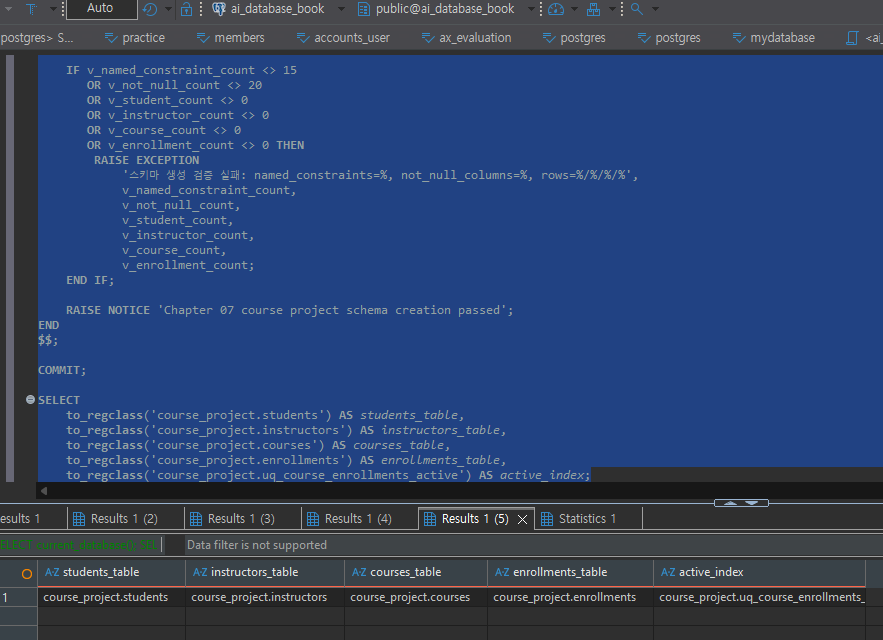
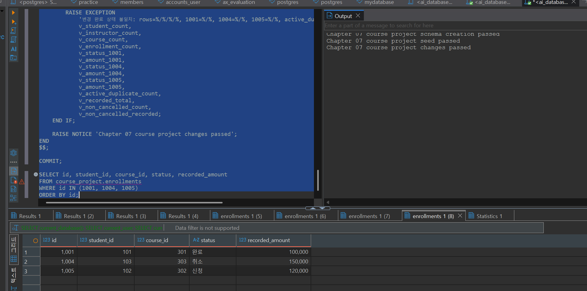
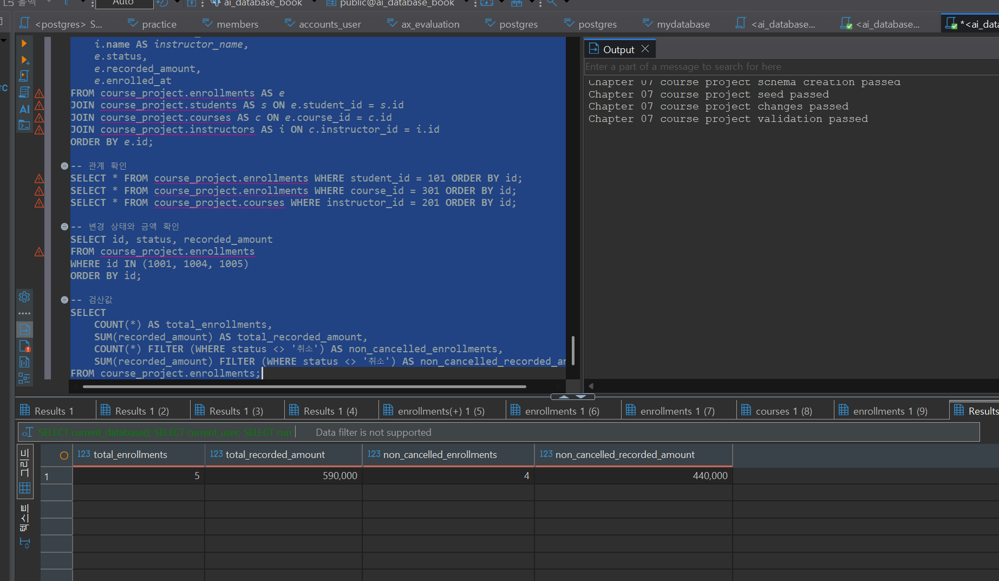
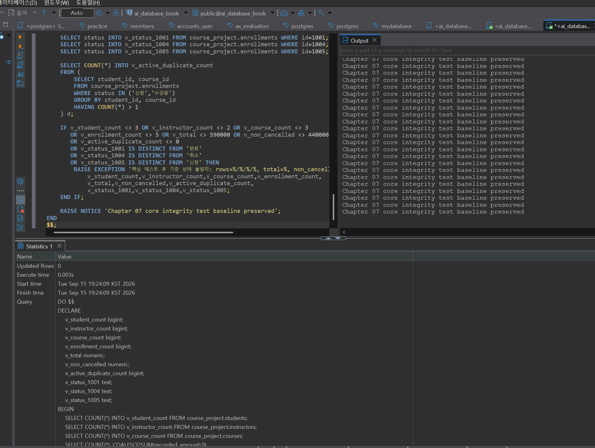
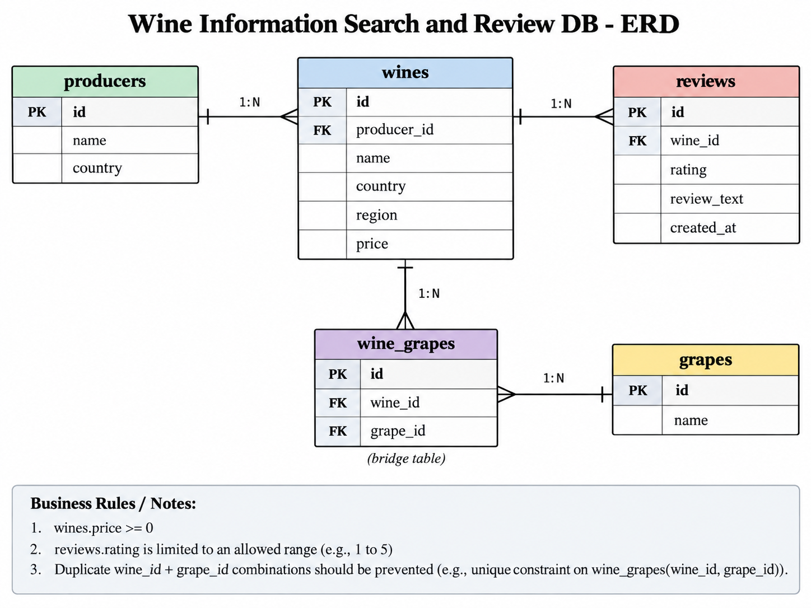

# Chapter 07 확장 실습 답안 템플릿

> **과제:** 실전 프로젝트 1 — 온라인 강의 수강신청 DB 완성하기  
> **사용 방법:** 이 파일을 내려받아 본인의 GitHub 저장소에 `chapter07_answer.md`라는 이름으로 저장한 뒤 실습하면서 바로 작성합니다.  
> **제출 방법:** LMS에는 파일을 직접 업로드하지 않고, **본인 GitHub 저장소의 `chapter07_answer.md` 파일 URL**을 제출합니다.

---

## 제출 전 주의

이 파일과 캡처 화면에는 실제 비밀번호, 전체 DB 접속 URL, API Key, 개인정보를 기록하지 않습니다.

```text
GitHub 계정 또는 별칭:wjs0951467-wq
과제 작성일:2026-09-15
사용한 AI 도구:chat gpt
```

---

# 1. 시작 환경 확인

다음을 실행합니다.

```sql
SELECT current_database();
SELECT current_user;
SELECT current_schema();
SHOW search_path;
SHOW transaction_read_only;
```

| 확인 항목 | 실제 결과 | 의미 |
| --- | --- | --- |
| `current_database()` | ai_database_book | 현재 연결된 데이터베이스가 `ai_database_book`임을 확인했다. |
| `current_user` | postgres | 현재 PostgreSQL에 `postgres` 사용자로 접속되어 있다. |
| `current_schema()` | public | 현재 기본 스키마는 `public`이다. |
| `search_path` | "$user", public | 테이블이나 객체를 찾을 때 사용자 스키마를 먼저 확인하고, 그다음 `public` 스키마를 확인한다. |
| `transaction_read_only` | off | 읽기 전용이 아니므로 데이터 생성, 수정, 삭제가 가능한 연결이다. |

- [x] 현재 DB가 `ai_database_book`이다.
- [x] 쓰기 가능한 연결인지 확인했다.
- [x] 실행할 SQL 범위를 확인했다.
- [x] Auto-commit 상태를 확인했다.

### 프로젝트 SQL을 실행하기 전에 시작 상태를 확인해야 하는 이유

```text
잘못된 DB나 너무 넓은 범위에 변경을 적용하는 실수를 막기 위해서이다.
```

---

# 2. 프로젝트 범위와 요구사항 읽기

## 2-1. 포함 범위

본문을 그대로 복사하지 말고 자신의 말로 정리합니다.

```text
1. 학생과 강사의 기본 정보를 관리한다.
2. 개설된 강의의 정보와 기준 가격을 관리한다.
3. 학생이 어떤 강의에 신청했는지 수강신청 기록을 관리한다.
4. 수강신청 상태와 신청 당시의 기록 금액을 저장한다.
```

## 2-2. 제외 범위

```text
1. 실제 결제 승인, 결제 실패, 환불 처리는 이번 프로젝트에서 다루지 않는다.
2. 강의 정원 관리나 대기 신청 기능은 포함하지 않는다.
3. 강의 진도율, 수료 여부, 강의 콘텐츠 관리 기능은 제외한다.
4. 쿠폰이나 할인 이력과 같은 가격 정책 기능은 이번 범위에서 제외한다.
```

### 범위를 명확하게 정해야 하는 이유

```text
프로젝트에서 구현할 기능과 구현하지 않을 기능을 미리 구분해야 필요하지 않은 기능까지 추가하는 것을 막고, 현재 학습 범위 안에서 정확하게 설계하고 검증할 수 있기 때문이다.
```

## 2-3. 요구사항 / 프로젝트 결정 / 미확정 질문 구분

아래 항목 중 대표 항목을 정리합니다.

| ID | 종류 | 내용 요약 | DB 구조/규칙에 미치는 영향 |
| --- | --- | --- | --- |
| P07-R01 | 요구사항 | 학생은 이름, 이메일, 가입일 정보를 가진다. | `students` 테이블에 학생 이름, 이메일, 가입일을 저장할 컬럼이 필요하다. |
| P07-R05 | 요구사항 | 수강신청은 학생, 강의, 신청일, 상태, 신청 당시 기록 금액을 가진다. | `enrollments` 테이블에서 학생과 강의를 참조하고 신청일, 상태, `recorded_amount`를 저장해야 한다. |
| P07-R07 | 요구사항 | 학생과 강사의 이메일은 각 테이블 안에서 공백일 수 없고 동일한 이메일이 중복될 수 없다. | 이메일에 공백을 막는 규칙과 `UNIQUE` 제약조건이 필요하다. |
| P07-D02 | 프로젝트 결정 | 할인 기능이 없는 현재 범위에서는 수강신청을 만들 때 강의의 현재 가격을 `recorded_amount`에 복사해서 보존한다. | 신청 당시 가격을 별도로 저장하여 이후 강의 가격이 변경되어도 기존 신청 금액은 유지되도록 한다. |
| P07-D03 | 프로젝트 결정 | 같은 학생이 같은 강의에 진행 중인 신청을 동시에 여러 건 가질 수 없다. | `신청`, `수강중` 상태에 대해 중복 신청을 막는 부분 고유 인덱스가 필요하다. |
| P07-Q01 | 미확정 질문 | 학생과 강사 사이에서도 같은 이메일을 사용할 수 없도록 전체 시스템에서 이메일을 고유하게 제한할 것인지 아직 정해지지 않았다. | 현재는 학생과 강사 테이블별로만 `UNIQUE`를 적용하고, 전역 고유 여부는 정책 확정 후 결정해야 한다. |

### 미확정 질문을 바로 제약조건으로 만들면 안 되는 이유

```text
아직 확정되지 않은 정책을 바로 DB 제약조건으로 만들면 실제 요구사항과 다른 규칙이 강제로 적용될 수 있기 때문이다.
따라서 미확정 질문은 먼저 정책을 확인한 뒤, 확정된 내용에 맞게 제약조건이나 구조를 적용해야 한다.
```

---

# 3. 네 테이블의 한 행 의미와 관계

## 3-1. 한 행 의미

```text
course_project.students 한 행 = 학생 한 명의 정보를 의미한다.

course_project.instructors 한 행 = 강사 한 명의 정보를 의미한다.

course_project.courses 한 행 = 개설된 강의 한 개의 정보를 의미한다.

course_project.enrollments 한 행 = 특정 학생이 특정 강의에 신청한 수강신청 한 건을 의미한다.
```

## 3-2. 키와 중요 규칙

| 테이블 | PK | FK | 중요 규칙 |
| --- | --- | --- | --- |
| students | `id` | 없음 | 이메일은 비어 있을 수 없고, 같은 이메일을 중복해서 사용할 수 없다. |
| instructors | `id` | 없음 | 이메일은 비어 있을 수 없고, 같은 이메일을 중복해서 사용할 수 없다. |
| courses | `id` | `instructor_id` → `instructors.id` | 강의는 반드시 존재하는 강사를 참조해야 하며, 기준 가격은 음수가 될 수 없다. |
| enrollments | `id` | `student_id` → `students.id`, `course_id` → `courses.id` | 신청 상태는 정해진 값만 사용할 수 있고, 기록 금액은 음수가 될 수 없으며 진행 중인 동일 학생·강의 중복 신청은 허용하지 않는다. |

## 3-3. 관계를 양방향 문장으로 작성

```text
instructors ↔ courses: 한 강사는 0개 이상의 강의를 담당할 수 있다.
한 강의는 반드시 한 명의 강사를 참조한다.

students ↔ enrollments:한 학생은 0개 이상의 수강신청을 가질 수 있다.
한 수강신청은 반드시 한 명의 학생을 참조한다.

courses ↔ enrollments:한 강의는 0개 이상의 수강신청을 가질 수 있다.
한 수강신청은 반드시 하나의 강의를 참조한다.
```

### 학생과 강의의 N:M 관계가 `enrollments`를 통해 어떻게 바뀌는지 설명

```text
학생 한 명은 여러 강의에 신청할 수 있고,
강의 하나에도 여러 학생이 신청할 수 있다.

이 N:M 관계를 enrollments 테이블이 중간에서 나누어
students 1:N enrollments, courses 1:N enrollments 관계로 표현한다.
```

### `enrollments`가 단순 연결 테이블이 아니라 사건 테이블이라고 볼 수 있는 이유

```text
enrollments는 학생과 강의의 연결 정보뿐만 아니라 신청일, 신청 상태, 신청 당시 기록 금액과 같은 수강신청 시점의 정보를 함께 저장하기 때문이다.
```

---

# 4. `recorded_amount`의 의미 이해

```text
courses.price = 현재 강의의 기준 가격이다.

enrollments.recorded_amount = 학생이 수강신청을 만들던 시점에 기록해 둔 금액이다.
```

### 두 값이 처음에는 같아도 같은 의미가 아닌 이유

```text
신청이 만들어질 때는 현재 강의 가격을 recorded_amount에 복사하기 때문에
처음에는 두 값이 같을 수 있다.
하지만 이후 courses.price가 변경되어도 기존 enrollments.recorded_amount는 신청 당시 기록값으로 그대로 남기 때문에 두 값은 같은 의미가 아니다.
```

### `recorded_amount`를 실제 결제 성공액이나 회계 매출로 해석하면 안 되는 이유

```text
recorded_amount는 실제 결제가 성공했는지, 환불되었는지, 실제 매출로 확정되었는지를 나타내는 값이 아니라 수강신청 당시 기록해 둔 금액이기 때문이다.
이번 프로젝트에서는 실제 결제와 환불 기능을 다루지 않는다.
```

---

# 5. STEP 01 — 스키마와 테이블 생성

실행 파일:

```text
code/chapter07/01_course_project_schema.sql
```

## 5-1. 실행 전 예상

```text
course_project 스키마 존재 여부: 생성될 것으로 예상한다.
예상 테이블 수: 4개
예상 데이터 행 수: 네 테이블 모두 0행
예상되는 명명 제약조건 수: 15개
예상되는 NOT NULL 열 수: 20개
부분 고유 인덱스 존재 여부: 존재할 것으로 예상한다.
```

## 5-2. 실행 결과

```text
실제 테이블 수:4개
실제 명명 제약조건 수:15개
실제 NOT NULL 열 수:20개
부분 고유 인덱스:uq_course_enrollments_active 존재
네 테이블의 실제 행 수:
students = 0
instructors = 0
courses = 0
enrollments = 0
통과 메시지:Chapter 07 course project schema creation passed
```

### 예상과 실제 비교

```text
실행 전에 예상한 테이블 수 4개, 명명 제약조건 15개, NOT NULL 열 20개, 네 테이블 0행, 부분 고유 인덱스 존재 여부가 실제 실행 결과와 모두 일치했다.
```

### 증거 화면

권장 경로:

```text
assignments/chapter07/images/step05_schema.png
```

`여기에 스키마/테이블 생성 검증 화면을 삽입하세요.`

---

# 6. STEP 02 — Seed 데이터 입력

실행 파일:

```text
code/chapter07/02_course_project_seed.sql
```

## 6-1. 실행 전 예상

```text
students:3
instructors:2
courses:3
enrollments:4
recorded_amount 합계:470000
학생 101 신청 건수:2
강의 301 신청 건수:2
강사 201 담당 강의 수:2
활성 중복 신청:0
```

## 6-2. 실제 결과

```text
students:3
instructors:2
courses:3
enrollments:4
recorded_amount 합계:470000
학생 101 신청 건수:2
강의 301 신청 건수:2
강사 201 담당 강의 수:2
활성 중복 신청:0
1001 상태:수강중
1004 상태:신청
1005 존재 여부:없음
통과 메시지:Chapter 07 course project seed passed
```

### Seed 데이터를 단순 예제가 아니라 검증 데이터라고 볼 수 있는 이유

```text
Seed 데이터는 단순히 화면에 값을 채우기 위한 데이터가 아니라,
학생-강의 관계, 여러 신청, 상태값, 금액 합계 등이 요구사항대로 동작하는지 확인하기 위한 기준 데이터이기 때문이다.
```

---

# 7. STEP 03 — 변경 시나리오 실행

실행 파일:

```text
code/chapter07/03_course_project_changes.sql
```

## 7-1. 실행 전에 상태 변화를 예상

| 신청 ID | 변경 전 예상 상태 | 변경 후 예상 상태 | 예상 recorded_amount |
| ---: | --- | --- | ---: |
| 1001 | 수강중 | 완료 | 100000 |
| 1004 | 신청 | 취소 | 150000 |
| 1005 | 없음 | 신청 | 120000 |

```text
변경 후 예상 enrollments 행 수:5
변경 후 예상 전체 recorded_amount 합계:590000
변경 후 예상 취소 제외 건수:4
변경 후 예상 취소 제외 recorded_amount 합계:440000
```

## 7-2. 실제 결과

```text
1001 상태 / recorded_amount:완료 / 100000
1004 상태 / recorded_amount:취소 / 150000
1005 상태 / recorded_amount:신청 / 120000
최종 enrollments 행 수:5
전체 recorded_amount 합계:590000
취소 제외 건수:4
취소 제외 recorded_amount 합계:440000
활성 중복 신청:0
통과 메시지:Chapter 07 course project changes passed
```

### 조건부 UPDATE에서 예상 이전 상태를 확인해야 하는 이유

```text
변경하기 전에 현재 상태가 내가 예상한 상태인지 확인해야 이미 다른 작업으로 변경된 데이터를 잘못 덮어쓰는 것을 막을 수 있기 때문이다.
예상 상태와 다르면 UPDATE를 진행하지 않는 것이 더 안전하다.
```

### 증거 화면

권장 경로:

```text
assignments/chapter07/images/step07_changes.png
```

`여기에 주요 변경 전/후 결과를 삽입하세요.`

---

# 8. STEP 04 — 최종 완료 게이트 실행

실행 파일:

```text
code/chapter07/04_course_project_validation.sql
```

## 8-1. 최종 검증 결과

```text
최종 행 수 students/instructors/courses/enrollments:3 / 2 / 3 / 5
서비스 JOIN 결과 행 수:5
학생 101 신청 수:2
강의 301 신청 수:2
강사 201 강의 수:2
고아 관계 수:0
활성 중복 신청 수:0
전체 recorded_amount:590000
취소 제외 recorded_amount:440000
통과 메시지:Chapter 07 course project validation passed
```

### SQL 파일 4개가 모두 실행되었다는 사실과 프로젝트 검증 PASS가 다른 이유

```text
SQL 파일을 모두 실행했다는 것은 단순히 실행 과정이 끝났다는 뜻이다.
하지만 validation PASS는 최종 구조, 관계, 상태, 금액 등이 요구사항과 예상 결과를 실제로 만족하는지 검증했다는 뜻이다.
```

### 증거 화면

권장 경로:

```text
assignments/chapter07/images/step08_validation.png
```

`여기에 최종 validation PASS 화면을 삽입하세요.`

---

# 9. 무결성 테스트

실행 파일:

```text
code/chapter07/05_course_project_integrity_tests.sql
```

> 오류 테스트는 파일 전체를 무작정 실행하지 않고 **한 테스트 구간씩** 실행합니다.

## 9-1. 허용되어야 하는 경계값 1개

```text
테스트 내용:recorded_amount에 0을 입력하는 경계값 테스트
기대 결과:0은 허용되는 금액이므로 INSERT가 정상적으로 실행되어야 한다.
실제 결과:정상적으로 실행되어 0 값이 허용되는 것을 확인했다.
왜 허용되어야 하는가:recorded_amount는 음수는 허용하지 않지만 0은 허용하도록 CHECK (recorded_amount >= 0) 조건이 설정되어 있기 때문이다.
```

## 9-2. 실패해야 하는 테스트 1 — 잘못된 참조 또는 값

```text
테스트 내용:존재하지 않는 student_id를 사용해 수강신청 데이터를 입력한다.
기대 결과:존재하지 않는 학생을 참조하므로 INSERT가 실패해야 한다.
실제 오류 핵심:외래 키(FK) 제약조건 위반 오류가 발생했다.
동작한 제약조건/규칙:fk_course_enrollments_student
왜 실패해야 하는가:enrollments의 student_id는 반드시 students 테이블에 실제로 존재하는 학생을 참조해야 하기 때문이다.
```

## 9-3. 실패해야 하는 테스트 2 — 활성 중복 신청

```text
테스트 내용:같은 학생과 같은 강의 조합으로 진행 중 상태의 수강신청을 한 건 더 입력한다.
기대 결과:이미 진행 중인 신청이 존재하므로 중복 신청이 차단되어 INSERT가 실패해야 한다.
실제 오류 핵심:중복 키 값이 고유 제약조건을 위반했다는 오류가 발생했다.
동작한 인덱스/규칙:uq_course_enrollments_active
왜 실패해야 하는가:같은 학생이 같은 강의에 대해 신청 또는 수강중 상태의 신청을 동시에 여러 건 가질 수 없도록 부분 고유 인덱스가 설정되어 있기 때문이다.
```

## 9-4. 실패 후 기준 상태 재검증

```text
04 validation 재실행 결과:Chapter 07 course project validation passed
기준 데이터가 유지되었는가:예. 실패 테스트 후에도 기준 상태가 유지되었다.
```

### 실패 테스트가 프로젝트 품질 검증에 필요한 이유

```text
정상 데이터만 확인하면 잘못된 값이나 잘못된 관계도 허용되는지 알 수 없다.
실패해야 하는 입력이 실제로 DB에서 차단되는지 확인해야 제약조건과 무결성 규칙이 제대로 동작하는지 검증할 수 있기 때문이다.
```

### 증거 화면

권장 경로:

```text
assignments/chapter07/images/step09_integrity.png
```

`여기에 대표 실패 테스트와 기준 상태 유지 결과를 삽입하세요.`

---

# 10. 재현성 실험

> 이 단계는 본인의 실습 환경이며 보존할 데이터가 없을 때만 수행합니다.

실행 순서:

```text
reset_course_project.sql
→ 01_course_project_schema.sql
→ 02_course_project_seed.sql
→ 03_course_project_changes.sql
→ 04_course_project_validation.sql
```

```text
처음 실행의 최종 결과:
Chapter 07 course project validation passed
재실행의 최종 결과:
Chapter 07 course project validation passed
두 결과가 일치했는가:
두 번 모두 같은 최종 검증 결과가 나왔다.
중간에 수동 수정이 필요했는가:
아니오. 정해진 순서대로 SQL 파일을 실행했으며 별도의 수동 데이터 수정은 필요하지 않았다.
```

### 다른 사람이 같은 순서로 실행해 같은 결과를 얻는 것이 중요한 이유

```text
같은 SQL 파일을 같은 순서로 실행했을 때 누가 실행하더라도 같은 구조와 기준 데이터, 검증 결과가 나와야 프로젝트가 특정 사람의 수동 작업에 의존하지 않고 재현 가능하게 만들어졌다고 볼 수 있기 때문이다.
```

---

# 11. Chapter 01~06 개인 프로젝트를 중간 프로젝트 초안으로 확장

온라인 강의 예제를 이름만 바꾸지 않고 본인의 아이디어를 사용합니다.

## 11-1. 프로젝트 기본 정보

```text
프로젝트 이름:와인 정보 검색 및 관리 데이터베이스

해결하려는 문제:사용자가 국가, 품종, 지역, 가격 등의 조건으로 와인을 쉽게 찾아보고 와인의 기본 정보를 확인할 수 있도록 정보를 체계적으로 관리한다.

주요 사용자:와인을 검색하거나 비교하려는 사용자
```

## 11-2. 포함 범위 / 제외 범위

```text
[포함]
1. 와인의 이름, 국가, 지역, 품종, 가격 정보를 관리한다.
2. 와인 생산자 정보를 관리한다.
3. 와인과 품종의 관계를 관리한다.
4. 사용자가 작성한 와인 리뷰와 평점을 관리한다.

[제외]
1. 실제 와인 주문 및 결제 기능은 제외한다.
2. 배송 및 재고 관리 기능은 제외한다.
3. 쿠폰이나 할인 이벤트 관리 기능은 제외한다.
```

## 11-3. 요구사항

최소 8개를 작성합니다.

| ID | 요구사항 | 관련 테이블/관계 | 검증 방법 후보 |
| --- | --- | --- | --- |
| P07-MR01 | 와인은 이름, 국가, 지역, 가격 정보를 가진다. | wines | 정상 데이터 조회 |
| P07-MR02 | 와인은 하나의 생산자를 참조한다. | wines ↔ producers | FK 확인 |
| P07-MR03 | 생산자는 이름과 국가 정보를 가진다. | producers | 정상 입력·조회 |
| P07-MR04 | 와인은 하나 이상의 품종과 연결될 수 있다. | wines ↔ wine_grapes ↔ grapes | 관계 조회 |
| P07-MR05 | 하나의 품종은 여러 와인에서 사용될 수 있다. | grapes ↔ wine_grapes | 관계 조회 |
| P07-MR06 | 와인의 가격은 음수가 될 수 없다. | wines.price | 음수 입력 실패 확인 |
| P07-MR07 | 사용자는 와인에 리뷰와 평점을 작성할 수 있다. | reviews | 정상 입력·조회 |
| P07-MR08 | 평점은 정해진 범위 안의 값만 허용한다. | reviews.rating | 범위를 벗어난 값 실패 확인 |

## 11-4. 프로젝트 결정

최소 3개를 작성합니다.

| ID | 이번 프로젝트에서 내린 결정 | 이유 | 구현 후보 |
| --- | --- | --- | --- |
| P07-MD01 | 와인과 품종은 N:M 관계로 관리한다. | 한 와인에 여러 품종이 들어갈 수 있고 한 품종도 여러 와인에 사용될 수 있기 때문이다. | wine_grapes 연결 테이블 |
| P07-MD02 | 가격이 없는 와인은 등록하지 않고 가격은 0 이상만 허용한다. | 가격 검색과 비교에 사용할 값이 필요하기 때문이다. | NOT NULL, CHECK |
| P07-MD03 | 리뷰를 삭제하지 않고 기록으로 유지한다. | 사용자가 작성한 평가 기록을 보존하기 위해서이다. | reviews 테이블 유지 |

## 11-5. 미확정 질문

최소 3개를 작성합니다.

```text
P07-MQ01.
한 사용자가 같은 와인에 여러 개의 리뷰를 작성할 수 있게 할 것인가?
P07-MQ02.
같은 이름의 와인이 생산자나 빈티지가 다르면 별개의 와인으로 관리할 것인가?
P07-MQ03.
가격이 변할 경우 현재 가격만 저장할지, 과거 가격 이력도 저장할 것인가?
```

---

# 12. 개인 프로젝트 ERD와 한 행 의미

## 12-1. 테이블 후보

최소 4개를 권장합니다.

| 테이블 | 한 행의 의미 | PK 후보 | FK 후보 | 주요 규칙 |
| --- | --- | --- | --- | --- |
| producers | 와인 생산자 한 곳 | id | 없음 | 생산자 이름은 필수 |
| wines | 와인 한 종류 | id | producer_id | 가격은 0 이상, 반드시 생산자를 참조 |
| grapes | 포도 품종 한 종류 | id | 없음 | 품종 이름은 필수 |
| wine_grapes | 특정 와인과 특정 품종의 연결 한 건 | id | wine_id, grape_id | 같은 와인-품종 조합 중복 방지 |
| reviews | 사용자가 특정 와인에 작성한 리뷰 한 건 | id | wine_id | 평점은 정해진 범위만 허용 |

## 12-2. 관계 문장

```text
1. 한 생산자는 여러 와인을 생산할 수 있고, 한 와인은 하나의 생산자를 참조한다.
2. 한 와인은 여러 품종을 가질 수 있고, 한 품종도 여러 와인에 사용될 수 있으므로 wine_grapes를 통해 N:M 관계를 표현한다.
3. 한 와인은 여러 리뷰를 가질 수 있고, 한 리뷰는 하나의 와인을 참조한다.
```

## 12-3. ERD

권장 이미지 경로:

```text
assignments/chapter07/images/personal_project_erd.png
```

`여기에 본인의 ERD 이미지를 삽입하세요.`

### Chapter 05~06 ERD에서 이번에 바꾼 점

```text
와인과 품종의 N:M 관계를 표현하기 위해 wine_grapes 연결 테이블을 추가했다.
또한 PK/FK 관계와 가격, 평점 등의 제약조건 후보를 더 구체적으로 정리했다.
```

---

# 13. 개인 프로젝트 완료 기준 만들기

“잘 동작한다”처럼 모호하게 쓰지 말고 검증 가능한 기준을 최소 6개 작성합니다.

| 번호 | 완료 기준 | 자동 SQL 검증 가능? | 검증 방법 |
| ---: | --- | --- | --- |
| 1 | producers, wines, grapes, wine_grapes, reviews 테이블이 모두 존재한다. | 가능 | information_schema 또는 to_regclass로 테이블 존재 여부 확인 |
| 2 | Seed 데이터 입력 후 각 테이블의 행 수가 예상한 값과 일치한다. | 가능 | 각 테이블에 COUNT(*) 실행 |
| 3 | 존재하지 않는 생산자, 와인, 품종을 참조하는 데이터는 입력되지 않는다. | 가능 | FK 위반 테스트 및 고아 관계 조회 |
| 4 | wines.price에 음수 값이 입력되면 DB가 거부한다. | 가능 | 음수 가격 INSERT 테스트 |
| 5 | reviews.rating에 허용 범위를 벗어난 값이 입력되면 DB가 거부한다. | 가능 | 잘못된 평점 INSERT 테스트 |
| 6 | 같은 wine_id와 grape_id 조합이 중복 등록되지 않는다. | 가능 | 중복 wine_grapes INSERT 테스트 |
| 7 | 한 생산자에 여러 와인이 연결될 수 있고, 각 와인은 하나의 생산자를 참조한다. | 가능 | JOIN으로 관계 확인 |
| 8 | 와인과 품종의 N:M 관계가 wine_grapes를 통해 정상적으로 조회된다. | 가능 | wines, wine_grapes, grapes JOIN 결과 확인 |

예시 형식:

```text
Seed 실행 후 A/B/C/D 테이블의 행 수가 각각 5/3/8/12다.
존재하지 않는 부모를 참조하는 행은 0건이다.
허용되지 않은 상태 입력은 DB가 거부한다.
검증 SQL이 예상 결과를 반환한다.
```

---

# 14. AI를 프로젝트 리뷰어로 사용

AI에게 프로젝트를 대신 완성시키지 않고 누락과 위험을 찾게 합니다.

## 14-1. AI에게 전달한 핵심 자료

```text
요구사항:
와인, 생산자, 품종, 리뷰 정보를 관리하고 와인과 품종의 N:M 관계를 wine_grapes로 표현한다.
가격은 0 이상이어야 하고 리뷰 평점은 정해진 범위 안의 값만 허용한다.

테이블/ERD 설명:
producers, wines, grapes, wine_grapes, reviews 총 5개 테이블로 구성했다.
wines는 producers를 참조하고, wine_grapes는 wines와 grapes를 연결하며, reviews는 wines를 참조한다.

프로젝트 결정:
와인과 품종은 N:M 관계로 관리한다.
와인 가격은 0 이상만 허용한다.
리뷰 정보는 별도 테이블로 관리한다.

미확정 질문:
한 사용자가 같은 와인에 여러 리뷰를 작성할 수 있는지,
같은 이름의 와인을 빈티지나 생산자 기준으로 어떻게 구분할지,
가격 변경 이력을 별도로 저장할지 아직 확정하지 않았다.

완료 기준:
테이블 존재 여부, FK 관계, 음수 가격 차단,
잘못된 평점 차단, wine_id와 grape_id 중복 방지,
JOIN 관계 조회 등을 SQL로 검증할 수 있도록 작성했다.
```

## 14-2. 내가 사용한 프롬프트

```text
나는 데이터베이스 입문 수업의 중간 프로젝트 초안을 작성하고 있습니다.

아래 프로젝트를 대신 완성하지 말고 리뷰어로 검토해 주세요.

특히 다음을 확인해 주세요.

1. 요구사항과 ERD가 서로 맞지 않는 부분
2. 한 행의 의미가 불명확한 테이블
3. 빠진 PK/FK 관계
4. 근거 없이 추가한 UNIQUE, NOT NULL, CHECK 조건
5. 아직 확정되지 않은 정책을 임의로 규칙으로 정한 부분
6. Seed 데이터로 검증하기 어려운 요구사항
7. 자동 SQL 검증이 어려운 완료 기준

정답 ERD나 전체 SQL을 새로 작성하지 말고,
문제점과 확인이 필요한 부분을 우선순위대로 알려 주세요.
```

## 14-3. AI 제안 검토

| AI 제안 | 수용 / 수정 / 보류 / 거절 | 실제 근거 | 반영 내용 |
| --- | --- | --- | --- |
| wines와 grapes의 N:M 관계를 연결 테이블로 분리 | 수용 | 한 와인에 여러 품종이 사용될 수 있고 한 품종도 여러 와인에 사용될 수 있음 | wine_grapes 테이블을 사용 |
| wine_grapes의 wine_id + grape_id 중복을 막는 규칙 추가 | 수용 | 동일한 와인-품종 관계가 여러 번 저장될 필요가 없음 | UNIQUE 후보로 반영 |
| 모든 와인 가격 변경 이력을 별도 테이블로 관리 | 보류 | 현재 프로젝트 범위에는 가격 이력 관리 요구사항이 없음 | 미확정 질문으로 유지 |
| 사용자는 같은 와인에 리뷰를 한 번만 작성 가능하도록 제한 | 보류 | 같은 와인에 여러 리뷰를 허용할지 정책이 아직 정해지지 않음 | UNIQUE 제약조건을 아직 적용하지 않음 |

### AI가 미확정 정책을 임의로 확정하려 한 부분이 있었나요?

```text
한 사용자가 같은 와인에 리뷰를 한 번만 작성할 수 있도록 UNIQUE 제약조건을 추가하는 방안을 생각할 수 있었지만,
해당 정책은 아직 확정되지 않았기 때문에 바로 적용하지 않고
미확정 질문으로 유지했다.
```

### AI가 제안한 규칙 중 아직 배우지 않은 기능이라 보류한 것이 있나요?

```text
가격 변경 이력을 별도 테이블로 관리하거나 복잡한 이력 관리 기능을 추가하는 방법은 생각할 수 있었지만, 현재 학습 범위와 프로젝트 요구사항에 꼭 필요한 기능은 아니어서 보류했다.
```

### AI 활용 후 실제로 좋아진 부분

```text
와인과 품종의 N:M 관계를 wine_grapes로 분리한 이유가 더 명확해졌고,
확정된 요구사항과 아직 정해지지 않은 정책을 구분해서 불필요한 제약조건을 미리 추가하지 않도록 정리할 수 있었다.
```

---

# 15. 최종 성찰

아래 문장은 반드시 본인의 말로 작성합니다.

```text
1. 데이터베이스 프로젝트가 완료되었다고 판단하려면
   SQL 파일의 존재보다 요구사항에 맞는 구조와 데이터가 만들어졌고
   검증까지 정상적으로 통과했는지가 중요하다.

2. Seed 데이터의 목적은 단순히 화면을 채우는 것이 아니라
   관계, 상태, 금액, 제약조건 등이 예상한 대로 동작하는지
   확인하기 위한 기준 데이터를 만드는 것이다.

3. 실패 테스트가 필요한 이유는
   정상 데이터만 들어가는지 보는 것뿐만 아니라
   잘못된 데이터가 실제로 차단되는지도 확인해야 하기 때문이다.

4. 요구사항과 프로젝트 결정을 구분해야 하는 이유는
   반드시 지켜야 하는 조건과 이번 프로젝트에서 선택한 설계 기준을
   구분해야 불필요한 규칙을 임의로 추가하지 않을 수 있기이다.

5. 내가 만든 개인 프로젝트에서 가장 먼저 추가 확인해야 할 정책은
   한 사용자가 같은 와인에 여러 번 리뷰를 작성할 수 있는지에 대한 기준이다.
```

---

# 16. 제출 체크리스트

- [x] `chapter07_answer.md`를 본인 저장소에 만들었다.
- [x] 시작 환경과 현재 DB를 확인했다.
- [x] 프로젝트 포함/제외 범위를 설명했다.
- [x] 요구사항/결정/미확정 질문을 구분했다.
- [x] 네 테이블의 한 행 의미와 관계를 설명했다.
- [x] `01_course_project_schema.sql`을 실행하고 결과를 확인했다.
- [x] `02_course_project_seed.sql`의 기준 상태를 확인했다.
- [x] `03_course_project_changes.sql` 전후 상태를 비교했다.
- [x] `04_course_project_validation.sql` PASS를 확인했다.
- [x] 허용 경계값 1개 이상을 확인했다.
- [x] 실패 테스트 2개 이상을 한 구간씩 실행했다.
- [x] 실패 후 validation을 다시 실행했다.
- [x] 개인 프로젝트 요구사항 8개 이상을 작성했다.
- [x] 프로젝트 결정 3개 이상과 미확정 질문 3개 이상을 작성했다.
- [x] 개인 프로젝트 ERD를 작성했다.
- [x] 검증 가능한 완료 기준 6개 이상을 작성했다.
- [x] AI 제안을 수용/수정/보류/거절로 구분했다.
- [x] 핵심 캡처는 3~4장 정도로 정리했다.
- [x] 캡처에 비밀번호나 개인정보가 없다.
- [x] GitHub 웹에서 Markdown과 이미지가 정상적으로 보인다.
- [x] 최종 파일을 commit/push했다.

---

# 17. LMS 제출 URL

아래 형식의 **본인 GitHub 파일 URL**을 LMS에 제출합니다.

```text
https://github.com/<본인-GitHub-ID>/<본인-저장소>/blob/main/assignments/chapter07/chapter07_answer.md
```

내 제출 URL:

```text

```

> 저장소 메인 URL, 교수자 템플릿 URL, Raw URL이 아니라 **작성 완료된 본인 `chapter07_answer.md` 파일 화면 URL**을 제출합니다.