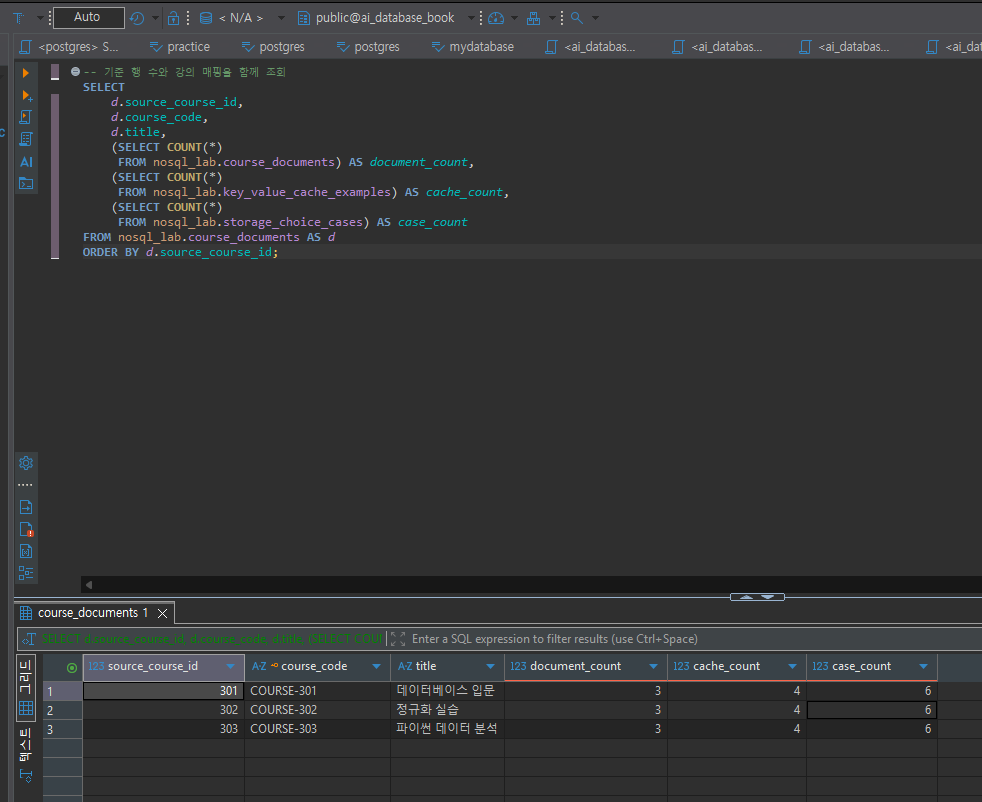
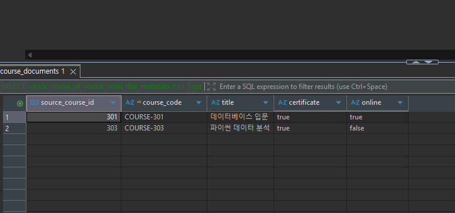
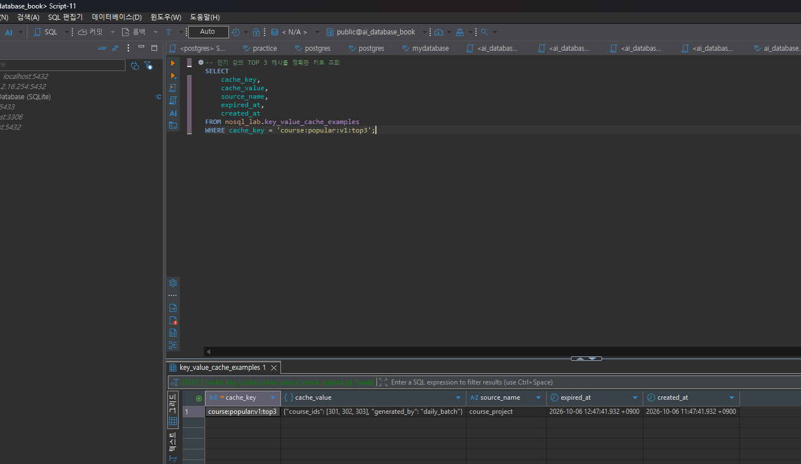
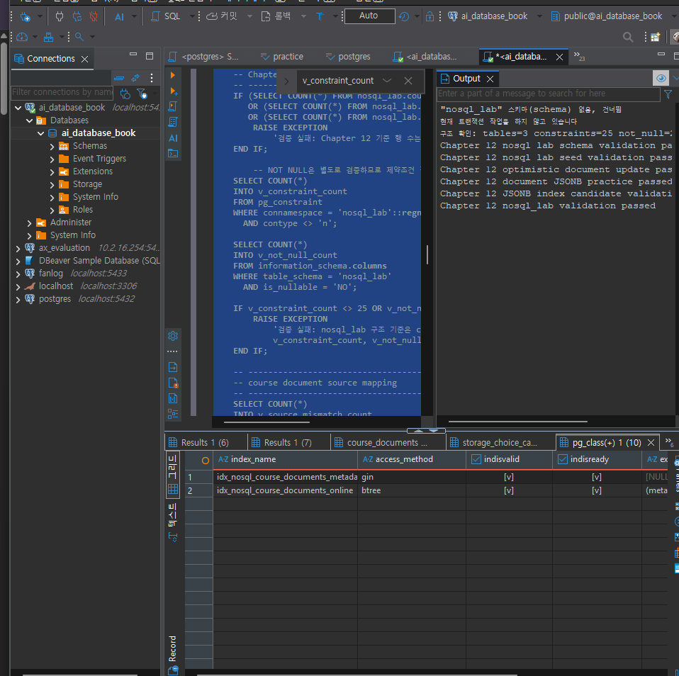

# Chapter 12 확장 실습 답안 템플릿

> **과제:** 조회 패턴으로 RDBMS와 NoSQL 선택하기  
> **사용 방법:** 이 파일을 내려받아 본인의 GitHub 저장소에 `chapter12_answer.md`라는 이름으로 저장한 뒤 실습하면서 바로 작성합니다.  
> **제출 방법:** LMS에는 파일을 직접 업로드하지 않고, **본인 GitHub 저장소의 `chapter12_answer.md` 파일 URL**을 제출합니다.

---

## 제출 전 주의

이 파일과 캡처 화면에는 실제 비밀번호, 전체 DB 접속 URL, API Key, 개인정보를 기록하지 않습니다.

```text
GitHub 계정 또는 별칭: wjs0951467-wq
과제 작성일: 2026-10-06
PostgreSQL 버전: PostgreSQL 18.4 (Windows / DBeaver 26.1.4)
사용한 AI 도구: ChatGPT(SQL 오류 해결 지원, 실행 결과 확인), Claude(답안 작성·설계 리뷰 지원)
```

> 이번 장에서는 MongoDB, Redis, Cassandra, Graph DB 같은 별도 서버를 반드시 설치하지 않습니다.  
> 제공된 PostgreSQL `nosql_lab`을 이용해 **원본·파생·캐시·문서·저장소 선택 기준**을 실습합니다.

### 이 답안의 근거 표시 방법

| 표시 | 의미 |
| --- | --- |
| **[학생 실행]** | 내가 DBeaver에서 직접 실행하고 결과 그리드·Output·캡처로 확인한 결과 |
| **[검증 PASS 근거]** | `07_nosql_lab_validation.sql`이 해당 조건을 검사하고, 내가 실행한 결과 `passed`가 나왔으므로 성립이 확인된 값 |
| **[설계 가정]** | 측정값이 아니라 설계를 위해 정한 가정 |
| **[설계, 미실행]** | 설계만 하고 아직 구현·실험하지 않은 내용 |

> Claude는 DB에 직접 접속하지 않았습니다. 이 답안의 실행 결과는 모두 **내가 DBeaver에서 실행한 결과**(2026-10-06)와 그 캡처, 최종 검증 SQL의 검사 조건을 근거로 합니다.

---

# 1. 시작 환경과 Chapter 07 기준 상태 확인

다음을 실행합니다.

```sql
SELECT current_database();
SELECT current_user;
SELECT current_schema();
SHOW search_path;
```

**[학생 실행]** 네 값을 한 번에 확인한 SQL:

```sql
SELECT
    current_database() AS database_name,
    current_user AS user_name,
    current_schema() AS schema_name,
    current_setting('search_path') AS search_path;
```

| 확인 항목 | 실제 결과 | 의미 |
| --- | --- | --- |
| `current_database()` | `ai_database_book` | 실습 DB에 연결되어 있다. 최종 검증 SQL도 이 DB가 아니면 즉시 중단하도록 되어 있다. |
| `current_user` | `postgres` | `postgres` 사용자 권한으로 `nosql_lab` 스키마·테이블을 만들고 조회했다. |
| `current_schema()` | `public` | 스키마 이름 없이 테이블을 쓰면 `public`에서 찾는다. 그래서 실습 SQL은 `nosql_lab.테이블`, `course_project.테이블`처럼 스키마를 직접 붙여 쓴다. |
| `search_path` | `"$user", public` | 이름만 쓴 객체를 찾는 순서다. `postgres`라는 스키마는 없으므로 실제로는 `public`만 찾는다. `nosql_lab`은 search_path에 없으므로 스키마 이름을 반드시 붙여야 한다. |

Chapter 07·08 기준 상태도 확인합니다.

```text
students = 3
instructors = 2
courses = 3
enrollments = 5

전체 recorded_amount = 590000
활성 = 3건 / 340000
취소 제외 = 4건 / 440000
```

**[검증 PASS 근거]** 최종 검증 SQL은 아래 조건이 하나라도 다르면 `RAISE EXCEPTION`으로 실패합니다. 실제로 `Chapter 12 nosql_lab validation passed`가 출력되었으므로 모두 성립합니다.

```text
students / instructors / courses / enrollments = 3 / 2 / 3 / 5
신청 / 수강중 / 완료 / 취소 = 2 / 1 / 1 / 1
전체 recorded_amount = 590000
활성(신청·수강중) = 3건 / 340000
취소 제외 = 4건 / 440000
1001 = 완료·100000, 1004 = 취소·150000, 1005 = 신청·120000
recorded_amount 타입 = NUMERIC(12,0), 이전 금액 열 paid_amount 없음
활성 신청 부분 고유 인덱스 uq_course_enrollments_active 존재, 활성 중복 0건
지정된 명명 제약조건 15개 / NOT NULL 열 20개
```

### 기준 상태를 유지한 채 별도 `nosql_lab`에서 실습하는 이유

```text
course_project는 Chapter 07~08에서 검증을 끝낸 원본(Source of Truth) 데이터다.
여기에 JSONB 문서, 캐시, 저장소 선택 사례를 섞어 넣으면
원본과 실험용 파생 데이터의 경계가 흐려지고, 실수로 원본 행 수나 금액이 바뀌어도 알아차리기 어렵다.

그래서 실험은 별도 스키마 nosql_lab에서 하고, course_project는 읽기만 한다.
최종 검증에서 Chapter 07 기준(3/2/3/5, 590000 등)을 다시 확인하는 것도
"실험을 했는데 원본은 그대로인가?"를 증명하기 위해서다.
```

---

# 2. 온라인 강의 데이터의 시스템 역할 분류

다음 데이터를 분류합니다.

| 데이터 | 시스템 역할 | Source of Truth 여부 | 잃어버리면 재구축 가능? | 이유 |
| --- | --- | --- | --- | --- |
| 수강신청 | Source of Truth | 예 | 불가 (백업으로 복구만 가능) | 누가 언제 어떤 강의를 신청했고 상태가 무엇인지는 이 기록이 처음 생기는 곳이다. 다른 데이터에서 계산해 낼 수 없다. |
| 신청 당시 금액 | Source of Truth (수강신청 사건의 속성) | 예 | 불가 | `recorded_amount`는 신청 시점에 복사해 둔 값이다. 나중에 `courses.price`가 바뀌면 현재 가격으로 다시 계산할 수 없다. |
| 로그인 세션 | Ephemeral State | 아니오 (영구 업무 원본이 아님) | 불가하지만 재로그인으로 대체 가능 | 일정 시간만 의미가 있는 임시 상태다. 원본은 인증 시스템의 사용자·로그인 정보이고, 세션을 잃으면 다시 로그인해 재발급하면 된다. |
| 인기 강의 TOP 3 | Derived Cache | 아니오 | 가능 | `enrollments`를 집계하면 언제든 다시 만들 수 있는 파생값이다. 원본과 잠시 달라도 되지만 최종 판단은 원본 집계를 따른다. |
| 강의 태그/옵션 | Flexible Metadata | 부분적으로 예 | 원본 강의 정보 부분은 재구축 가능, 태그·옵션 값은 백업 필요 | 강의마다 항목이 달라 JSONB에 둔다. 실습에서 태그·옵션 값은 `course_documents.metadata`에만 있으므로 그 값 자체의 원본은 이 문서다. 강의 제목·난이도·강사 정보의 원본은 `course_project`다. |
| 학습 행동 이벤트 | Event Log | 예 (검증된 이벤트 수집 로그 자체) | 불가 (보관본에서만 복구) | "몇 시에 어떤 영상을 재생했다" 같은 사건은 지나가면 다시 만들 수 없다. 대신 이벤트로 만든 통계·추천·파티션은 이벤트 보관본에서 재구축할 수 있다. |
| 추천 관계 | Relationship Index | 아니오 | 가능 | "이 강의를 들은 학생은 저 강의도 들었다" 같은 관계는 수강신청·이벤트에서 계산한 결과다. 원본이 있으면 다시 만들 수 있다. |

사용 가능한 역할 예:

```text
Source of Truth
Derived Cache
Ephemeral State
Flexible Metadata
Event Log
Relationship Index
```

### Source of Truth와 파생 저장소를 구분해야 하는 이유

```text
값이 서로 다를 때 무엇을 믿을지 미리 정해 두어야 하기 때문이다.

- 원본(Source of Truth)은 잃어버리면 다시 만들 수 없으므로 트랜잭션, 제약조건, 백업이 반드시 필요하다.
- 파생 저장소(캐시, 추천 관계, 집계)는 원본에서 다시 만들 수 있으므로
  잠시 오래된 값을 허용하고, 문제가 생기면 지우고 재생성하는 방식으로 복구할 수 있다.

구분하지 않으면 캐시 값을 원본처럼 수정하거나, 반대로 원본을 캐시처럼 쉽게 지워 버리는 사고가 생긴다.
"재구축 가능한가?"는 원본 여부와 별개의 질문이라 표에서 따로 적었다.
예를 들어 로그인 세션은 원본이 아니지만 그대로 재구축할 수도 없고(재로그인으로 대체),
학습 이벤트는 원본이라서 재구축이 불가능하다.
```

---

# 3. 저장소보다 먼저 조회·쓰기 패턴 정의

최소 6개의 읽기/쓰기 문장을 작성합니다.

> 예상 빈도와 허용 지연은 실제 측정값이 아니라 **[설계 가정]**입니다.

| ID | 읽기/쓰기 문장 | 키/조건 | 정렬/범위 | 예상 빈도 | 일관성 요구 | 함께 원자적으로 맞아야 하는 데이터 |
| --- | --- | --- | --- | --- | --- | --- |
| Q01 | (쓰기) 학생이 강의에 수강신청을 만든다 | `student_id`, `course_id` | 단건 | 중간 (가정) | 강한 일관성. 즉시 정확해야 함 | 신청 행 + 신청 당시 `recorded_amount` + 활성 중복 없음(부분 고유 인덱스) |
| Q02 | (쓰기) 신청 상태를 변경한다 (예: 신청 → 취소) | `enrollments.id` + 예상 이전 상태 | 단건 | 낮음 (가정) | 강한 일관성. 다른 변경을 덮어쓰면 안 됨 | 상태 변경 + 이전 상태 조건 확인이 한 번에 처리되어야 함 |
| Q03 | (읽기) 학생이 자신의 신청 목록을 본다 | `student_id` | 신청일 내림차순, 전체 | 높음 (가정) | 본인 신청 직후 바로 보여야 함 (read-your-writes) | 신청 + 강의 제목 (JOIN) |
| Q04 | (읽기) 메인 화면에 인기 강의 TOP 3를 보여 준다 | 고정 키 또는 취소 제외 신청 수 집계 | 신청 수 내림차순, 상위 3개 | 매우 높음 (가정) | 약한 일관성. 최대 5분 지연 허용 (가정) | 없음 (원본 집계에서 파생) |
| Q05 | (읽기) 강의 상세에서 태그·옵션·강사 요약을 본다 | `course_code` 또는 `source_course_id` | 단건 | 높음 (가정) | 제목·난이도는 원본과 일치해야 함. 강사 요약은 복사 시점 값 허용 | 문서 내용 + `document_version` |
| Q06 | (읽기/쓰기) 요청마다 로그인 세션을 확인하고, 로그인 시 세션을 만든다 | 세션 키 정확 일치 (예: `student:101:session`) | 단건, 만료 시각 이전만 | 매우 높음 (가정) | 만료·폐기된 세션은 거절해야 함 | 세션 값 + 만료 시각 |

### 기술 이름보다 조회 패턴을 먼저 작성해야 하는 이유

```text
저장소마다 잘하는 접근 방식이 다르기 때문이다.
Key-Value는 "정확한 키 하나로 빨리 꺼내기"(Q04 캐시, Q06)에 맞고,
RDBMS는 "여러 테이블을 조건과 트랜잭션으로 함께 맞추기"(Q01, Q02)에 맞는다.

"Redis를 쓰자"부터 정하면 Q01처럼 금액과 중복 방지가 원자적으로 맞아야 하는 쓰기까지
맞지 않는 저장소에 억지로 넣게 된다.
먼저 키, 정렬, 빈도, 허용 지연, 함께 맞아야 할 데이터를 적어야
"이 패턴에는 지금의 PostgreSQL로 충분한가?"를 근거로 판단할 수 있다.
```

---

# 4. `nosql_lab` 생성과 기준 데이터 확인

다음 파일을 순서대로 실행합니다.

```text
code/chapter12/01_nosql_lab_schema.sql
code/chapter12/02_nosql_lab_seed.sql
```

**[학생 실행]** DBeaver Output에서 다음 메시지를 확인했습니다.

```text
"nosql_lab" 스키마(schema) 없음, 건너뜀
구조 확인: tables=3 constraints=25 not_null=26
Chapter 12 nosql lab schema validation passed
Chapter 12 nosql lab seed validation passed
```

**[학생 실행]** 행 수와 강의 매핑을 한 번에 확인한 SQL:

```sql
SELECT
    d.source_course_id,
    d.course_code,
    d.title,
    (SELECT COUNT(*) FROM nosql_lab.course_documents) AS document_count,
    (SELECT COUNT(*) FROM nosql_lab.key_value_cache_examples) AS cache_count,
    (SELECT COUNT(*) FROM nosql_lab.storage_choice_cases) AS case_count
FROM nosql_lab.course_documents AS d
ORDER BY d.source_course_id;
```

## 4-1. 기준 행 수

| 테이블 | 기대 행 수 | 실제 행 수 | 일치? |
| --- | ---: | ---: | --- |
| `nosql_lab.course_documents` | 3 | 3 | 일치 **[학생 실행]** |
| `nosql_lab.key_value_cache_examples` | 4 | 4 | 일치 **[학생 실행]** |
| `nosql_lab.storage_choice_cases` | 6 | 6 | 일치 **[학생 실행]** |

구조 기준 **[학생 실행]**: `table_count = 3`, `constraint_count = 25`(NOT NULL 제외), `not_null_count = 26`

## 4-2. 원본 매핑 확인

| source_course_id | 기대 course_code | 실제 title | 원본과 일치? |
| ---: | --- | --- | --- |
| 301 | `COURSE-301` | 데이터베이스 입문 | 일치 **[학생 실행]** |
| 302 | `COURSE-302` | 정규화 실습 | 일치 **[학생 실행]** |
| 303 | `COURSE-303` | 파이썬 데이터 분석 | 일치 **[학생 실행]** |

> 원본과의 일치는 최종 검증으로도 확인했습니다. 검증 SQL은 `course_documents`와 `course_project.courses(301~303)`를 `FULL JOIN`하여 한쪽에만 있는 행과 `course_code`·`title`·`level` 불일치를 세고, 0이 아니면 실패합니다. **[검증 PASS 근거]**

### 결과의 의미

```text
nosql_lab의 강의 문서는 새로운 원본이 아니라 course_project.courses를 복사해 만든 문서다.
문서 3건이 원본 강의 301~303과 1:1로 대응하고 course_code, title이 원본과 같다는 것은
"문서형 저장 방식을 실험해도 원본과의 연결(source_course_id)이 끊기지 않았다"는 뜻이다.
```

### 증거 화면

권장 경로:

```text
assignments/chapter12/images/step04_nosql_lab.png
```

행 수 3/4/6과 301~303 강의 매핑 조회 결과:



> 보조 증거: 스키마 수정 후 구조 요약 3/25/26 화면 → [images/step04_schema_structure.png](images/step04_schema_structure.png)

---

# 5. PostgreSQL JSONB 혼합 문서 실습

다음을 실행합니다.

```text
code/chapter12/03_document_jsonb_queries.sql
```

**[학생 실행]** Output에서 다음 두 메시지를 확인했습니다.

```text
Chapter 12 optimistic document update passed
Chapter 12 document JSONB practice passed
```

## 5-1. 일반 컬럼과 JSONB 영역 구분

| 항목 | 일반 컬럼 / JSONB | 그렇게 둔 이유 |
| --- | --- | --- |
| `source_course_id` | 일반 컬럼 | 원본 강의(`course_project.courses.id`)를 가리키는 연결 키다. 모든 문서에 반드시 있어야 하고 원본 대조에 쓰인다. |
| `course_code` | 일반 컬럼 | `COURSE-301`처럼 정확한 값으로 찾는 식별자다. 형식과 중복을 DB 제약조건으로 지키기 쉽다. |
| `title` | 일반 컬럼 | 모든 강의에 있고 화면·검색에 자주 쓰인다. 원본과 같은지 검증해야 한다. |
| `level` | 일반 컬럼 | 모든 강의에 있고 값의 범위가 정해진 필터 조건이다. (아래 설명) |
| `document_version` | 일반 컬럼 | 낙관적 잠금에 쓰는 숫자다. `WHERE document_version = ?` 조건과 `+ 1` 연산을 정확하게 해야 한다. |
| `tags` | JSONB (`metadata -> 'tags'`, 배열) | 강의마다 개수와 내용이 다르다. 배열 그대로 저장하고 포함 여부로 찾는다. |
| `options` | JSONB (`metadata -> 'options'`, 객체) | `online`, `certificate`처럼 강의별로 늘어날 수 있는 선택 속성이다. 항목이 바뀔 때마다 테이블 구조를 바꾸지 않아도 된다. |
| `instructor_snapshot` | JSONB (`metadata -> 'instructor_snapshot'`, 객체) | 문서를 만들 당시의 강사 정보(원본 ID, 이름, 전문분야, 복사 시각)를 화면 표시용으로 함께 담아 둔 복사본이다. |

> **[검증 PASS 근거]** `metadata`는 object, `tags`는 array, `options`는 object, `options.online`·`options.certificate`는 boolean, `instructor_snapshot`은 object이고, `document_version >= 1`, `updated_at >= created_at`을 만족합니다.

### `level`을 JSONB 안에 넣지 않고 일반 컬럼으로 둔 이유

```text
level은 모든 강의가 반드시 가지는 값이고, 정해진 값만 들어가야 하며,
목록 필터(예: 입문 강의만 보기)에 자주 쓰이는 "안정된 필드"이기 때문이다.

JSONB 안의 값도 CHECK 제약조건(예: metadata ? 'level', jsonb_typeof 검사)이나 검증 SQL로
누락·타입을 검사할 수는 있다. 하지만 그런 규칙을 키마다 직접 식으로 작성하고 관리해야 한다.
일반 컬럼이면 NOT NULL·CHECK를 컬럼에 바로 걸 수 있고, 타입이 정해져 있어
원본 courses.level과 비교하거나 인덱스를 거는 것도 단순하다.

정리하면 "모든 행에 있고, 규칙이 있고, 자주 검색하는 값"은 일반 컬럼에서 관리하기 쉽고,
"행마다 다르고 자주 늘어나는 값"은 JSONB에 두는 것이 유리하다.
```

### `instructor_snapshot`이 Source of Truth가 아닌 이유

```text
강사 정보의 원본은 course_project.instructors다.
instructor_snapshot은 copied_at 시점에 그 값을 복사해 온 것일 뿐이므로,
나중에 강사 이름이나 전문분야가 바뀌어도 자동으로 따라 바뀌지 않는다.

두 값이 다르면 원본(instructors)을 믿고 스냅샷을 다시 만들어야 한다.
그래서 최종 검증도 스냅샷의 source_instructor_id, name, specialty를 원본과 대조하고,
copied_at이 비어 있지 않은지 확인한다. (검증 PASS → 현재는 3건 모두 원본과 일치)
```

## 5-2. JSONB 조회 결과

```text
사용한 JSONB 조건: metadata @> '{"options": {"certificate": true}}'  (수료증이 있는 강의)
예상 결과: 301, 303 2건 (검증 SQL이 301·303 certificate=true, 302 certificate=false를 확인했으므로)
실제 결과: 2행 [학생 실행]
  301 / COURSE-301 / 데이터베이스 입문   / certificate=true / online=true
  303 / COURSE-303 / 파이썬 데이터 분석 / certificate=true / online=false
예상과 일치: 일치
```

```sql
SELECT
    source_course_id,
    course_code,
    title,
    metadata #>> '{options,certificate}' AS certificate,
    metadata #>> '{options,online}'      AS online
FROM nosql_lab.course_documents
WHERE metadata @> '{"options": {"certificate": true}}'
ORDER BY source_course_id;
```

```text
해석: @>는 "왼쪽 JSONB 문서가 오른쪽 구조를 포함하는가"를 묻는다.
options 안의 다른 키(online)는 조건에 없으므로 online 값과 관계없이 certificate=true인 문서만 남았다.
302는 certificate=false라서 제외되었다.
```



## 5-3. 낙관적 잠금 관찰

**[학생 실행]** 다음 순서로 실행했습니다: `BEGIN` → DO 블록(버전 읽기 + UPDATE 2회 + 영향 행 수 출력) → `ROLLBACK` → 버전 재조회

```sql
BEGIN;

DO $$
DECLARE
    v_version INTEGER;
    v_first_count INTEGER;
    v_second_count INTEGER;
BEGIN
    -- 현재 버전을 읽어 변수에 저장
    SELECT document_version
    INTO v_version
    FROM nosql_lab.course_documents
    WHERE source_course_id = 301;

    -- 읽은 버전이 그대로이면 첫 번째 변경 성공
    UPDATE nosql_lab.course_documents
    SET document_version = document_version + 1,
        updated_at = CURRENT_TIMESTAMP
    WHERE source_course_id = 301
      AND document_version = v_version;

    GET DIAGNOSTICS v_first_count = ROW_COUNT;

    -- 이전 버전으로 다시 변경 시도
    -- 첫 번째 변경으로 버전이 올라갔으므로 0행 예상
    UPDATE nosql_lab.course_documents
    SET document_version = document_version + 1,
        updated_at = CURRENT_TIMESTAMP
    WHERE source_course_id = 301
      AND document_version = v_version;

    GET DIAGNOSTICS v_second_count = ROW_COUNT;

    RAISE NOTICE '읽은 버전: %', v_version;
    RAISE NOTICE '첫 번째 UPDATE 영향 행 수: %', v_first_count;
    RAISE NOTICE '두 번째 UPDATE 영향 행 수: %', v_second_count;
END;
$$;

-- 실험 변경 취소
ROLLBACK;

-- 원래 버전으로 복구됐는지 확인
SELECT source_course_id, document_version
FROM nosql_lab.course_documents
WHERE source_course_id = 301;
```

> 이 SQL은 ChatGPT에서 받아 내가 실행한 코드입니다. `DECLARE` 선언부(`v_version`, `v_first_count`, `v_second_count` 모두 `INTEGER`)는 실행한 코드 그대로 옮겼고, 캡처에는 버전 SELECT의 마지막 줄(`WHERE source_course_id = 301;`)부터 마지막 재조회까지 보입니다. 변수 타입은 내가 실행한 코드의 선언이며, 테이블 컬럼 타입을 따로 조회한 것은 아닙니다.

```text
대상: source_course_id = 301
읽은 document_version: 1                         [학생 실행, Output "읽은 버전: 1"]
UPDATE 조건에 사용한 version: v_version(= 1) — 두 UPDATE 모두 같은 변수 사용
예상 영향 행 수: 첫 번째 1행 / 두 번째 0행
실제 영향 행 수: 첫 번째 1행 / 두 번째 0행        [학생 실행, Output]
ROLLBACK 후 document_version: 1                   [학생 실행, 재조회 결과]
```

실험의 해석:

```text
이 실험은 다른 사용자가 동시에 수정한 상황이 아니라,
"한 번 읽어 둔 오래된 버전 값으로 다시 쓰려고 하면 막히는지"를 한 세션 안에서 확인한 것이다.

1. 처음 읽은 버전은 1이었고, 첫 UPDATE는 WHERE document_version = 1에 맞아 1행이 바뀌었다.
   이때 document_version이 2가 되었다.
2. 두 번째 UPDATE도 처음 읽은 버전(1)을 조건으로 썼다.
   하지만 이미 버전이 2로 올라가 조건에 맞는 행이 없어 0행이 되었다.
3. 즉 오래된 버전 정보를 가진 변경이 최신 내용을 덮어쓰지 못하도록 막혔다.
   이것이 낙관적 잠금이 "마지막에 쓴 값이 무조건 이기는 것"을 막는 원리다.
4. 마지막에 ROLLBACK했으므로 재조회한 버전은 다시 1이었다.
```

영향 행 수의 의미:

```text
1행 = 내가 읽은 버전이 아직 최신이다. 내 변경이 반영되고 version이 1 증가한다.
0행 = 내가 읽은 뒤 버전이 이미 바뀌었다. (이번 실험에서는 같은 세션의 첫 UPDATE가 바꿈)
      오류가 나지 않고 "조용히" 0행이므로, 애플리케이션이 반드시 영향 행 수를 확인해야 한다.
```

### 영향 행 수가 0이면 무엇을 의심해야 하나요?

```text
1. 내가 읽은 뒤 문서가 이미 수정되어 document_version이 올라갔다.
   (실제 서비스에서는 다른 사용자·다른 요청이 먼저 수정한 경우가 대표적이다)
2. 내가 오래된 버전 값을 가지고 있었다. (화면을 오래 열어 둔 경우, 재시도 시 옛 값을 재사용한 경우 등)
3. 조건의 키 자체가 틀렸다. (없는 source_course_id, 오타)

대응: 0행이면 성공으로 처리하지 말고 문서를 다시 읽어 최신 버전과 내용을 확인한 뒤
      사용자에게 충돌을 알리거나 다시 수정하게 해야 한다.
```

### 실습에서 ROLLBACK 후 기준 상태를 유지하는 이유

```text
낙관적 잠금 실습은 version을 1 → 2로 바꾸는 실험이다.
COMMIT하면 다음 단계와 최종 검증이 기대하는 기준(document_version = 1)이 깨지고,
다른 사람이 같은 순서로 실행했을 때 같은 결과가 나오지 않는다.

ROLLBACK으로 실험만 관찰하고 되돌려야 재현 가능한 기준 상태가 유지된다.
실제로 ROLLBACK 후 재조회한 301의 document_version은 1이었고,
최종 검증도 301~303 모두 document_version = 1임을 확인하고 통과했다.
```

---

# 6. Key-Value 캐시 개념 실습

다음을 실행합니다.

```text
code/chapter12/04_key_value_cache_queries.sql
```

## 6-1. Seed 기준

```text
전체 캐시 = 4
Seed 시점 유효 = 3
Seed 시점 만료 = 1
```

**[학생 실행]** 생성 시점과 현재 시점 기준을 함께 비교한 SQL:

```sql
SELECT
    COUNT(*) AS total_count,
    COUNT(*) FILTER (
        WHERE expired_at IS NULL OR expired_at > created_at
    ) AS seed_valid_count,
    COUNT(*) FILTER (
        WHERE expired_at <= created_at
    ) AS seed_expired_count,
    COUNT(*) FILTER (
        WHERE expired_at IS NULL
    ) AS no_expiry_count,
    COUNT(*) FILTER (
        WHERE expired_at IS NULL OR expired_at > CURRENT_TIMESTAMP
    ) AS current_valid_count,
    CURRENT_TIMESTAMP AS checked_at
FROM nosql_lab.key_value_cache_examples;
```

| 항목 | 기대 | 실제 |
| --- | ---: | ---: |
| 전체 | 4 | 4 **[학생 실행]** |
| Seed 시점 유효 | 3 | 3 **[학생 실행]** |
| Seed 시점 만료 | 1 | 1 **[학생 실행]** |

```text
추가 결과 [학생 실행]: no_expiry_count = 1 (만료 시각이 없는 키 1개)

판정 기준:
- 생성(Seed) 시점 유효 = expired_at IS NULL OR expired_at > created_at
- 생성(Seed) 시점 만료 = expired_at <= created_at
  (만들 때부터 이미 만료된 상태로 넣은 "만료 예시" 키)
```

이 기준은 행을 만든 시각(`created_at`)과 비교하므로 **언제 실행해도 같은 결과**가 나옵니다.

## 6-2. Seed 기준과 현재 시각 기준 차이

```text
현재 유효 캐시 수: 1  (checked_at = 2026-10-06 17:55:14.581 +09:00 시점) [학생 실행]
현재 시점 기준 = expired_at IS NULL OR expired_at > CURRENT_TIMESTAMP
```

```text
해석:
- Seed 시점에는 3개가 유효했지만, 17:55에 확인했을 때는 1개만 유효했다.
- no_expiry_count가 1이고 current_valid_count도 1이므로,
  이 시각에 유효한 1개는 만료 시각이 없는 키이고, 만료 시각이 있는 키들은 모두 이미 만료된 상태였다.
- 이 "1개"는 위 확인 시각의 결과일 뿐이다. 다른 시각에 Seed를 다시 넣거나 더 일찍 조회하면 값이 달라진다.
```

### 현재 유효 건수를 고정 정답으로 사용하면 안 되는 이유

```text
CURRENT_TIMESTAMP는 실행할 때마다 바뀐다.
실제로 Seed 시점에는 유효 3개였던 캐시가 몇 시간 뒤(17:55)에는 1개만 유효했다.
같은 SQL이라도 실행 시각과 Seed를 넣은 시각에 따라 결과가 달라진다.

그래서 재현 가능한 검증에는 created_at과 비교한 Seed 시점 기준(4/3/1)을 쓰고,
현재 시각 기준 값은 "언제 확인했는지(checked_at)"와 함께 관찰값으로만 기록해야 한다.
```

## 6-3. 정확 키 조회

**[학생 실행]**

```sql
SELECT
    cache_key,
    cache_value,
    source_name,
    expired_at,
    created_at
FROM nosql_lab.key_value_cache_examples
WHERE cache_key = 'course:popular:v1:top3';
```

| cache_key | cache_value | source_name | created_at | expired_at |
| --- | --- | --- | --- | --- |
| `course:popular:v1:top3` | `{"course_ids": [301, 302, 303], "generated_by": "daily_batch"}` | `course_project` | 2026-10-06 11:47:41.932 +09:00 | 2026-10-06 12:47:41.932 +09:00 |

```text
조회한 키: course:popular:v1:top3
결과: 1행 반환. 원본은 course_project, 값은 일일 배치(daily_batch)가 만든 상위 강의 ID [301, 302, 303].
      created_at과 expired_at의 차이는 1시간이다.
캐시 미스 여부: 이 결과를 "현재 유효한 캐시 히트"라고 볼 수 없다.
  - 이 SQL은 키만 조건으로 걸었고 만료 조건을 걸지 않았기 때문에 만료된 행도 그대로 반환한다.
  - expired_at이 12:47:41이고, 6-2에서 17:55 기준 현재 유효 키가 만료 시각 없는 키 1개뿐이었으므로
    17:55 시점에는 이 키가 만료된 상태였다.
  - 실제 캐시처럼 판단하려면 "AND (expired_at IS NULL OR expired_at > CURRENT_TIMESTAMP)"를 붙여야 하고,
    그 조건에서 0행이면 캐시 미스로 보고 원본에서 TOP 3를 다시 계산해야 한다.
```



### Key-Value 제품의 TTL과 eviction을 같은 개념으로 보면 안 되는 이유

```text
TTL(Time To Live)은 "이 값은 언제까지 유효하다"고 내가 정한 만료 규칙이다.
시간이 지나면 메모리가 넉넉해도 값이 사라진다. (실습의 expired_at이 이 역할을 흉내 낸다)

eviction(축출)은 메모리가 가득 찼을 때 저장소가 정책(예: 오래 안 쓴 키부터)에 따라
아직 만료되지 않은 키도 지우는 동작이다.

즉 TTL은 "의도한 신선도 관리", eviction은 "용량 부족 때문에 생기는 손실"이다.
TTL을 길게 잡아도 eviction으로 먼저 사라질 수 있으므로,
캐시는 언제든 비어 있을 수 있다고 가정하고 원본에서 다시 만들 수 있게 설계해야 한다.
```

### 이 PostgreSQL 테이블이 실제 Redis 같은 Key-Value DB가 아닌 이유

```text
1. 만료된 행이 자동으로 사라지지 않는다. expired_at은 그냥 컬럼이고,
   실제로 정확 키 조회에서 만료된 행도 그대로 반환되었다. 조회할 때 내가 조건으로 걸러야 한다.
2. 메모리가 가득 찰 때의 eviction 정책이 없다. 디스크 기반 테이블이고 WAL·트랜잭션을 거친다.
3. 접근 방식이 SQL이다. GET/SET/EXPIRE 같은 단순 키 명령과 그에 맞춘 저지연 구조가 아니다.
4. 같은 PostgreSQL 서버 안에 있으므로 원본 DB 장애와 캐시 장애가 분리되지 않는다.

그래서 이 테이블은 "키로 값을 꺼낸다, 만료 시각이 있다, 원본에서 파생된다"는
Key-Value 캐시의 개념을 관찰하기 위한 시뮬레이션이다. 성능이나 운영 특성을 대신 보여 주지 않는다.
```

---

# 7. 캐시 장애 사고 실험

> 실제 장애를 재현하지 않았습니다. 아래는 상황을 가정한 **설계 답변**입니다.

상황:

```text
PostgreSQL 원본에서는 인기 강의 순위가 변경되었다.
캐시에는 이전 TOP 3가 남아 있다.
```

다음에 답합니다.

```text
신뢰해야 할 원본:
  course_project의 강의·수강신청 데이터 (취소 제외 신청 수를 집계한 결과)
  캐시 course:popular:v1:top3의 course_ids [301, 302, 303]은 일일 배치가 만든 원본 집계의 복사본일 뿐이다.

사용자에게 오래된 값을 허용할 수 있는 시간:
  최대 5분 [설계 가정]. 메인 화면 추천용 순위이고 금액·결제와 무관하므로 몇 분 늦어도 업무 피해가 작다.
  (실습 Seed의 이 키는 생성 후 1시간 뒤 만료로 들어 있었다.)
  단, 수강신청 자체나 금액 표시에는 캐시를 쓰지 않는다.

캐시 갱신 방식:
  배치 갱신 + 조회 시 미스면 원본에서 다시 계산(cache-aside) [설계 가정].
  신청·취소가 발생하면 해당 키를 삭제(무효화)해서 다음 조회 때 새로 계산하게 한다.

캐시 삭제 후 재생성 방법:
  1) 키 course:popular:v1:top3 삭제
  2) enrollments에서 status <> '취소' 기준으로 강의별 신청 수를 집계해 상위 3개 course_id 계산
  3) 계산 결과와 계산 시각, 만료 시각을 같은 키에 다시 저장
  4) 저장한 값이 원본 집계와 같은지 확인
  값의 형식이 바뀌면 키 버전(v1 → v2)을 올려 옛 값과 섞이지 않게 하고, 오래된 버전 키는 폐기한다.

캐시 서버 장애 시 fallback:
  캐시를 읽지 못하면 PostgreSQL에서 직접 집계해 응답한다(조금 느려도 정확함).
  원본 DB에 부담이 크면 마지막으로 성공한 TOP 3 또는 고정 추천 목록을 보여 주고 "잠시 후 갱신" 상태로 둔다.
  어떤 경우에도 캐시 장애 때문에 수강신청 같은 원본 쓰기가 막히면 안 된다.

동시 재생성 요청이 몰릴 때의 위험:
  캐시가 만료되는 순간 많은 요청이 동시에 미스를 보고 모두 원본 집계를 실행하면(cache stampede)
  PostgreSQL에 부하가 몰려 원본 서비스까지 느려질 수 있다.
  또 늦게 끝난 오래된 계산 결과가 새 결과를 덮어쓸 수도 있다.
  대응: 재생성은 한 요청(락 또는 단일 작업)만 하고 나머지는 기존 값을 잠시 사용,
        만료 시각에 무작위 여유를 주어 동시에 만료되지 않게 한다.
```

### 캐시가 Source of Truth가 되어서는 안 되는 이유

```text
캐시는 TTL 만료, eviction, 서버 재시작으로 언제든 사라질 수 있고,
원본과 잠시 다른 값을 가지는 것을 전제로 만든 저장소다.
실습에서도 인기 강의 키는 1시간 뒤 만료되도록 만들어져 있었다.

캐시를 원본처럼 쓰면 캐시가 사라지는 순간 데이터 자체를 잃고,
원본과 캐시 값이 다를 때 어느 쪽이 맞는지 판단할 기준이 없어진다.
캐시는 "원본에서 언제든 다시 만들 수 있는 복사본"이어야 장애가 나도 지우고 다시 만들면 된다.
```

---

# 8. 저장 방식 선택 사례 검토

다음을 실행합니다.

```text
code/chapter12/05_storage_choice_review.sql
```

**[학생 실행]** 6건 전체를 JSON 한 셀로 모아 조회한 뒤, 그 내용을 정리했습니다.

```sql
SELECT jsonb_pretty(
    jsonb_agg(to_jsonb(s) ORDER BY s.id)
) AS cases
FROM nosql_lab.storage_choice_cases AS s;
```

각 사례에서 최소 다음 정보를 확인합니다.

| 사례 | system_role | primary_query | 후보 저장소 | consistency | sync 전략 | recovery 전략 | decision_status |
| --- | --- | --- | --- | --- | --- | --- | --- |
| 1. 수강신청과 신청 당시 금액 기록 | `source_of_truth` | 학생·강의·신청 당시 기록 금액을 제약조건·트랜잭션·JOIN으로 처리 | PostgreSQL RDBMS | 강한 무결성과 다중 변경 원자성 필요 | 원본 데이터베이스 내부 트랜잭션 | Chapter 11에서 검증한 백업·복원 원칙 | **`adopted`** |
| 2. 학생 로그인 세션 | `ephemeral_state` | 정확한 세션 키로 읽고 TTL 또는 명시적 폐기 후 무효화 | Key-Value DB 후보 | 세션 생성 직후 읽기와 만료·폐기 정책 | 세션 생성·폐기 이벤트와 TTL 정책 | 원본 인증 상태 확인 후 세션 재발급 | `poc_planned` |
| 3. 인기 강의 캐시 | `derived_cache` | 고정 키로 상위 강의 ID 목록 읽기 | Key-Value DB 후보 | 일시적으로 오래된 값 허용 | 배치·변경 이벤트 갱신과 캐시 미스 재생성 | 원본 집계로 키 재생성, 오래된 버전 폐기 | `poc_planned` |
| 4. 강의 유연 메타데이터 | `flexible_metadata` | 원본 강의 ID 또는 문서 필드로 상세 조회 | PostgreSQL JSONB 또는 Document DB 후보 | 핵심 제목·난이도는 원본과 일치, 부가 정보는 지연 가능 | 원본 변경 이벤트·문서 버전·주기적 대조 | `source_course_id`로 원본 대조 후 문서 재구축 | `candidate` |
| 5. 학습 행동 이벤트 | `event_log` | 학생·날짜 파티션에서 이벤트를 시간순 범위 조회 | Column-Family DB 후보 | 중복·늦은 도착·재처리 허용 범위 정의 필요 | `event_id` 멱등성·실패 대기열·분석 파이프라인 | 원본 이벤트 보관본에서 파티션 재생성 | `hold` |
| 6. 학생-강의-주제 추천 관계 | `relationship_index` | 여러 단계 관계를 따라 추천 후보 탐색 | Graph DB 후보 | 원본보다 지연된 파생 관계 허용 가능 | 변경 이벤트·주기적 재구축·대조 | 원본에서 전체 관계 인덱스 재생성 | `candidate` |

각 사례의 원본, PoC 기준, 결정 이유 **[학생 실행]**:

| 사례 | Source of Truth | PoC 성공 기준 | 결정 이유 |
| --- | --- | --- | --- |
| 1 | `course_project.enrollments`와 관련 원본 테이블 | PK·FK·CHECK·활성 신청 규칙과 트랜잭션 검증 통과 | `recorded_amount NUMERIC(12,0)`는 신청 당시 기록 금액이며 결제 승인액·환불 반영 순액·회계 매출이 아니다. 별도 결제·환불 원장은 현재 범위 밖이다. |
| 2 | 인증 시스템의 사용자·로그인 원본 | 키 조회·만료·폐기·장애 시 재로그인 흐름 검증 | 정확한 키 조회와 만료가 중심이며 영구 원본이 아니다. |
| 3 | `course_project` 강의·수강신청 데이터 | 캐시 히트·미스·동시 재생성·원본 부하와 복구 시간 측정 | 원본에서 다시 만들 수 있는 파생 데이터다. |
| 4 | `course_project` 강의·강사 원본 | 대표 필드 조회·버전 충돌·마이그레이션·재구축 시험 | 가변 속성은 문서형 저장을 검토하고, 안정된 필드는 일반 컬럼에 유지한다. |
| 5 | 검증된 이벤트 수집 로그 | 실제 분포에서 파티션 크기·쓰기 핫스팟·재처리·복구 측정 | 대표 조회와 데이터 규모가 확정되기 전까지 전용 제품 도입을 보류한다. |
| 6 | RDBMS·학습 이벤트·추천 모델 입력 데이터 | JOIN 대안과 관계 깊이·지연·재구축 시간 비교 | 다단계 관계 탐색이 반복되는지 PoC로 확인한 뒤 결정한다. |

```text
상태 합계 [학생 실행]: adopted 1 / poc_planned 2 / candidate 2 / hold 1 / rejected 0
(최종 검증 SQL도 같은 분포를 검사하고 통과했다 [검증 PASS 근거])

실제 채택 (adopted)        : 사례 1 PostgreSQL RDBMS — 현재 운영 원본
PoC 계획 (poc_planned)     : 사례 2 세션 Key-Value, 사례 3 인기 강의 캐시 Key-Value
검토 후보 (candidate)      : 사례 4 JSONB/Document, 사례 6 Graph
보류 (hold)                : 사례 5 Column-Family
→ 사례 2~6의 "후보 저장소"는 어느 것도 아직 채택된 저장소가 아니다.
```

결정 상태:

```text
candidate
poc_planned
hold
adopted
rejected
```

### 후보 저장소와 실제 채택을 구분해야 하는 이유

```text
candidate_storage는 "이 패턴에 이런 저장 방식이 맞을 수도 있다"는 가설이고,
adopted는 "실제로 운영에 쓰기로 했다"는 결정이다.
예를 들어 사례 2·3은 Key-Value DB가 "후보"로 적혀 있지만 상태는 poc_planned다.
즉 Redis 같은 제품을 쓰기로 한 것이 아니라, PoC 기준(만료·폐기, 히트·미스, 동시 재생성, 복구 시간)을
측정할 계획이 있다는 뜻이다.

후보만 보고 바로 도입하면 동기화 방법, 장애 시 복구, 백업, 보안, 운영 인력 같은 비용을
확인하지 않은 채 저장소가 늘어난다.
후보 → PoC 계획 → 성공 기준 통과 → 채택 순서로 상태를 나눠 두어야
"왜 아직 도입하지 않았는지", "무엇을 확인하면 도입할 수 있는지"가 기록으로 남는다.
```

### 현재 데이터에서 `adopted`가 PostgreSQL 원본 1건뿐인 이유를 자신의 말로 설명

```text
지금 실제로 운영에서 검증을 끝낸 것은 course_project의 PostgreSQL 원본뿐이기 때문이다.
수강신청과 recorded_amount는 PK·FK·CHECK·활성 신청 규칙과 트랜잭션으로 정확성을 지켜야 하는 원본이고,
Chapter 07~08 검증과 Chapter 11 백업·복원 원칙으로 이미 그 역할을 하고 있다는 것이 확인되었다.

나머지 세션·캐시·메타데이터·이벤트·추천 관계는 원본에서 파생되거나,
대표 조회와 데이터 규모가 아직 측정되지 않은 것들이다.
각 사례의 PoC 기준을 아직 통과하지 않았으므로 poc_planned, candidate, hold에 머물러 있는 것이 맞다.
즉 "NoSQL이 나빠서"가 아니라 "아직 도입 근거를 증명하지 않았기 때문"이다.
```

---

# 9. 저장 모델 비교표

제품 이름보다 저장 모델을 비교합니다.

| 후보 | 잘 맞는 접근 패턴 | 트랜잭션/일관성 고려 | 재구축 가능성 | 운영·보안·백업 부담 | 현재 판단 |
| --- | --- | --- | --- | --- | --- |
| PostgreSQL RDBMS | 여러 테이블 JOIN, 조건 검색, 집계, 여러 행을 함께 바꾸는 쓰기 (Q01~Q03) | ACID 트랜잭션, FK·CHECK·UNIQUE로 강한 일관성 | 원본이므로 재구축 불가 → 백업 필수 | 이미 운영 중이라 추가 부담 없음 | **채택 (사례 1, adopted)** |
| PostgreSQL JSONB | 행마다 항목이 다른 부가 속성 조회, `@>` 포함 검색 (Q05) | 같은 PostgreSQL 트랜잭션 안에서 일반 컬럼과 함께 원자적으로 처리 | 원본 강의에서 복사한 부분은 재구축 가능, 문서에만 있는 값은 백업 필요 | 같은 DB라 추가 서버 없음. JSON 내부 규칙도 CHECK로 검증할 수 있지만 키별 규칙을 직접 작성·관리해야 함 | 유연한 메타데이터 **후보** (사례 4, candidate) |
| Key-Value | 정확한 키 하나로 빠른 조회, 만료가 있는 값 (Q04 캐시, Q06 세션) | 여러 키를 함께 맞추는 트랜잭션·JOIN이 약함. 원본과 지연 허용 필요 | 캐시는 원본에서 재구축 가능, 세션은 재로그인으로 재발급 | 별도 서버, 메모리 용량, 장애 fallback, 접근 제어, 모니터링 필요 | **PoC 계획** (사례 2·3, poc_planned) |
| Document | 한 화면에 필요한 정보를 문서 하나로 통째로 읽기, 구조가 자주 바뀌는 데이터 | 보통 문서 하나 단위 원자성. 여러 문서·원본 테이블과 맞추려면 동기화 필요 | 원본에서 만든 문서는 재생성 가능 | 별도 DB 운영·백업·스키마 버전 관리 필요 | JSONB와 함께 **후보** (사례 4, candidate). 현재 규모에서는 JSONB로 먼저 검토 |
| Column-Family | 매우 많은 쓰기, 파티션 키 + 시간 범위 조회 (대량 이벤트 로그) | 조회 패턴에 맞춰 테이블을 미리 설계해야 함. JOIN 없음, 중복·늦은 도착 처리 필요 | 이벤트 보관본이 있으면 파티션 재생성 가능 | 클러스터 운영, 파티션 설계, 복제·백업 부담이 큼 | **보류** (사례 5, hold) |
| Graph | 여러 단계 관계 탐색 (함께 들은 강의, 주제 기반 추천) | 관계 인덱스는 원본과 비동기 동기화가 일반적 | 원본에서 전체 관계 인덱스 재생성 가능 | 별도 서버·쿼리 언어 학습·동기화 파이프라인 필요 | **후보** (사례 6, candidate). 강의 3개 규모에서는 SQL JOIN으로 충분 |

### “NoSQL은 항상 더 빠르다”가 잘못된 설명인 이유

```text
속도는 저장소 이름이 아니라 "조회 패턴과 저장 구조가 맞는가"로 결정된다.

- Key-Value는 정확한 키 조회는 빠르지만, "취소 제외 신청 수로 정렬한 TOP 3"처럼
  조건·집계가 필요한 질문은 직접 처리하지 못해 결국 원본에서 계산해 넣어야 한다.
- RDBMS도 인덱스가 맞으면 단건 조회가 충분히 빠르다.
- 데이터가 작으면(실습처럼 3~6행) 차이를 측정할 수조차 없다.
- 저장소를 하나 더 두면 동기화, 네트워크 왕복, 장애 처리 때문에 전체 시스템은 오히려 느려지거나 복잡해질 수 있다.

따라서 "어떤 패턴에서, 어떤 데이터 규모로, 무엇과 비교해 얼마나 빠른가"를 측정하기 전에는
빠르다고 말할 수 없다. 사례 2·3·5·6의 PoC 기준에 "측정"이 들어 있는 것도 이 때문이다.
```

### 저장소가 하나 추가될 때 새로 생기는 운영 책임 최소 5개

```text
1. 원본과의 동기화: 원본이 바뀌었을 때 언제, 어떻게 반영하고 실패하면 어떻게 재시도할지
2. 장애 대응과 fallback: 새 저장소가 죽었을 때 서비스가 멈추지 않게 원본으로 우회하는 방법
3. 백업·복구 또는 재구축 절차: 백업할지, 원본에서 다시 만들지, 얼마나 걸리는지
4. 보안: 접속 계정·비밀번호 관리, 네트워크 접근 제한, 저장되는 개인정보(세션 등) 보호
5. 모니터링과 용량 관리: 메모리·디스크 사용량, 지연 시간, 만료·eviction 발생 여부 감시
6. 버전 업그레이드·패치와 팀 학습 비용: 새 쿼리 방식과 운영 도구를 팀이 익혀야 함
```

---

# 10. JSONB 인덱스 후보 관찰

다음을 실행합니다.

```text
code/chapter12/06_jsonb_index_candidates.sql
```

**[학생 실행]** Output: `Chapter 12 JSONB index candidate validation passed`

본문 후보:

```text
metadata @> ...
→ GIN 후보

metadata #>> '{options,online}' = 'true'
→ 표현식 B-tree 후보
```

**[학생 실행]** 인덱스 정의 확인 SQL:

```sql
SELECT indexname, indexdef
FROM pg_indexes
WHERE schemaname = 'nosql_lab'
  AND indexname IN (
      'idx_nosql_course_documents_metadata_gin',
      'idx_nosql_course_documents_online'
  )
ORDER BY indexname;
```

## 10-1. 생성된 인덱스

| 인덱스 | 대상 표현식/컬럼 | 대응 조회 | 실제 정의 확인 |
| --- | --- | --- | --- |
| `idx_nosql_course_documents_metadata_gin` | `metadata` 컬럼 전체, GIN, 연산자 클래스 지정 없음 → 기본값 `jsonb_ops` | `WHERE metadata @> '{"options": {"certificate": true}}'` 처럼 문서에 특정 구조가 포함되어 있는지 찾는 조회 (5-2) | **[학생 실행]** `CREATE INDEX idx_nosql_course_documents_metadata_gin ON nosql_lab.course_documents USING gin (metadata)` |
| `idx_nosql_course_documents_online` | 표현식 `(metadata #>> '{options,online}'::text[])`, B-tree | `WHERE metadata #>> '{options,online}' = 'true'` (온라인 강의만 보기) | **[학생 실행]** `CREATE INDEX idx_nosql_course_documents_online ON nosql_lab.course_documents USING btree (((metadata #>> '{options,online}'::text[])))` |

```text
최종 검증에서 두 인덱스의 접근 방식(gin / btree)과 indisvalid·indisready = true도 확인했다. [학생 실행, step11 캡처]

구분해서 기록할 점:
- 확인한 것: 인덱스가 존재하고, 정의가 위와 같으며, 사용 가능한 상태(valid/ready)라는 것
- 확인하지 않은 것: 실제 조회의 실행 계획(EXPLAIN)에서 이 인덱스가 쓰였는지, 실행 시간이 줄었는지
  → 이번 실습에서는 EXPLAIN이나 성능 측정을 하지 않았다.

표현식 B-tree 인덱스는 조회 조건이 인덱스 표현식과 "같은 모양"일 때만 쓰일 수 있다.
metadata #>> '{options,online}'로 만들었으므로
metadata -> 'options' ->> 'online' = 'true'처럼 다른 연산자로 쓰거나
metadata @> '{"options":{"online":true}}'로 쓰면 이 B-tree 인덱스가 아니라 GIN 쪽 후보가 된다.
```

### 데이터가 3행뿐이라 인덱스가 있어도 Seq Scan이 합리적일 수 있는 이유

```text
테이블이 3행이면 데이터 전체가 디스크 페이지 1개 정도에 들어간다.
Seq Scan은 그 페이지 하나만 읽으면 끝나지만,
인덱스를 쓰면 인덱스 페이지를 읽고 다시 테이블 페이지를 읽어야 해서 오히려 일이 더 많다.

PostgreSQL 플래너는 통계로 비용을 계산해 더 싼 방법을 고르므로
작은 테이블에서는 인덱스가 있어도 Seq Scan을 선택하는 것이 정상이다.
그래서 "인덱스가 안 쓰였다 = 인덱스가 잘못됐다"가 아니며,
인덱스 효과는 실제와 비슷한 데이터 양에서 EXPLAIN으로 확인해야 한다.
```

### `jsonb_ops`와 `jsonb_path_ops`를 무조건 같은 것으로 보면 안 되는 이유

PostgreSQL 18 공식 문서(8.14.4 jsonb Indexing)를 확인해 정리했습니다.  
출처: https://www.postgresql.org/docs/18/datatype-json.html

| 구분 | `jsonb_ops` (GIN 기본값, 이번 실습 인덱스) | `jsonb_path_ops` |
| --- | --- | --- |
| 지원 연산자 | 키 존재 연산자 3종, `@>`(포함), `@?`·`@@`(jsonpath) | `@>`, `@?`, `@@`만 지원. **키 존재 연산자 3종은 지원하지 않음** |
| 인덱스 항목 | 키와 값을 각각 독립된 항목으로 저장 | 값마다, 그 값에 이르는 키 경로와 함께 해시한 항목 하나만 저장 |
| 크기·속도 | 상대적으로 크고, 검색이 덜 구체적 | 보통 더 작고, 지원하는 검색에서는 더 구체적이라 빠름 |
| 주의점 | — | `{"a": {}}`처럼 값이 없는 구조를 찾는 조회는 인덱스 항목이 없어 인덱스 전체를 훑어야 함 |
| 만드는 방법 | `USING gin (metadata)` | `USING gin (metadata jsonb_path_ops)` |

```text
키 존재 연산자 3종: ?  (키 하나가 있는가), ?| (여러 키 중 하나라도 있는가), ?& (여러 키가 모두 있는가)

둘 다 "JSONB용 GIN 인덱스"라는 이름은 같지만 지원하는 연산자가 다르다.
예를 들어 metadata ? 'tags'(키가 있는가)를 자주 쓰는데 jsonb_path_ops로 만들면
그 조회는 인덱스를 전혀 쓸 수 없다.
반대로 @> 포함 검색만 쓴다면 jsonb_path_ops가 더 작고 빠를 수 있다.

이번 실습의 GIN 인덱스는 정의에 연산자 클래스가 없으므로 기본값 jsonb_ops다.
따라서 @>와 키 존재 연산자를 모두 지원하는 대신, jsonb_path_ops보다 인덱스가 클 수 있다.
"GIN 인덱스를 만들었다"로 끝내지 말고, 실제로 쓰는 연산자를 먼저 정한 뒤 연산자 클래스를 골라야 한다.
```

---

# 11. 최종 자동 검증

다음을 실행합니다.

```text
code/chapter12/07_nosql_lab_validation.sql
```

기대 메시지:

```text
Chapter 12 nosql_lab validation passed
```

```text
실제 검증 메시지: Chapter 12 nosql_lab validation passed   [학생 실행, DBeaver Output 캡처]
```

같은 실행의 Output 전체 (01 → 07 순서):

```text
"nosql_lab" 스키마(schema) 없음, 건너뜀
현재 트랜잭션 작업을 하지 않고 있습니다
구조 확인: tables=3 constraints=25 not_null=26
Chapter 12 nosql lab schema validation passed
Chapter 12 nosql lab seed validation passed
Chapter 12 optimistic document update passed
Chapter 12 document JSONB practice passed
Chapter 12 JSONB index candidate validation passed
Chapter 12 nosql_lab validation passed
```

검증되는 주요 내용:

```text
Chapter 07 기준 상태 유지
nosql_lab = 3 / 4 / 6
강의 301~303 원본 매핑
instructor_snapshot 원본 대조
JSONB 구조와 document_version 기준 유지
Seed 캐시 = 4 / 3 / 1
저장소 선택 근거 공백 0
adopted 사례 1
JSONB 인덱스 정의
```

검증 SQL을 읽고 정리한 각 항목의 검사 방법 (모두 통과):

| 검증 항목 | 검증 SQL이 실제로 검사하는 것 |
| --- | --- |
| Chapter 07 기준 상태 | 행 수 3/2/3/5, 상태 2/1/1/1, 금액 590000/340000/440000, 1001·1004·1005 값, `recorded_amount` NUMERIC(12,0), `paid_amount` 없음, 부분 고유 인덱스와 활성 중복 0, 명명 제약조건 15 / NOT NULL 20 |
| nosql_lab 행 수·구조 | 3/4/6, NOT NULL 제외 제약조건 25, NOT NULL 열 26 |
| 원본 매핑 | 301~303 문서와 원본 강의의 `FULL JOIN` 불일치 0 (code·title·level) |
| instructor_snapshot | 원본 강사 ID·이름·전문분야 일치, `copied_at` 비어 있지 않음 |
| JSONB 구조·버전 | 타입(object/array/boolean), 301~303 옵션 값, `document_version = 1`, `updated_at >= created_at` |
| Seed 캐시 | 유효 3 / 만료 1 / 무만료 1, 키 4개 집합, 인기 캐시의 원본·course_ids |
| 저장소 선택 | 근거 8개 칸 공백 0, 역할 6종, 상태 분포 1/2/2/1/0, 원본 adopted 사례의 `recorded_amount` 근거 |
| JSONB 인덱스 | GIN·B-tree 두 인덱스 존재, 접근 방식, 정의·표현식, `indisvalid`·`indisready` |

## 11-1. 오류 해결 기록 [학생 실행]

실습 중 다음 오류를 만났고, 기준값을 바꾸지 않고 **집계 방법만** 고쳐서 해결했습니다.

**① `25P02` — 중단된 트랜잭션**

```text
SQL Error [25P02]: 오류: 현재 트랜잭션은 중지되어 있습니다.
이 트랜잭션을 종료하기 전까지는 모든 명령이 무시될 것입니다
```

```text
원인: 트랜잭션 안에서 앞의 명령이 이미 실패해서, 이후 명령이 모두 거부되는 상태였다.
      25P02는 진짜 원인이 아니라 "앞에서 이미 실패했다"는 뜻이다.
해결: ROLLBACK;으로 중단된 트랜잭션을 끝낸 뒤, 처음 실패한 오류 메시지를 찾았다.
      → 최초 오류가 아래 ②의 구조 검증 실패였다.
```

**② 스키마 생성 단계 구조 검증 실패**

```text
SQL Error [P0001]: 오류: Chapter 12 구조 검증 실패: tables=3 constraints=51 not_null=26
```

**③ 최종 검증 단계에서도 같은 원인의 실패**

```text
SQL Error [P0001]: 오류: 검증 실패: nosql_lab 구조 기준은 constraints=25, not_null=26입니다. actual=51/26
```

**④ 원인**

```text
PostgreSQL 18부터 NOT NULL 제약조건도 pg_constraint 카탈로그에 contype = 'n' 행으로 저장된다.
그래서 pg_constraint 전체를 세면
  기존 제약조건(PK·FK·UNIQUE·CHECK 등) 25개 + NOT NULL 26개 = 51개
가 되어 기준 25와 달라졌다. 테이블이나 데이터가 잘못된 것이 아니라 "세는 방법"이 버전과 맞지 않았던 것이다.
```

**⑤ 수정 (두 SQL의 `v_constraint_count` 집계만 최소 수정)**

```sql
-- NOT NULL은 별도로 검증하므로 제약조건 집계에서 제외합니다.
SELECT COUNT(*)
INTO v_constraint_count
FROM pg_constraint
WHERE connamespace = 'nosql_lab'::regnamespace
  AND contype <> 'n';          -- 추가한 조건
```

**⑥ NOT NULL은 따로 검증**

```sql
SELECT COUNT(*)
INTO v_not_null_count
FROM information_schema.columns
WHERE table_schema = 'nosql_lab'
  AND is_nullable = 'NO';      -- 26이어야 함
```

**⑦ 결과**

```text
검증 기준 25 / 26은 그대로 유지했다. (기준을 51로 바꿔 통과시키지 않았다)
수정 후 01 스키마 단계: 구조 확인 tables=3 constraints=25 not_null=26, schema validation passed
수정 후 07 최종 검증: Chapter 12 nosql_lab validation passed
```

```text
배운 점: 검증이 실패했을 때 기준값을 실제값에 맞춰 바꾸면 검증의 의미가 사라진다.
         "무엇을 세고 있는가"를 확인하고, 세는 방법을 기준의 의도(NOT NULL 제외 25개)에 맞게 고쳐야 한다.
```

> 이 저장소에는 `code/chapter12/` SQL 파일이 없어(교재 제공 파일을 DBeaver에서 직접 실행) 저장소 쪽 SQL 수정은 없습니다. 위 수정은 DBeaver에서 실행한 01·07 스크립트에 적용했습니다.  
> 보조 증거: 수정 전 최종 검증 실패 화면 → [images/step11_error_constraint51.png](images/step11_error_constraint51.png)

### 자동 검증이 통과해도 저장소 선택이 자동으로 정답이 되는 것은 아닌 이유

```text
검증 SQL이 확인하는 것은 "실습 데이터가 정해진 기준 상태와 같은가"다.
예를 들어 저장소 선택 사례의 근거 칸이 비어 있지 않은지, adopted가 1건인지는 확인하지만,
그 근거 문장이 내 서비스의 실제 조회 패턴·트래픽·팀 역량에 맞는지는 판단하지 못한다.

또 검증은 3~6행의 작은 실습 데이터에서 돌았으므로 성능이나 장애 상황을 보여 주지 않는다.
저장소 선택이 타당한지는 조회 패턴, 일관성 요구, 동기화·복구 비용을 사람이 설명하고
필요하면 PoC로 측정해야 알 수 있다. PASS는 "실습 상태가 올바르다"는 뜻이지 "이 설계가 정답"이라는 뜻이 아니다.
```

### 증거 화면

권장 경로:

```text
assignments/chapter12/images/step11_validation.png
```

최종 검증 통과 화면 (Output 마지막 줄 `Chapter 12 nosql_lab validation passed`, 하단 결과 그리드에 GIN·B-tree 인덱스 2개가 valid/ready):



---

# 12. 개인 프로젝트의 데이터 역할 분류

Chapter 07부터 발전시킨 개인 프로젝트를 사용합니다.

```text
프로젝트: 와인 정보 검색 및 관리 데이터베이스 (Chapter 07 11번에서 정의)
테이블: producers, wines, grapes, wine_grapes, reviews (Chapter 07 ERD 기준)
현재 상태: PostgreSQL 구현·데이터 입력 전 (Chapter 08 12번에서 SQL 초안만 작성, 미실행)
참고: Chapter 08 SQL 초안에서는 countries, grape_varieties, wine_grape_varieties라는 이름도 썼다.
      테이블 이름은 구현할 때 한 가지로 통일해야 한다.
```

최소 6개 데이터 항목을 분류합니다.

| 데이터 | 시스템 역할 | Source of Truth? | 대표 조회/쓰기 | 트랜잭션 필요? | 재구축 가능? | 저장소 후보 |
| --- | --- | --- | --- | --- | --- | --- |
| 와인 기본 정보 (`wines`: 이름·국가·지역·가격·생산자) | Source of Truth | 예 | 국가·지역·가격 조건으로 와인 검색 / 관리자가 와인 등록·가격 수정 | 예 (생산자 FK, 가격 0 이상 CHECK와 함께) | 불가 (백업 필요) | PostgreSQL RDBMS |
| 생산자 (`producers`) | Source of Truth | 예 | 와인 상세에서 생산자 표시 / 생산자 등록 | 예 (와인이 참조하므로 삭제·변경 시 FK 확인) | 불가 | PostgreSQL RDBMS |
| 와인-품종 연결 (`wine_grapes`) | Source of Truth (N:M 관계 원본) | 예 | 품종별 와인 목록 / 와인 등록 시 품종 연결 | 예 (와인과 품종 연결이 함께 저장되어야 함, 중복 연결 방지) | 불가 | PostgreSQL RDBMS |
| 리뷰·평점 (`reviews`) | Source of Truth | 예 | 와인별 리뷰 목록 / 사용자가 리뷰 작성 | 예 (존재하는 와인 참조, 평점 범위 CHECK) | 불가 | PostgreSQL RDBMS |
| 와인별 평균 평점·리뷰 수 | Derived Cache (집계 결과) | 아니오 | 검색 결과·상세 화면에 요약 표시 / 리뷰 작성·수정·삭제 후 갱신 | 아니오 (원본에서 다시 계산) | 가능 (`reviews` 집계) | PostgreSQL 집계 쿼리. Key-Value 캐시는 **hold** |
| 검색 조건별 결과 목록 (국가·품종·가격대 필터) | Derived Cache | 아니오 | 같은 필터로 반복 검색 | 아니오 | 가능 (원본에 같은 쿼리 재실행) | PostgreSQL 인덱스로 충분. 별도 캐시 불필요 |
| 와인 부가 속성 (테이스팅 노트, 음식 페어링 등 와인마다 다른 항목) **[향후 확장 가정]** | Flexible Metadata | 예 (그 값의 원본) | 와인 상세에서 표시 / 특정 페어링 포함 와인 찾기 | 와인 행과 함께 저장되면 좋음 | 불가 (백업 필요) | PostgreSQL JSONB **candidate** (요구사항 확정 전) |
| 비슷한 와인 추천 (같은 품종·생산자 공유) | Relationship Index | 아니오 | "이 와인과 품종이 같은 와인" 조회 | 아니오 | 가능 (`wine_grapes` JOIN) | PostgreSQL JOIN으로 충분. Graph DB 불필요 |

---

# 13. 개인 프로젝트 저장 전략 결정

## 13-1. Source of Truth

```text
내 프로젝트의 Source of Truth: PostgreSQL의 producers, wines, grapes, wine_grapes, reviews 테이블

그 이유:
- 와인·생산자·품종·리뷰는 사용자나 관리자가 직접 입력하는 원래 데이터라 다른 곳에서 다시 만들 수 없다.
- 와인은 반드시 존재하는 생산자를 참조해야 하고(FK), 가격은 0 이상, 평점은 범위 안이어야 하며(CHECK),
  같은 와인-품종 연결은 중복되면 안 된다(UNIQUE). 이런 규칙을 DB가 직접 지켜 주는 곳이 원본이어야 한다.
- 평균 평점, 검색 결과, 추천 목록은 이 원본에서 계산한 파생 데이터다.
```

## 13-2. PostgreSQL만 유지할지, 다른 저장 모델을 검토할지

```text
현재 결정:
PostgreSQL만 사용
(와인 부가 속성 요구사항이 확정되면 같은 PostgreSQL 안의 JSONB 컬럼을 후보로 검토)
```

### 결정 근거

```text
주요 조회 패턴:
  국가·지역·품종·가격 조건 검색, 와인별 리뷰 목록, 품종별 와인 수 같은 JOIN·집계 중심이다.
  정확한 키 하나만으로 끝나는 조회(Key-Value가 잘하는 패턴)는 거의 없다.

일관성 요구:
  리뷰 작성 시 존재하는 와인 참조, 평점 범위, 와인-품종 중복 방지가 즉시 정확해야 한다.
  → 트랜잭션과 제약조건이 필요해 RDBMS가 맞다.

파생 데이터 여부:
  평균 평점·검색 결과·추천은 파생 데이터지만 원본 쿼리로 바로 계산할 수 있다.

재구축 가능 여부:
  파생 데이터는 모두 원본에서 재구축 가능하므로, 따로 저장소를 두지 않아도 데이터를 잃을 위험이 없다.

운영 부담:
  저장소를 추가하면 동기화, 장애 fallback, 모니터링을 혼자 맡아야 한다. 현재 얻는 이점보다 부담이 크다.

백업/복구 부담:
  PostgreSQL 하나만 백업하면 전체를 복구할 수 있다. 저장소가 늘면 백업 시점이 서로 달라 맞추기 어렵다.

현재 팀 역량:
  1인 학습 프로젝트이며, 아직 원본 테이블도 PostgreSQL로 구현하기 전이다.
  먼저 원본 스키마와 검증 SQL을 완성하는 것이 우선이다.
```

> **“현재는 PostgreSQL만 사용한다”도 충분히 좋은 결론입니다.**  
> 기술을 추가하지 않는 이유를 조회 패턴·일관성·운영 책임으로 설명할 수 있어야 합니다.

```text
NoSQL을 도입하지 않는 이유 요약:
현재 데이터 양과 조회 패턴은 PostgreSQL의 인덱스·JOIN·집계로 처리할 수 있고,
원본 규칙을 지키려면 트랜잭션이 필요하며,
저장소를 추가하면 생기는 동기화·장애·백업 책임을 감당할 측정된 이유가 아직 없다.
이는 실습 사례에서 PostgreSQL 원본만 adopted이고 나머지는 PoC 전 단계였던 것과 같은 판단이다.
```

---

# 14. 작은 PoC 설계

> **[설계, 미실행]** 실제 도입 전에 확인하기 위한 계획입니다. 별도 Key-Value 서버를 설치하지 않고 먼저 `nosql_lab`처럼 PostgreSQL 테이블로 시뮬레이션합니다. 현재 결정은 13번대로 **PostgreSQL만 사용**이고, 이 PoC는 그 결정을 바꿀 근거가 생기는지 확인하는 용도입니다. 아래 수치(TTL 등)는 모두 **[설계 가정]**입니다.

```text
후보 저장 방식: Key-Value 캐시 (와인별 평균 평점·리뷰 수 요약)
시스템 역할: Derived Cache
Source of Truth 여부: 아니오. 원본은 PostgreSQL reviews 테이블이다.
키/문서/파티션/관계 구조:
  키 = wine:{wine_id}:rating_summary:v1   (예: wine:12:rating_summary:v1)
  값 = {"wine_id": 12, "avg_rating": 4.2, "review_count": 37,
        "source_version": 58, "computed_at": "..."}
  만료 = 계산 시각 + 10분 [설계 가정]
  source_version = 와인별 "리뷰 변경 버전" (아래 원본 동기화 방법 참고)
대표 읽기 2개:
  R1. 와인 상세 화면: 키 하나로 해당 와인의 평균 평점·리뷰 수 조회
  R2. 검색 결과 목록(20개): 와인 20개의 키를 한 번에 조회, 없는 키만 원본에서 계산
대표 쓰기 1개:
  W1. 사용자가 리뷰를 작성·수정·삭제하면 원본 reviews 변경이 커밋된 뒤 해당 와인 키를 삭제(무효화)
원본 동기화 방법:
  cache-aside. 조회 시 키가 없거나 만료되면 reviews를 집계해 다시 저장한다.
  캐시에 직접 값을 더하거나 빼지 않는다.
  변경 순서를 판단하기 위해 원본 쪽에 와인별 변경 버전(예: wines.review_version)을 두고,
  리뷰 작성·수정·삭제와 같은 트랜잭션에서 1씩 올린다.
  → 처음 초안의 "max_review_id"는 새 리뷰 추가만 알 수 있고,
    리뷰 평점 수정이나 (최대 id가 아닌) 리뷰 삭제는 max_review_id를 바꾸지 않아
    오래된 값인지 판단할 수 없으므로 이 설계로 보완했다.
중복/재시도 시 멱등성 처리:
  - 키 삭제는 여러 번 실행해도 결과가 같다(멱등).
  - 재생성은 항상 원본 전체 집계로 값을 "덮어쓰기"하므로 같은 버전에서 두 번 실행해도 같은 값이 된다.
  - 재생성 경합 대책: 집계할 때 읽은 source_version을 값에 함께 넣고,
    저장 시 캐시에 이미 있는 source_version보다 작으면 저장하지 않는다(비교 후 저장).
    또 같은 키의 재생성은 한 번에 하나만 실행되도록 짧은 락(single-flight)을 둔다.
    이유: "무효화 → 느린 재생성 A가 옛 버전을 읽음 → 새 리뷰 커밋·무효화 → A가 늦게 저장"하면
         무효화 직후에 옛 값이 다시 들어갈 수 있기 때문이다.
  - 위 경합 대책이 실제로 충분한지는 아직 구현·실험하지 않았다. PoC 성공 기준 4로 확인할 대상이다.
장애 시 fallback:
  캐시를 읽지 못하면 PostgreSQL에서 직접 AVG/COUNT 집계로 응답한다.
  캐시 장애가 리뷰 작성(원본 쓰기)을 막지 않도록, 무효화 실패는 기록만 하고 TTL 만료로 자연 복구되게 한다.
재구축 방법:
  캐시 전체 삭제 → reviews를 wine_id별로 GROUP BY 집계(각 와인의 현재 review_version 포함) → 모든 키 다시 저장 → 원본 집계와 대조.
보안 요구:
  캐시에는 평균 평점·리뷰 수만 저장하고 리뷰 작성자 정보 같은 개인정보는 넣지 않는다.
  접속 계정·비밀번호는 코드와 저장소에 기록하지 않고, 캐시 접근은 애플리케이션 서버에서만 허용한다.
백업/복구 방법:
  캐시는 백업하지 않는다. 복구는 위 재구축 방법으로 하고, 원본 PostgreSQL만 정기 백업한다.
```

## PoC 성공 기준

최소 5개를 작성합니다.

```text
1. 정합성: 재구축 직후 모든 와인에 대해 캐시 값(avg_rating, review_count)과
   원본 SQL 집계 결과를 비교한 불일치 건수가 0이다.
2. 신선도: 리뷰를 추가·수정·삭제한 각 경우에 해당 와인을 다시 조회하면,
   무효화가 성공한 경우 즉시, 무효화가 실패한 경우에도 TTL(10분) 안에 원본 집계와 같은 값이 보인다.
3. 장애 대응: 캐시를 사용할 수 없게 만든 상태에서 R1·R2 조회가 오류 없이 원본 집계로 응답하고,
   그 값이 원본 SQL 결과와 같다. 리뷰 작성(W1)도 성공한다.
4. 멱등성·경합: 같은 와인 키를 연속 2번 무효화·재생성해도 최종 값이 1번 실행했을 때와 같다.
   또 "느린 재생성 중 새 리뷰 커밋"을 일부러 만든 시나리오에서
   더 작은 source_version의 값이 최신 값을 덮어쓴 건수가 0이다.
5. 재구축: 캐시를 전부 삭제한 뒤 재구축 절차만으로(수동 수정 없이) 모든 키가 다시 만들어지고 기준 1을 통과한다.
6. 도입 판단: 실제와 비슷한 데이터 양에서 R2(목록 20개) 응답 시간을 캐시 사용/미사용으로 측정해
   의미 있는 개선이 없으면 도입하지 않는다(PostgreSQL만 사용 유지). 개선 기준치는 측정 전에 미리 정한다.
```

---

# 15. AI를 저장소 선택 리뷰어로 활용

## 15-0. AI 사용 범위

```text
- ChatGPT: Chapter 12 실습 중 SQL 오류 해결 지원(25P02, constraints=51 문제, 11-1에 기록)과
  추가 조회 결과·캡처 확인
- Claude: 이 답안 작성과 저장 전략 설계 리뷰 지원
ChatGPT와의 대화 원문은 이 답안에 남기지 않았으므로 대화 내용은 적지 않는다.

이번 Chapter에서 Claude 리뷰 전에 내가 따로 정리해 둔 저장 전략 판단 기록은 없다.
리뷰에 사용된 내 기존 판단은 Chapter 07·08 답안의 프로젝트 정의(원본 테이블 5개, 미확정 질문)다.
```

## 15-1. 내가 AI에게 제공한 정보

```text
Source of Truth:
  Chapter 07 답안의 와인 프로젝트 테이블(producers, wines, grapes, wine_grapes, reviews)과
  "아직 PostgreSQL 구현 전, SQL 초안 미실행" 상태 (Chapter 08 답안)
반복 조회/쓰기 패턴:
  Chapter 08의 업무 질문 3개(국가별 와인 수, 품종별 와인 수, 와인별 리뷰 수)
트랜잭션 범위:
  Chapter 07 완료 기준(FK, 가격 0 이상, 평점 범위, 와인-품종 중복 방지)
허용 가능한 불일치:
  따로 정해 제공하지 않았다. (Claude가 평균 평점은 몇 분 지연 허용을 가정으로 제안)
재구축 가능 여부:
  따로 제공하지 않았다. (Claude가 원본/파생을 나누어 판단)
운영·보안·백업 조건:
  Windows + PostgreSQL 18.4 개인 실습 환경, 1인 학습 프로젝트라는 정보만 제공
```

## 15-2. AI 제안 검토

> 1행은 내가 직접 적용하고 검증까지 마친 결정입니다. 2~4행은 Claude가 이번 답안에서 제안한 내용을 내가 검토하고 최종 판단한 결과입니다.

| AI 제안 | 수용 / 수정 / 보류 / 거절 | 근거 |
| --- | --- | --- |
| (ChatGPT 지원) 구조 검증의 제약조건 집계에 `contype <> 'n'`을 추가하고 NOT NULL은 `information_schema.columns`로 따로 센다 | **수용** (학생이 적용·검증 완료) | PostgreSQL 18에서 NOT NULL이 `pg_constraint`에 포함되어 51이 나왔다. 기준 25/26은 그대로 두고 세는 방법만 고쳐 최종 검증을 통과했다. |
| (Claude) 개인 프로젝트는 현재 PostgreSQL만 사용한다 | **수용** | 현재 와인 프로젝트는 JOIN·집계와 무결성 관리가 중심이므로 PostgreSQL만 사용한다. 아직 원본 테이블도 구현 전이다. |
| (Claude) 와인별 평균 평점을 Key-Value 캐시로 분리하는 것은 PoC 후 결정한다 | **보류** | 평균 평점 캐시는 실제 조회 성능과 운영 부담을 PoC로 확인한 뒤 도입 여부를 결정한다. 현재 측정값이 없으므로 14번 PoC 성공 기준(특히 6번 측정)을 통과해야 도입 근거가 생긴다. |
| (Claude) 와인 부가 속성(테이스팅 노트·페어링)을 JSONB 컬럼으로 둔다 | **수정** | 부가 속성을 바로 추가하지 않고, 요구사항이 확정되면 JSONB를 후보로 검토한다. Chapter 07 범위에 없는 항목이므로 미확정 질문으로 관리한다. 국가·가격처럼 검색 필터로 쓰는 값은 JSONB가 아닌 일반 컬럼으로 유지한다. |

### AI가 기술 이름만 보고 추천한 부분이 있었나요?

```text
ChatGPT와의 대화 원문을 남기지 않아 ChatGPT 쪽은 확인할 수 없다.
이번 Claude 리뷰에서는 기술 이름부터 정하지 않고 3번처럼 조회·쓰기 패턴을 먼저 적은 뒤 판단했다.
다만 "추천 기능 = Graph DB", "세션 = Redis"처럼 이름만으로 연결하는 설명이 나오면
실제 데이터 규모와 조회 패턴을 먼저 물어봐야 한다는 점을 기준으로 삼는다.
실습 사례에서도 Graph DB·Column-Family는 "후보"일 뿐, PoC 기준 없이 채택하지 않았다.
```

### AI가 놓친 동기화·복구·운영 비용이 있었나요?

```text
Claude가 처음 작성한 PoC 초안에서 다음 부족한 점을 다시 점검해 보완했다. (모두 설계 수정이며 실험은 아님)
- 처음 초안은 max_review_id로 오래된 계산인지 판단했는데,
  이 값은 리뷰 수정이나 최대 id가 아닌 리뷰 삭제를 감지하지 못한다.
  → 원본 쪽 와인별 변경 버전(review_version)과 비교 후 저장, 재생성 single-flight로 보완했다.
- 캐시 서버를 따로 띄우면 그 서버의 접속 정보 관리와 모니터링도 1인이 맡아야 한다는 운영 비용은
  성능 이점과 함께 비교해야 한다.
```

### AI 제안보다 내가 최종적으로 다르게 판단한 부분

```text
최종 보완된 제안과 다르게 판단한 부분은 없다.
현재는 저장소를 추가하기보다 PostgreSQL 원본 구조를 먼저 완성하기로 했다.
```

---

# 16. 이번 Chapter에서 알게 된 점

다음 문장을 자신의 말로 완성합니다.

```text
1. Source of Truth란 값이 서로 다를 때 최종적으로 믿어야 하고, 잃어버리면 다른 곳에서 다시 만들 수 없는
   원래 기록이다. 실습에서는 course_project.enrollments와 recorded_amount가 원본이었고(유일한 adopted 사례),
   캐시 course:popular:v1:top3이나 instructor_snapshot은 원본에서 복사한 값이었다.

2. 파생 저장소를 추가할 때 반드시 생각해야 할 것은 원본이 바뀌었을 때 언제 어떻게 동기화하는지,
   값이 오래되었거나 사라졌을 때 원본에서 다시 만드는 방법과 fallback, 그리고 그 저장소의
   백업·보안·모니터링 책임을 누가 지는지이다. 실습에서 만료된 캐시 행도 키 조회로는 그대로 나온 것처럼,
   "값이 있다"와 "믿을 수 있는 최신 값이다"는 다르다.

3. NoSQL을 선택해야 하는 가장 좋은 이유는 “최신 기술”이 아니라 측정된 조회·쓰기 패턴이
   그 저장 모델에 맞고, 그 이점이 동기화·운영 비용보다 크다는 것을 PoC로 확인했기 때문이다.

4. 현재 내 프로젝트에서 가장 적절한 저장 전략은 와인·생산자·품종·리뷰를 PostgreSQL 하나에
   원본으로 저장하고, 평균 평점 같은 파생 값은 원본 쿼리로 계산하는 것이다.
   필요가 측정되면 그때 JSONB나 Key-Value 캐시를 PoC로 검토한다.
```

---

# 17. 핵심 증거 화면

권장 3~4장만 사용합니다.

```text
assignments/chapter12/images/step04_nosql_lab.png
assignments/chapter12/images/step05_jsonb.png
assignments/chapter12/images/step06_cache.png
assignments/chapter12/images/step11_validation.png
```

본문에 표시한 핵심 증거 4장 (모두 2026-10-06 DBeaver 실습 화면, [학생 실행]):

| 파일 | 화면 내용 | 의미 | 본문 위치 |
| --- | --- | --- | --- |
| `images/step04_nosql_lab.png` | 행 수 3/4/6과 301~303 강의 매핑 조회 결과 | nosql_lab 기준 데이터가 기대와 같고 원본 강의와 1:1로 대응함 | 4번 |
| `images/step05_jsonb.png` | `certificate=true` 조회 결과 301·303 | `@>` 포함 조건이 기대한 2건만 반환함 | 5-2 |
| `images/step06_cache.png` | `course:popular:v1:top3` 정확 키 조회 1행 | 키·값·원본·생성/만료 시각 확인. 만료 조건 없이 조회해 만료된 행도 반환됨 | 6-3 |
| `images/step11_validation.png` | Output 마지막 줄 `Chapter 12 nosql_lab validation passed`, 인덱스 결과 그리드 | 01~07 전체 통과, GIN·B-tree 인덱스 2개 valid/ready | 11번 |

보조 증거 (파일은 보관하고 본문에는 링크로만 연결):

| 파일 | 화면 내용 |
| --- | --- |
| `images/step04_schema_structure.png` | 스키마 수정 후 구조 요약 3/25/26 |
| `images/step11_error_constraint51.png` | 수정 전 최종 검증 실패 `actual=51/26` |

낙관적 잠금(5-3)과 캐시 집계(6-1·6-2) 결과는 캡처를 본문에 넣지 않고 실제 수치와 해석을 본문에 기록했습니다.

화면 캡처만 제출하지 않습니다. 반드시 각 결과의 의미를 Markdown에 설명합니다.

---

# 18. GitHub 제출 확인

```bash
git status
git add assignments/chapter12
git commit -m "docs: complete chapter12 assignment"
git push
```

```text
현재 상태 (2026-10-06 기준):
- 답안 파일과 이미지 6장(핵심 4장 + 보조 2장)을 assignments/chapter12/에 작성했다.
- 15번 학생 판단을 반영한 뒤 assignments/chapter12 변경만 commit하고 main 브랜치에 push했다.
- GitHub 웹 확인: 아직 하지 않음.
```

GitHub 웹에서 다음을 확인합니다.

```text
chapter12_answer.md가 정상 표시된다.
이미지가 정상 표시된다.
실제 비밀번호·접속 URL·API Key가 없다.
SQL과 결과 해석이 함께 있다.
개인 프로젝트 저장 전략이 작성되어 있다.
AI 제안에 대한 내 판단이 작성되어 있다.
```

---

# 19. LMS 제출 URL

LMS에는 다음 형태의 **본인 파일 URL 하나**를 제출합니다.

```text
https://github.com/<본인-GitHub-ID>/<본인-저장소>/blob/main/assignments/chapter12/chapter12_answer.md
```

내 제출 URL (push 후 유효):

```text
https://github.com/wjs0951467-wq/database-repository/blob/main/assignments/chapter12/chapter12_answer.md
```

다음을 제출하면 안 됩니다.

```text
교수자 답안 템플릿 URL
본인 저장소 메인 URL
로컬 PC 파일 경로
Raw 파일 주소만 제출
```

---

# 최종 자기 점검

- [x] PostgreSQL 연결과 Chapter 07 기준 상태를 확인했다.
- [x] 원본·파생·캐시·이벤트·관계 인덱스를 구분했다.
- [x] 조회/쓰기 패턴을 최소 6개 작성했다.
- [x] `nosql_lab` 3/4/6 기준을 확인했다.
- [x] 일반 컬럼과 JSONB의 역할 차이를 설명했다.
- [x] 낙관적 잠금의 영향 행 수를 해석했다.
- [x] Seed 캐시 4/3/1과 현재 시각 기준을 구분했다.
- [x] 캐시 장애 시 Source of Truth와 복구 흐름을 설명했다.
- [x] 후보 저장소와 실제 채택을 구분했다.
- [x] JSONB 인덱스 후보를 조회 패턴과 연결했다.
- [x] `07_nosql_lab_validation.sql`을 통과했다.
- [x] 개인 프로젝트의 Source of Truth를 정했다.
- [x] NoSQL이 필요 없다면 그 이유도 설명했다.
- [x] PoC 성공 기준을 작성했다.
- [x] AI 제안을 수용/수정/보류/거절로 판단했다.
- [x] 핵심 캡처를 3~4장 이내로 정리했다.
- [ ] GitHub 웹에서 Markdown과 이미지를 최종 확인했다.
- [ ] LMS에는 본인 `chapter12_answer.md` URL을 제출한다.
